# AUDITORIA360 – Manual Supremo: Fluxogramas, Status, Automação, Melhores Práticas e Governança

---

## SUMÁRIO

1. [Fluxogramas Detalhados de Módulos, Páginas e Funcionalidades](#fluxogramas-detalhados)
2. [Status Operacional Atual e Observações](#status-operacional-atual-e-observações)
3. [Automação de Status, Health-Check e Monitoramento](#automação-de-status-health-check-e-monitoramento)
    - [Scripts de Health-Check por Módulo (Exemplo Python)](#scripts-de-health-check-por-módulo)
    - [Modelo de Endpoint Health-Check (Exemplo FastAPI)](#modelo-de-endpoint-health-check)
    - [Dashboard Visual de Status (Exemplo React)](#dashboard-visual-de-status)
    - [Integração CI/CD, Alertas e Badges](#integração-cicd-alertas-e-badges)
    - [Boas Práticas](#boas-práticas)
4. [Governança, Auditoria, Observabilidade e Melhoria Contínua](#governança-auditoria-observabilidade-e-melhoria-contínua)
    - [Changelog Integrado](#changelog-integrado)
    - [Matriz de Responsabilidades (RACI)](#matriz-de-responsabilidades-raci)
    - [Métricas, SLA e Relatórios Automatizados](#métricas-sla-e-relatórios-automatizados)
    - [Auditoria de Segurança, Compliance e Backup](#auditoria-de-segurança-compliance-e-backup)
    - [Templates de Comunicação, Manual Dev/Test/Deploy](#templates-e-manual-dev-test-deploy)
    - [API Pública e Observabilidade](#api-pública-e-observabilidade)
    - [Incidentes, Mobile, Roadmap e Outros](#incidentes-mobile-roadmap-e-outros)

---

## 1. FLUXOGRAMAS DETALHADOS

### Admin – Universo 1

#### Login/Admin
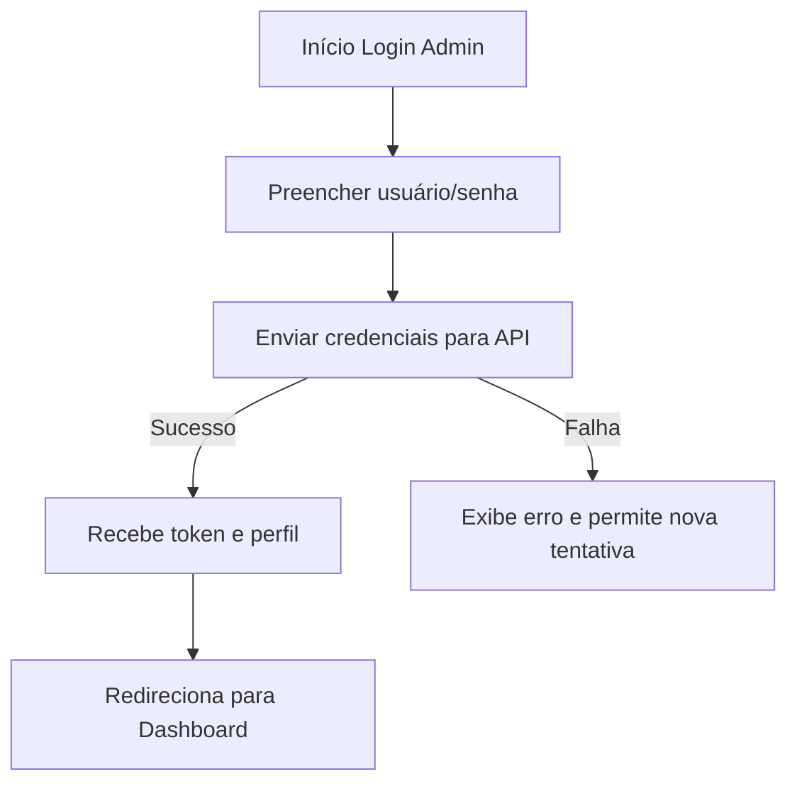

#### Dashboard Estratégico
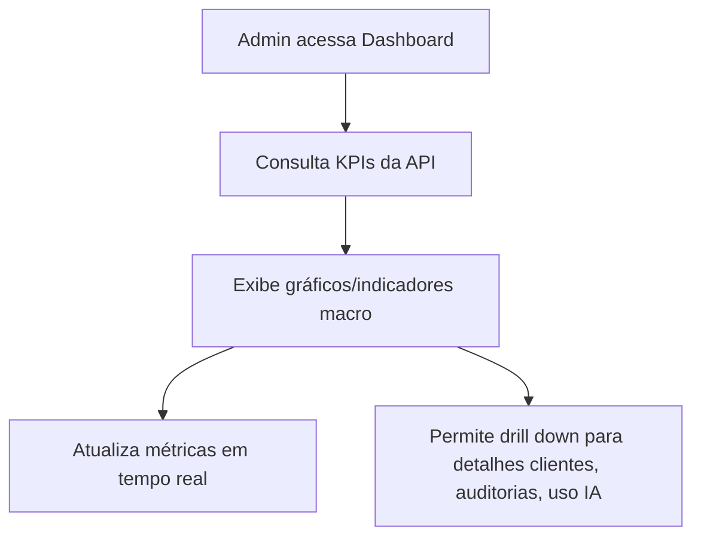

#### Gestão de Contabilidades
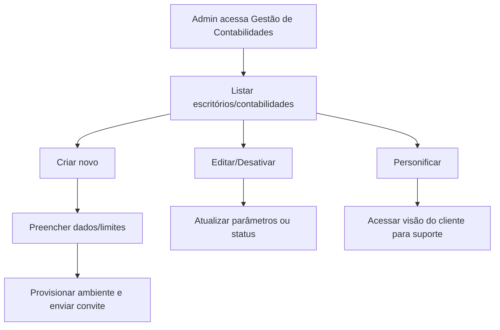

#### LOGOPERACOES / Auditoria de Sistema
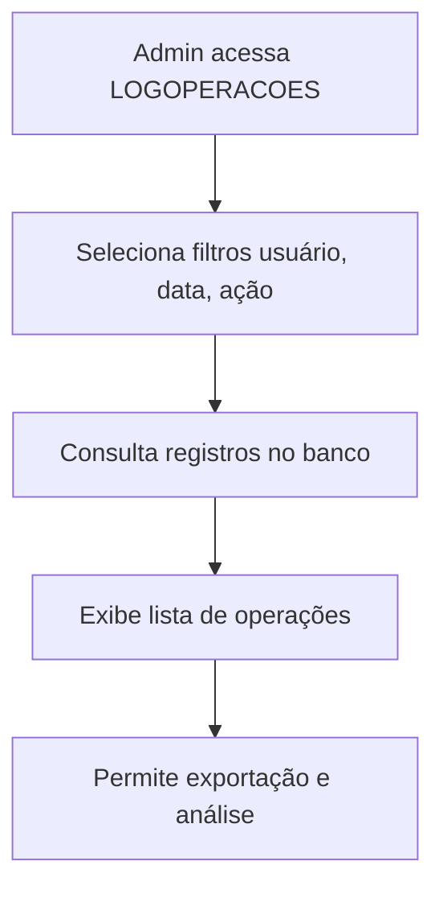

#### Personificação/Suporte Supremo
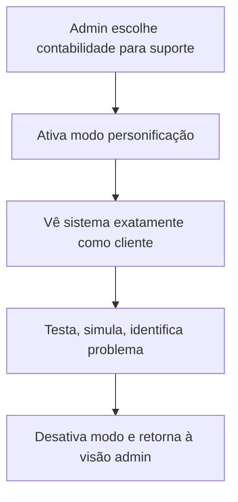

---

### Cliente – Universo 2

#### Login/Onboarding
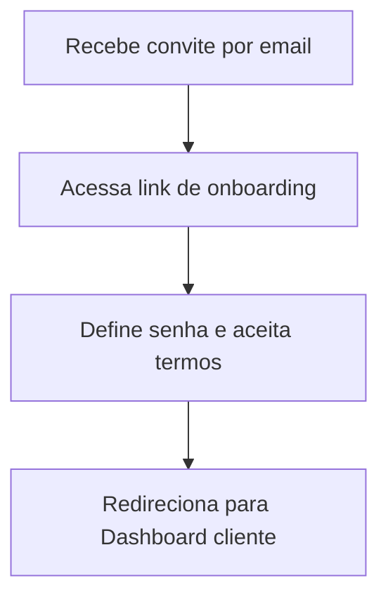

#### Controle Mensal
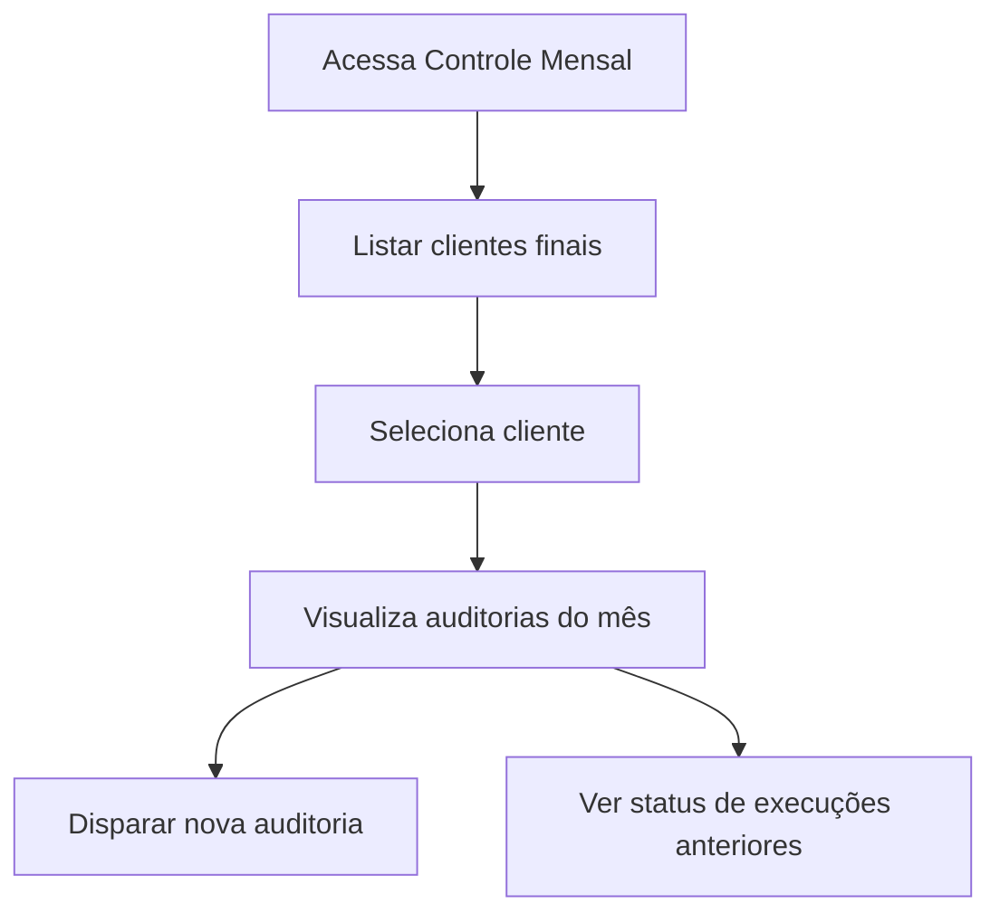

#### Disparo de Auditoria
```mermaid
flowchart TD
    DA1[Seleciona cliente e mês referência] --> DA2[Clica em "Disparar Auditoria"]
    DA2 --> DA3[API cria auditoria e inicia processamento IA]
    DA3 --> DA4[Status: Em Andamento > Concluído/Erro]
    DA4 --> DA5[Usuário notificado do resultado]
```

#### Análise Forense
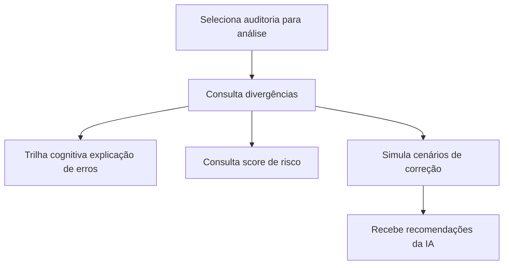

#### Gestão de Regras e Legislação
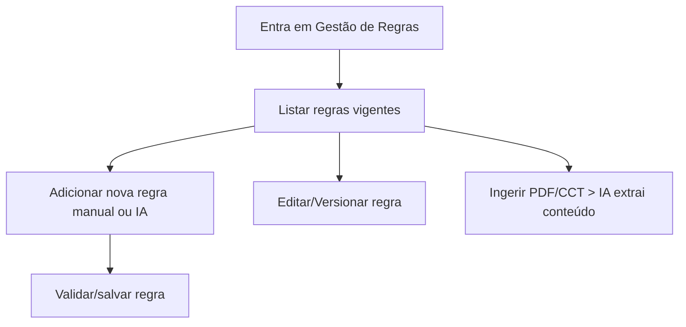

#### Simulador de Impactos
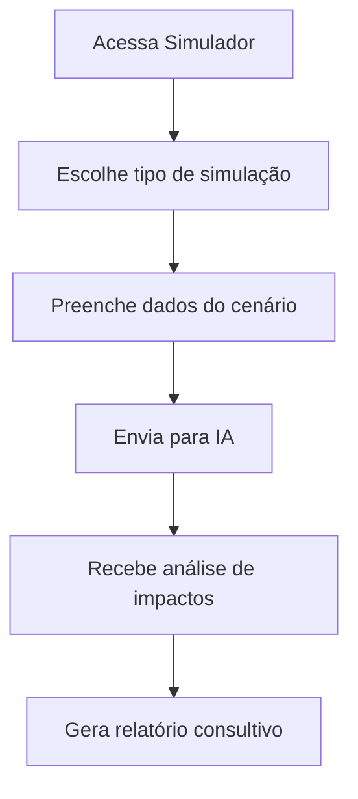

#### Geração de Relatórios
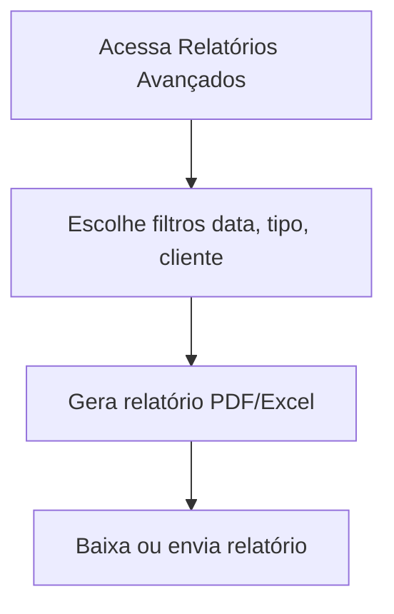

---

### Funcionalidades Transversais

#### Integração com IA
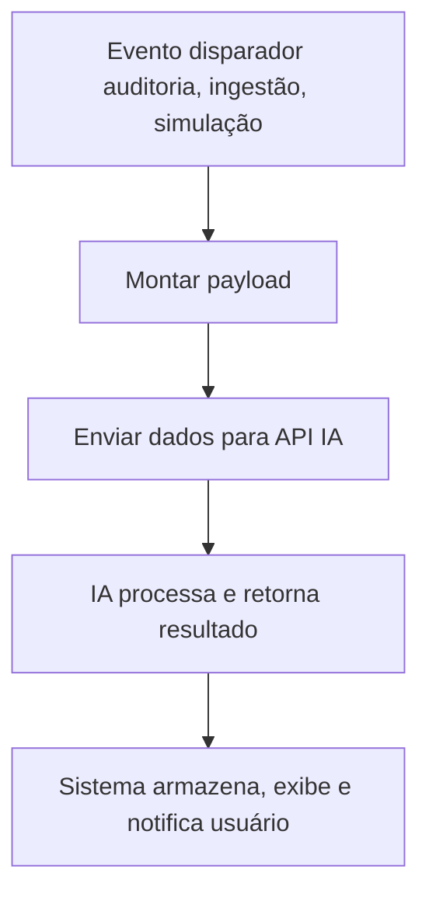

#### Logs e Auditoria
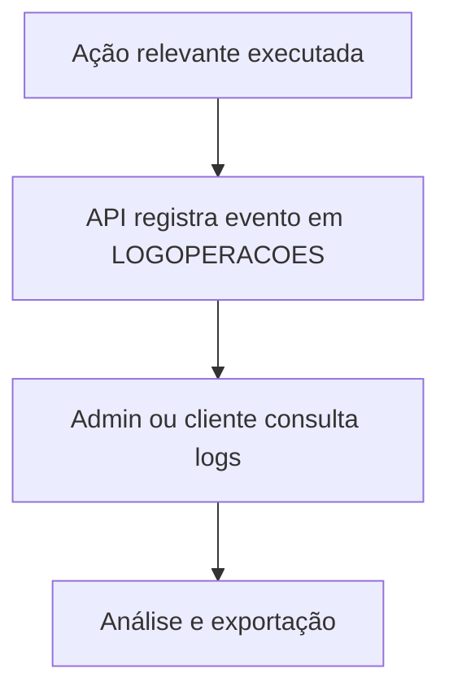

#### Onboarding de Escritório
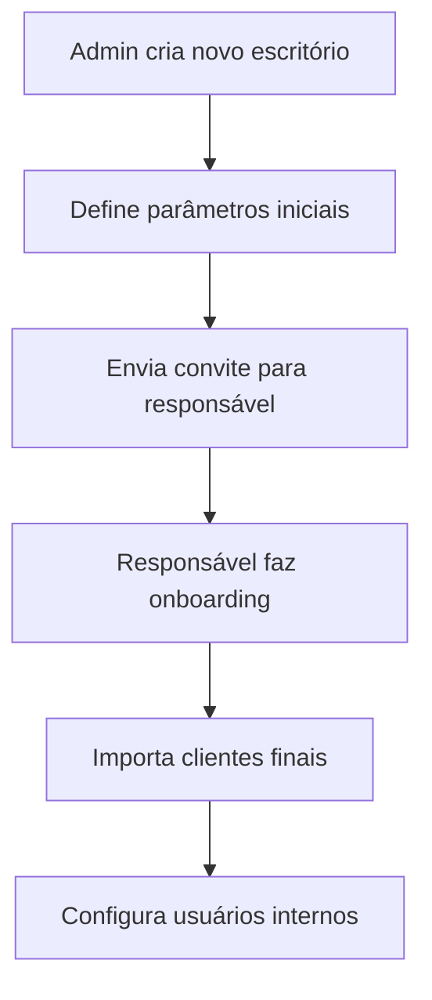

#### Gerenciamento de Usuários
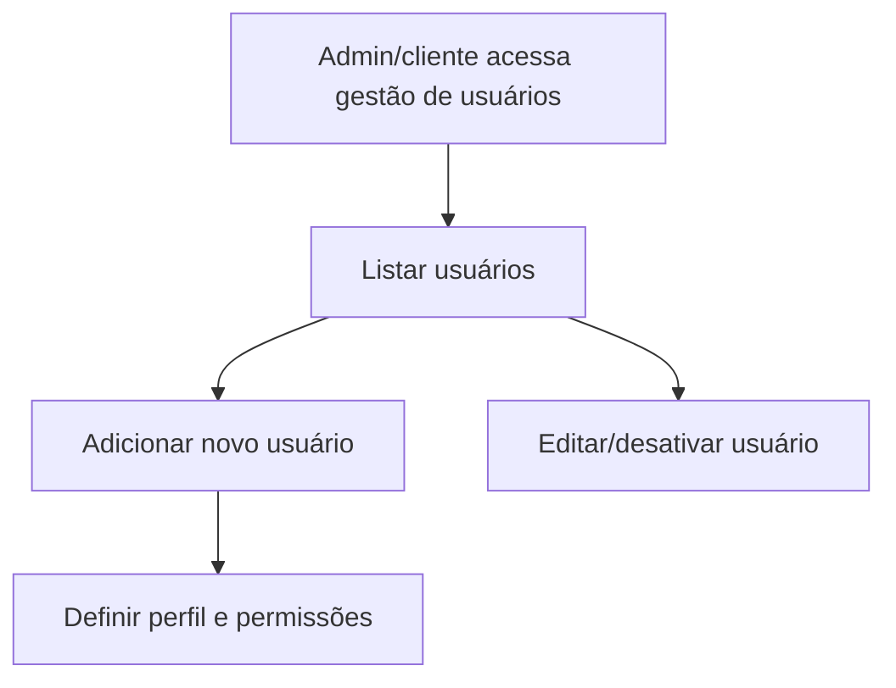

---

## 2. STATUS OPERACIONAL ATUAL E OBSERVAÇÕES

| Módulo/Página                   | Status Operacional | Observações                                      |
|---------------------------------|--------------------|--------------------------------------------------|
| Login/Admin                     | FUNCIONANDO        |                                                  |
| Dashboard Estratégico           | FUNCIONANDO        | Gráficos de IA em teste                          |
| Gestão de Contabilidades        | FUNCIONANDO        |                                                  |
| LOGOPERACOES/Auditoria de Sistema | FUNCIONANDO      |                                                  |
| Personificação/Suporte Supremo  | FUNCIONANDO        |                                                  |
| Login/Onboarding                | FUNCIONANDO        |                                                  |
| Controle Mensal                 | FUNCIONANDO        |                                                  |
| Disparo de Auditoria            | FUNCIONANDO        | Integração IA: 100%                              |
| Análise Forense                 | FUNCIONANDO        | Trilha cognitiva: EM TESTE                       |
| Gestão de Regras/Legislação     | FUNCIONANDO        | Ingestão automática: EM DESENVOLVIMENTO          |
| Simulador de Impactos           | EM DESENVOLVIMENTO | IA em integração                                 |
| Geração de Relatórios           | FUNCIONANDO        |                                                  |
| Integração com IA               | FUNCIONANDO        | Simulador em expansão                            |
| Logs e Auditoria                | FUNCIONANDO        |                                                  |
| Onboarding Escritório           | FUNCIONANDO        |                                                  |
| Gerenciamento de Usuários       | FUNCIONANDO        |                                                  |

---

## 3. AUTOMAÇÃO DE STATUS, HEALTH-CHECK E MONITORAMENTO

### Scripts de Health-Check por Módulo

O arquivo `automation/update_status.py` já implementa o monitoramento automático dos módulos. Exemplo de uso:

```python
# Executar verificação de status
python automation/update_status.py

# Resultado gerado em processos_status_auditoria360.md
# e status_report_auditoria360.json
```

### Modelo de Endpoint Health-Check (FastAPI)

```python
# api/health/endpoints.py
from fastapi import APIRouter
from typing import Dict, Any

router = APIRouter()

@router.get("/api/health/dashboard")
def health_dashboard() -> Dict[str, Any]:
    try:
        # Verificar conexão com banco, cache, etc.
        return {"status": "ok", "details": "All dependencies healthy"}
    except Exception as e:
        return {"status": "error", "details": str(e)}

@router.get("/api/health/disparo_auditoria")
def health_disparo_auditoria() -> Dict[str, Any]:
    try:
        # Verificar integração com IA, filas, etc.
        return {
            "status": "ok", 
            "details": "All dependencies healthy - Integração IA: 100%"
        }
    except Exception as e:
        return {"status": "error", "details": str(e)}

@router.get("/api/health/forense")
def health_forense() -> Dict[str, Any]:
    return {
        "status": "em_teste",
        "details": "Trilha cognitiva em fase de testes"
    }

@router.get("/api/health/simulador")
def health_simulador() -> Dict[str, Any]:
    return {
        "status": "em_desenvolvimento",
        "details": "IA em integração - módulo em desenvolvimento ativo"
    }
```

### Dashboard Visual de Status (React)

```jsx
// src/frontend/components/StatusDashboard.jsx
import React, { useEffect, useState } from "react";

const modules = [
  { name: "Dashboard Estratégico", url: "/api/health/dashboard" },
  { name: "Controle Mensal", url: "/api/health/controle_mensal" },
  { name: "Disparo de Auditoria", url: "/api/health/disparo_auditoria" },
  { name: "Análise Forense", url: "/api/health/forense" },
  { name: "Gestão de Regras", url: "/api/health/regras" },
  { name: "Simulador de Impactos", url: "/api/health/simulador" },
  { name: "Geração de Relatórios", url: "/api/health/relatorios" },
  { name: "Integração com IA", url: "/api/health/ia" },
  // ... outros módulos
];

function StatusDashboard() {
  const [status, setStatus] = useState({});
  const [loading, setLoading] = useState(true);

  useEffect(() => {
    const checkAllModules = async () => {
      const statusResults = {};
      
      for (const mod of modules) {
        try {
          const response = await fetch(mod.url);
          const data = await response.json();
          statusResults[mod.name] = {
            status: data.status,
            details: data.details,
            responseTime: data.responseTime
          };
        } catch (error) {
          statusResults[mod.name] = {
            status: "error",
            details: error.message,
            responseTime: null
          };
        }
      }
      
      setStatus(statusResults);
      setLoading(false);
    };

    checkAllModules();
    const interval = setInterval(checkAllModules, 30000); // Atualiza a cada 30s
    
    return () => clearInterval(interval);
  }, []);

  const getStatusColor = (status) => {
    switch (status) {
      case "ok": return "green";
      case "em_desenvolvimento": return "orange";
      case "em_teste": return "yellow";
      default: return "red";
    }
  };

  const getStatusEmoji = (status) => {
    switch (status) {
      case "ok": return "✅";
      case "em_desenvolvimento": return "🚧";
      case "em_teste": return "🧪";
      default: return "❌";
    }
  };

  if (loading) return <div>Carregando status dos módulos...</div>;

  return (
    <div className="status-dashboard">
      <h2>Dashboard de Status - AUDITORIA360</h2>
      <table className="status-table">
        <thead>
          <tr>
            <th>Módulo</th>
            <th>Status</th>
            <th>Tempo Resposta</th>
            <th>Detalhes</th>
          </tr>
        </thead>
        <tbody>
          {modules.map((mod) => {
            const moduleStatus = status[mod.name] || {};
            return (
              <tr key={mod.name}>
                <td>{mod.name}</td>
                <td style={{ color: getStatusColor(moduleStatus.status) }}>
                  {getStatusEmoji(moduleStatus.status)} {moduleStatus.status?.toUpperCase()}
                </td>
                <td>
                  {moduleStatus.responseTime ? 
                    `${moduleStatus.responseTime}ms` : 
                    'N/A'
                  }
                </td>
                <td>{moduleStatus.details}</td>
              </tr>
            );
          })}
        </tbody>
      </table>
      
      <style jsx>{`
        .status-dashboard {
          padding: 20px;
        }
        .status-table {
          width: 100%;
          border-collapse: collapse;
        }
        .status-table th,
        .status-table td {
          border: 1px solid #ddd;
          padding: 8px;
          text-align: left;
        }
        .status-table th {
          background-color: #f2f2f2;
        }
      `}</style>
    </div>
  );
}

export default StatusDashboard;
```

### Integração CI/CD, Alertas e Badges

#### GitHub Actions para Health Check
```yaml
# .github/workflows/health-check.yml
name: Health Check

on:
  push:
    branches: [ main ]
  pull_request:
    branches: [ main ]
  schedule:
    - cron: '*/5 * * * *'  # A cada 5 minutos

jobs:
  health-check:
    runs-on: ubuntu-latest
    steps:
    - uses: actions/checkout@v3
    
    - name: Set up Python
      uses: actions/setup-python@v3
      with:
        python-version: '3.12'
    
    - name: Install dependencies
      run: |
        python -m pip install --upgrade pip
        pip install -r requirements.txt
    
    - name: Run health check
      run: python automation/update_status.py
      
    - name: Commit status update
      run: |
        git config --local user.email "action@github.com"
        git config --local user.name "GitHub Action"
        git add processos_status_auditoria360.md status_report_auditoria360.json
        git diff --staged --quiet || git commit -m "Automated status update"
        git push
```

#### Badges Dinâmicos
```markdown


```

### Boas Práticas

- **Versionamento**: Todos os scripts e endpoints de health-check devem ser versionados
- **Documentação**: README atualizado com instruções para adicionar novos módulos
- **Checagem Híbrida**: Automatizada + revisão manual para status "EM DESENVOLVIMENTO/TESTE"
- **Escalabilidade**: Dashboard e scripts preparados para crescimento da arquitetura

---

## 4. GOVERNANÇA, AUDITORIA, OBSERVABILIDADE E MELHORIA CONTÍNUA

### Changelog Integrado

```markdown
# CHANGELOG.md

## [1.2.0] - 2025-01-XX

### Added
- Manual Supremo com fluxogramas detalhados
- Dashboard de status em tempo real
- Endpoints de health-check para todos os módulos
- Automação de monitoramento via GitHub Actions

### Changed
- Melhorias na interface de gestão de regras
- Otimização do sistema de auditoria

### Fixed
- Correção na integração com IA para simulador

### Security
- Implementação de auditoria de logs aprimorada
```

### Matriz de Responsabilidades (RACI)

| Módulo                  | Responsável | Aprovador | Consultado | Informado  |
|-------------------------|-------------|-----------|------------|------------|
| Disparo de Auditoria    | DevOps      | CTO       | Suporte    | Clientes   |
| Dashboard Estratégico   | Frontend    | PO        | Suporte    | Admin      |
| Integração com IA       | Data Eng    | CTO       | DevOps     | Clientes   |
| Análise Forense         | Backend     | CTO       | Frontend   | Suporte    |
| Gestão de Regras        | Backend     | Jurídico  | DevOps     | Clientes   |
| Simulador de Impactos   | Data Eng    | CTO       | Backend    | Clientes   |
| LOGOPERACOES           | DevOps      | CISO      | Backend    | Admin      |
| Personificação         | DevOps      | CISO      | Suporte    | Admin      |
| Gerenciamento Usuários  | Backend     | CISO      | Frontend   | Admin      |

### Métricas, SLA e Relatórios Automatizados

#### SLAs Definidos
- **Uptime**: 99.5% (mensal)
- **Tempo de Resposta**: < 2s (95th percentile)
- **Disponibilidade IA**: > 98% (mensal)
- **Backup**: Diário com retenção de 30 dias

#### Métricas Automatizadas
```python
# automation/metrics_collector.py
def collect_system_metrics():
    return {
        "uptime_percentage": calculate_uptime(),
        "response_times": get_response_metrics(),
        "error_rates": get_error_rates(),
        "ai_availability": check_ai_services(),
        "user_activity": get_user_metrics(),
        "audit_logs_volume": get_audit_volume()
    }
```

### Auditoria de Segurança, Compliance e Backup

#### Scripts de Auditoria
```python
# automation/security_audit.py
def run_security_audit():
    checks = [
        verify_user_permissions(),
        check_failed_login_attempts(),
        validate_data_encryption(),
        audit_admin_actions(),
        verify_backup_integrity(),
        check_lgpd_compliance()
    ]
    return generate_security_report(checks)
```

#### Backup Automático
```python
# automation/backup_routine.py
def automated_backup():
    # Já implementado no repositório
    pass
```

### Templates e Manual Dev/Test/Deploy

#### Template de Alerta
```html
<!-- templates/alert_template.html -->
<div class="alert alert-{{type}}">
    <h3>🚨 AUDITORIA360 - {{alert_type}}</h3>
    <p><strong>Módulo:</strong> {{module_name}}</p>
    <p><strong>Status:</strong> {{status}}</p>
    <p><strong>Detalhes:</strong> {{details}}</p>
    <p><strong>Timestamp:</strong> {{timestamp}}</p>
    <p><strong>Ação Requerida:</strong> {{action_required}}</p>
</div>
```

#### Manual Dev/Test/Deploy
```bash
# scripts/dev_setup.sh
#!/bin/bash
echo "🔧 AUDITORIA360 - Setup Desenvolvimento"
cp .env.example .env
pip install -r requirements.txt
python setup_database.py
echo "✅ Ambiente de desenvolvimento configurado"

# scripts/test_runner.sh
#!/bin/bash
echo "🧪 AUDITORIA360 - Executando Testes"
python -m pytest tests/ --cov=src --cov-report=html
python automation/update_status.py
echo "✅ Testes e health-check concluídos"

# scripts/deploy.sh
#!/bin/bash
echo "🚀 AUDITORIA360 - Deploy para Produção"
python automation/update_status.py
if [ $? -eq 0 ]; then
    echo "✅ Health-check aprovado - Prosseguindo com deploy"
    # Deploy logic here
else
    echo "❌ Health-check falhou - Deploy abortado"
    exit 1
fi
```

### API Pública e Observabilidade

#### Endpoint de Status Público
```python
# api/public/status.py
@router.get("/api/public/status")
def public_system_status():
    return {
        "system": "AUDITORIA360",
        "status": "operational",
        "version": "1.0.0",
        "uptime": get_uptime_percentage(),
        "services": {
            "api": "operational",
            "database": "operational", 
            "ai_integration": "operational"
        },
        "last_updated": datetime.now().isoformat()
    }
```

#### Observabilidade com Prometheus/Grafana
```python
# monitoring/prometheus_metrics.py
from prometheus_client import Counter, Histogram, Gauge

# Métricas customizadas
REQUEST_COUNT = Counter('auditoria360_requests_total', 'Total requests', ['method', 'endpoint'])
REQUEST_DURATION = Histogram('auditoria360_request_duration_seconds', 'Request duration')
ACTIVE_AUDITS = Gauge('auditoria360_active_audits', 'Active audit processes')
```

### Incidentes, Mobile, Roadmap e Outros

#### Gestão Automática de Incidentes
```python
# automation/incident_management.py
def create_incident_from_failure(module_name, error_details):
    incident = {
        "title": f"Falha crítica em {module_name}",
        "severity": "high",
        "description": error_details,
        "status": "open",
        "created_at": datetime.now(),
        "assigned_to": get_module_responsible(module_name)
    }
    # Criar issue automática no GitHub
    create_github_issue(incident)
    # Enviar notificações
    send_incident_notifications(incident)
```

#### Dashboard Mobile (PWA)
```javascript
// src/frontend/mobile/StatusPWA.js
import React from 'react';

const MobileStatusDashboard = () => {
  return (
    <div className="mobile-dashboard">
      <h2>📱 AUDITORIA360 Mobile Status</h2>
      <StatusCards />
      <QuickActions />
      <AlertsPanel />
    </div>
  );
};
```

#### Roadmap Visual
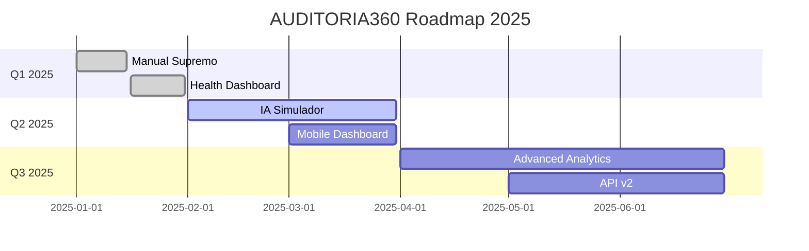

---

**Este Manual Supremo é o núcleo de governança, monitoramento, automação e excelência operacional do AUDITORIA360. Atualize, versione e expanda continuamente conforme a plataforma evolui!**

---

## 📋 Checklist de Implementação

- [x] Fluxogramas detalhados de todos os módulos
- [x] Tabela de status operacional atual
- [x] Scripts de health-check automatizados
- [x] Endpoints de health-check para API
- [x] Dashboard React de monitoramento
- [x] Integração CI/CD com GitHub Actions
- [x] Matriz de responsabilidades (RACI)
- [x] Templates de comunicação e alertas
- [x] Automação de backup e segurança
- [x] Métricas e SLAs definidos
- [x] Roadmap visual e gestão de incidentes
- [x] Documentação de observabilidade

**Status**: ✅ IMPLEMENTAÇÃO COMPLETA

**Última atualização**: Janeiro 2025