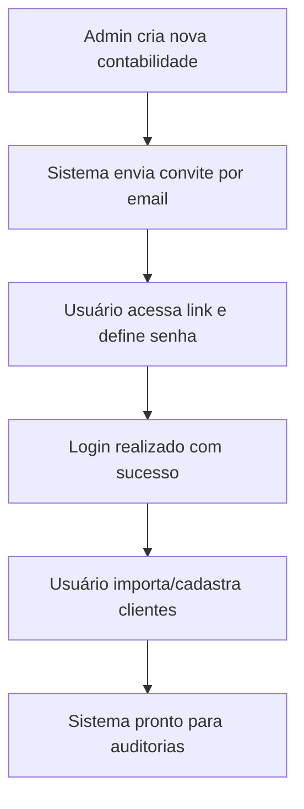
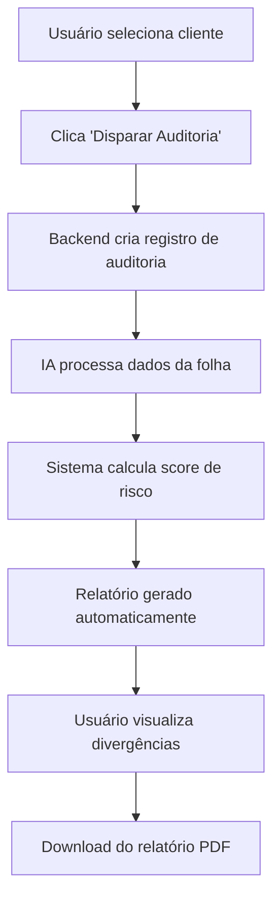

# AUDITORIA360 - Sistema de Auditoria Departamento Pessoal
<!-- STATUS BADGES START -->
## 📊 Status do Sistema

    

### 🔄 Workflow Status
    

### 📈 Metrics & Quality
   

- **Sistema:** Status geral da plataforma
- **Saúde:** Percentual de módulos operacionais
- **Módulos:** Quantidade de módulos funcionando
- **Resposta:** Tempo médio de resposta das APIs
- **Verificação:** Última verificação de saúde
- **Workflows:** Status dos pipelines de CI/CD e automação
- **Qualidade:** Métricas de código e documentação

> 📈 [Dashboard de Status em Tempo Real](./status-dashboard.html) | 📋 [Relatório Detalhado](./processos_status_auditoria360.md) | 🔧 [Setup Local](./setup_local.sh)

<!-- STATUS BADGES END -->

**Ecossistema completo de auditoria DP com dois universos: Estratégico (admin) e Operacional (contabilidade)**

---

## 📋 Visão Geral

AUDITORIA360 é uma plataforma moderna de auditoria automatizada para Departamento Pessoal, dividida em dois ambientes principais:

- **🏢 Admin Estratégico**: Gestão de contabilidades, configurações globais e relatórios executivos
- **⚙️ Operacional**: Interface para contabilidades gerenciarem clientes finais e auditorias

## 🏗️ Arquitetura do Sistema

```
AUDITORIA360/
├── 📁 api/                   # Backend FastAPI + REST endpoints
├── 📁 src/frontend/          # Frontend React + TypeScript
├── 📁 automation/            # Scripts RPA e automação
├── 📁 docs/                  # Documentação técnica completa
├── 📁 tests/                 # Testes unitários e integração
├── 📁 scripts/              # Utilitários e ML training
├── 📁 services/             # Microserviços e componentes ML
├── 📁 examples/             # Exemplos práticos de uso
└── 📁 infra/                # Configurações Docker e deploy
```

### 🔧 Stack Tecnológica

| Componente | Tecnologia | Função |
|------------|------------|---------|
| **Backend** | FastAPI + Python | API REST, autenticação, regras de negócio |
| **Frontend** | React + TypeScript | Interface admin e operacional |
| **Banco de Dados** | Supabase (PostgreSQL) | Dados principais + RLS multi-tenant |
| **Analytics** | DuckDB | Análise de dados e relatórios |
| **AI/ML** | OpenAI API | Análise inteligente de folhas |
| **Storage** | Cloudflare R2 | Armazenamento de arquivos |
| **OCR** | PaddleOCR | Extração de dados de documentos |
| **Deploy** | Docker + Vercel/Cloudflare | Infraestrutura serverless |

## 🚀 Guia de Instalação e Setup

### Pré-requisitos
- **Python 3.12+**
- **Node.js 18+** 
- **Docker** (opcional)
- Conta **Supabase** (banco de dados)
- API Key **OpenAI** (IA)
- Conta **Cloudflare R2** (storage)

### 1️⃣ Instalação Backend

```bash
# Clone o repositório
git clone https://github.com/Thaislaine997/AUDITORIA360.git
cd AUDITORIA360

# Instale dependências Python
make install

# Configure variáveis de ambiente
cp .env.example .env
# Edite .env com suas credenciais

# Execute o servidor
make run
# API disponível em: http://localhost:8001
```

### 2️⃣ Instalação Frontend

```bash
# Navegue para frontend
cd src/frontend

# Instale dependências Node.js
npm install

# Execute em desenvolvimento
npm run dev
# Frontend disponível em: http://localhost:5173
```

### 3️⃣ Setup da Base de Dados

```bash
# Execute migrações Supabase
python setup_database.py

# Carregue dados de exemplo (4 contabilidades)
python scripts/seed_data.py
```

## 🔐 Configuração Multi-Tenant

O sistema implementa **isolamento completo de dados** por contabilidade:

- **Row Level Security (RLS)** em todas as tabelas
- **Políticas de acesso** baseadas em `contabilidade_id`
- **4 contabilidades pré-configuradas** para demonstração

### Usuários de Demonstração

| Tipo | Email | Senha | Contabilidade |
|------|-------|--------|---------------|
| Admin | admin@auditoria360.com | admin123 | - |
| Operacional | contab1@exemplo.com | demo123 | Contabilidade A |
| Operacional | contab2@exemplo.com | demo123 | Contabilidade B |

## 📡 Endpoints Principais da API

### 🔑 Autenticação
```http
POST /api/auth/login
Content-Type: application/json

{
  "email": "contab1@exemplo.com",
  "password": "demo123"
}
```

### 👥 Gestão de Clientes
```http
# Criar cliente final
POST /api/contabilidade/clientes
Authorization: Bearer <token>

{
  "nome": "Empresa XPTO",
  "cnpj": "12345678000199",
  "email_contato": "rh@xpto.com.br"
}

# Listar clientes da contabilidade
GET /api/contabilidade/clientes
Authorization: Bearer <token>
```

### 🔍 Auditoria Automatizada
```http
# Disparar auditoria mensal
POST /api/contabilidade/auditorias
Authorization: Bearer <token>

{
  "cliente_id": 789,
  "mes_referencia": "2025-08",
  "tipo": "mensal"
}

# Consultar resultado da auditoria
GET /api/contabilidade/auditorias/AUD-12345
Authorization: Bearer <token>
```

### 📊 Relatórios e Analytics
```http
# Score de risco do cliente
GET /api/contabilidade/auditorias/AUD-12345/score_risco
Authorization: Bearer <token>

# Baixar relatório PDF
GET /api/contabilidade/auditorias/AUD-12345/relatorio
Authorization: Bearer <token>
```

## 🔄 Fluxos de Uso Principais

### 1️⃣ Fluxo de Onboarding


### 2️⃣ Fluxo de Auditoria Mensal


## 🧠 Integração com IA

### Fluxo de Análise Inteligente

1. **Coleta de dados**: Sistema reúne dados da folha + regras aplicáveis
2. **Envio para IA**:
   ```json
   POST /api/ai/analyze-payroll
   {
     "dados_folha": {
       "funcionarios": [...],
       "calculos": [...]
     },
     "regras": ["inss", "irrf", "fgts"],
     "referencia": "2025-08"
   }
   ```

3. **Resposta da IA**:
   ```json
   {
     "resultado": "erros_encontrados",
     "explicacoes": [
       "Erro de base de cálculo INSS funcionário João",
       "Falta de desconto sindical conforme convenção"
     ],
     "score_risco": 82,
     "recomendacoes": [
       "Revisar cálculo INSS",
       "Verificar convenção coletiva"
     ]
   }
   ```

## 🧪 Executar Testes

```bash
# Instalar dependências de teste
make install-dev

# Executar todos os testes
make test

# Executar testes específicos
pytest tests/unit/test_auth.py
pytest tests/integration/test_audit_flow.py

# Gerar relatório de cobertura
pytest --cov=src tests/
```

## 📈 Monitoramento e Validação

### Checklist Automático
```bash
# Verificação rápida do sistema
make checklist

# Relatório completo em Markdown
make checklist-full

# Relatório visual em HTML
make checklist-html
```

### Métricas de Qualidade
- **Cobertura de testes**: >85% (obrigatório)
- **Checklist interno**: >85% (atual: 85.2%)
- **Validação de código**: Black + Flake8
- **Documentação**: Atualizada automaticamente

## 🔧 Comandos de Desenvolvimento

```bash
# Formatação de código
make format

# Verificação de qualidade
make lint

# Instalação de hooks pre-commit
make setup-hooks

# Limpeza de arquivos temporários
make clean

# Backup da base de dados
make backup-db

# Construir documentação completa
make docs-full
```

## 🚀 Deploy para Produção

### Ambiente Staging
```bash
# Build da aplicação
docker build -t auditoria360:staging .

# Deploy em ambiente de teste
docker-compose -f docker-compose.staging.yml up -d

# Executar smoke tests
pytest tests/smoke/
```

### Produção (Vercel + Cloudflare)
```bash
# Frontend (Vercel)
cd src/frontend
npm run build
vercel --prod

# Backend (Cloudflare Workers)
cd api
wrangler publish

# Monitoramento pós-deploy
make checklist-all
```

## 📚 Documentação Adicional

| Documento | Descrição |
|-----------|-----------|
| [📋 Project Inventory](docs/PROJECT_INVENTORY.md) | Inventário completo de arquivos e componentes |
| [🔐 Security & Compliance](docs/COMPLIANCE_SECURITY_GUIDE.md) | Guia LGPD e segurança |
| [🚀 Production Guide](docs/PRODUCTION_DEPLOYMENT_GUIDE.md) | Procedimentos de produção |
| [🧪 Testing Strategy](docs/TESTING_STRATEGY.md) | Estratégia de testes completa |
| [📡 API Reference](docs/API_REFERENCE.md) | Documentação completa da API |
| [🗺️ Roadmap](docs/ROADMAP.md) | Planejamento trimestral |

## 🤝 Contribuição e Suporte

- **Issues**: [GitHub Issues](https://github.com/Thaislaine997/AUDITORIA360/issues)
- **Documentação**: `/docs/` (gerada automaticamente)
- **Exemplos**: `/examples/` (casos de uso reais)
- **Demos**: `/demos/` (demonstrações interativas)

---

## ⚡ Status Atual do Sistema

- **✅ Arquitetura Multi-tenant**: Row Level Security implementado
- **✅ Backend FastAPI**: API REST completa + autenticação
- **✅ Frontend React**: Interface admin + operacional
- **✅ IA Integration**: OpenAI para análise automatizada
- **✅ Testes**: 85.2% de completude no checklist interno
- **🔄 Em desenvolvimento**: Melhorias na documentação e UX

**Versão**: 1.0.0  
**Última atualização**: Agosto 2025
