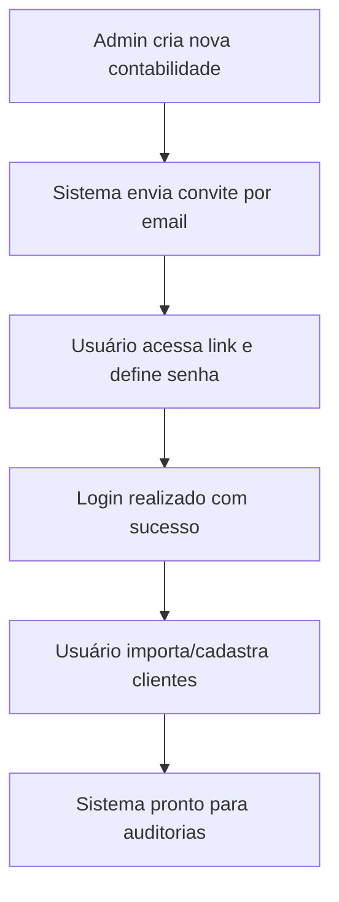
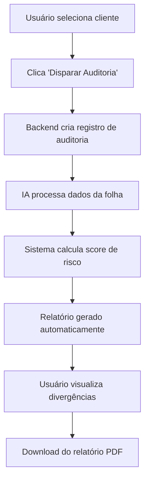

# AUDITORIA360 - Plataforma Moderna de Terceirização de Departamento Pessoal

[](https://github.com/Thaislaine997/AUDITORIA360/actions/workflows/deploy.yml)
    

## 🚀 Visão Geral

AUDITORIA360 é uma plataforma moderna e escalável para terceirização de Departamento Pessoal, **completamente refatorada** com **Next.js** (React) e integração **Supabase** para autenticação e banco de dados. A plataforma oferece deploy automático no **GitHub Pages** e área de login protegida para o portal AUDITORIA360.

### 🏢 DPEIXER - Assessoria & Terceirização

A DPEIXER oferece soluções completas em Departamento Pessoal e Recursos Humanos, voltadas para contabilidades e empresas que buscam:

- ✅ **Precisão** e segurança jurídica
- ✅ **Eficiência operacional**  
- ✅ **Compliance** trabalhista
- ✅ **Processos 100% digitais**

## 🏗️ Arquitetura Moderna (Nova Estrutura)

```
AUDITORIA360/
├── 📁 pages/                 # Páginas Next.js (SSG/SSR)
│   ├── index.tsx            # Homepage institucional
│   ├── login.tsx            # Página de autenticação
│   ├── dashboard.tsx        # Dashboard protegido
│   └── _app.tsx             # App wrapper
├── 📁 components/            # Componentes React reutilizáveis  
│   ├── ui/                  # Componentes base (Button, Loading)
│   └── layout/              # Layouts (Header, Footer)
├── 📁 lib/                   # Integrações (Supabase, APIs)
├── 📁 styles/                # CSS global e Tailwind
├── 📁 public/                # Assets estáticos
├── 📁 .github/               # GitHub Actions e templates
│   ├── workflows/            # CI/CD workflows
│   └── ISSUE_TEMPLATE/       # Templates de issues
├── 📄 next.config.js         # Configuração Next.js
├── 📄 tailwind.config.js     # Configuração Tailwind CSS
├── 📄 .env.example           # Variáveis de ambiente
└── 📁 src/                   # Sistema legado (compatibilidade)
    ├── frontend/             # React/Vite original
    └── api/                  # APIs FastAPI existentes
```

### 🔧 Stack Tecnológica Modernizada

| Componente | Tecnologia | Função |
|------------|------------|---------|
| **Frontend** | Next.js 14 + React 18 + TypeScript | Interface moderna e responsiva |
| **Styling** | Tailwind CSS | Design system e componentes |
| **Auth/DB** | Supabase | Autenticação e banco de dados |
| **Deploy** | GitHub Pages | Hospedagem estática automatizada |
| **CI/CD** | GitHub Actions | Deploy e integração contínua |

## 🚀 Instalação e Desenvolvimento

### Pré-requisitos

- Node.js >= 18.0.0
- npm ou yarn
- Conta Supabase (para auth/DB)

### 1. Clone e Instale

```bash
git clone https://github.com/Thaislaine997/AUDITORIA360.git
cd AUDITORIA360
npm install
```

### 2. Configure Variáveis de Ambiente

```bash
cp .env.example .env.local
```

Edite `.env.local` com suas credenciais Supabase:

```env
NEXT_PUBLIC_SUPABASE_URL=your_supabase_project_url
NEXT_PUBLIC_SUPABASE_ANON_KEY=your_supabase_anon_key
```

### 3. Execute em Desenvolvimento

```bash
npm run dev
```

Acesse: `http://localhost:3000`

### 4. Build para Produção

```bash
npm run build
```

## 🔐 Configuração do Supabase

### 1. Criar Projeto

1. Acesse [supabase.com](https://supabase.com)
2. Crie um novo projeto
3. Anote a URL e chave pública (anon key)

### 2. Configurar Autenticação

No painel Supabase:
- Vá em **Authentication > Settings**
- Configure **Site URL**: `https://thaislaine997.github.io`
- Adicione **Redirect URLs**:
  - `http://localhost:3000` (desenvolvimento)
  - `https://thaislaine997.github.io/AUDITORIA360` (produção)

## 🌐 Deploy Automatizado (GitHub Pages)

### Deploy Automático via Actions

O deploy é **100% automatizado** via GitHub Actions:

1. **Push para branch `main` ou `Principal`**
2. **GitHub Actions** executa automaticamente:
   - Instala dependências
   - Executa build Next.js com static export
   - Gera páginas estáticas otimizadas
   - Deploy automático no GitHub Pages

### Configuração de Secrets

No repositório GitHub, configure em **Settings > Secrets and Variables > Actions**:

```
NEXT_PUBLIC_SUPABASE_URL=your_supabase_url
NEXT_PUBLIC_SUPABASE_ANON_KEY=your_supabase_anon_key
```

## 🎯 Funcionalidades Principais

### 🏠 Site Institucional Moderno
- **Hero section** com proposta de valor clara
- **Sobre a empresa** com diferenciais técnicos
- **Serviços detalhados** e especializados
- **Planos e preços** transparentes e competitivos
- **Design responsivo** e otimizado (Tailwind CSS)

### 🔒 Portal AUDITORIA360 (Área Protegida)
- **Login/Registro seguro** com Supabase Auth
- **Dashboard inteligente** com métricas e KPIs
- **Módulos integrados**:
  - 📊 Controle da Folha Mensal
  - 🎫 Portal de Demandas
  - 🔍 Portal de Auditoria
  - 📋 Tabelas Oficiais (INSS, FGTS, etc.)
  - 📄 Portal CCT
  - 📈 Gestão e Relatórios

### 🛡️ Segurança e Performance
- **Autenticação robusta** via Supabase
- **Rotas protegidas** com verificação server-side
- **SSL/TLS automático** via GitHub Pages
- **Páginas estáticas otimizadas** (SEO friendly)
- **Carregamento rápido** com Next.js optimizations

## 💰 Planos e Valores DPEIXER

| Plano | Valor/Mês | Inclui |
|-------|-----------|---------|
| **Plus** | R$ 39,90 | Folha mensal, eSocial, relatórios básicos, suporte por email |
| **Premium** | R$ 49,90 | Plus + admissões/rescisões digitais + portal básico + suporte prioritário |
| **Diamante** | R$ 69,90 | Premium + documentação personalizada + analytics + suporte 24/7 |

### Diferenciais Exclusivos
- 📍 **Ponto digital** com geolocalização (celular, tablet, físico)
- 🎫 **Gestão automatizada** de benefícios (VR/VA/VT)
- ✍️ **Assinatura eletrônica** para admissão/rescisão
- 🔒 **Processos 100% digitais**, auditáveis e seguros
- 🤖 **IA integrada** para análise e automações

## 📋 Serviços Técnicos Especializados

### 1. Processamento Mensal da Folha
- Cálculo detalhado de salários, benefícios, descontos
- Emissão automática de holerites e guias (INSS, FGTS, IRRF)
- Integração direta com eSocial, DCTFWeb e FGTS Digital
- Protocolos de conferência dupla e rastreabilidade completa

### 2. Compliance e Obrigações Acessórias
- Gestão completa de declarações e devoluções
- Aplicação automática de convenções coletivas
- Revisões fiscais e previdenciárias proativas
- Correção automática de inconsistências

### 3. Consultoria Trabalhista Especializada
- Diagnóstico técnico de passivos trabalhistas
- Revisão detalhada de contratos e políticas
- Recomendações estratégicas para mitigação de riscos
- Suporte jurídico especializado

### 4. Gestão de Informação e Plataforma
- Integração segura com sistemas do cliente
- Backups automáticos e controle de versões
- Operação via plataforma própria ou acesso remoto
- Monitoramento 24/7 e alertas inteligentes

### 5. Serviços Sob Demanda Flexíveis
- Admissão/rescisão 100% digital
- Recálculos técnicos e homologações online
- Preço por evento, totalmente flexível
- Videochamadas para homologações

## 🤝 Contribuição e Desenvolvimento

### Como Contribuir

1. **Leia o guia:** [CONTRIBUTING_NEXTJS.md](CONTRIBUTING_NEXTJS.md)
2. **Fork o repositório**
3. **Criar branch:** `git checkout -b feature/nova-funcionalidade`
4. **Commit:** `git commit -am 'feat: adiciona nova funcionalidade'`
5. **Push:** `git push origin feature/nova-funcionalidade`
6. **Abrir Pull Request** usando nosso template

### Padrões de Desenvolvimento

- ✅ **TypeScript obrigatório** para type safety
- ✅ **Next.js 14** com App Router
- ✅ **Tailwind CSS** para styling
- ✅ **Componentes funcionais** com hooks
- ✅ **Supabase** para backend/auth
- ✅ **GitHub Actions** para CI/CD

### Templates Disponíveis

- 📝 **Issue Templates** - Bug reports e feature requests
- 📋 **PR Template** - Pull request padronizado
- 🔧 **Workflow Templates** - GitHub Actions configurados

## 📖 Documentação Técnica

### Arquitetura de Rotas

- `/` - Homepage institucional (pública)
- `/login` - Página de autenticação
- `/dashboard` - Portal principal (protegido)
- `/dashboard/*` - Módulos do sistema (protegidos)

### Principais Arquivos

```typescript
// Autenticação e integração
lib/supabaseClient.ts     # Cliente Supabase configurado
pages/_app.tsx            # App wrapper com auth state

// Páginas principais  
pages/index.tsx           # Homepage institucional
pages/login.tsx           # Sistema de login/registro
pages/dashboard.tsx       # Dashboard principal

// Componentes reutilizáveis
components/ui/            # Componentes base
components/layout/        # Layouts e estrutura
```

## 🚨 Migração e Compatibilidade

### ✅ Nova Arquitetura (Recomendada)
- **Next.js 14** - `/pages`, `/components`, `/lib`
- **Deploy automático** - GitHub Pages via Actions
- **Autenticação moderna** - Supabase Auth integrado
- **Performance otimizada** - Static generation + SSR

### 🔄 Sistema Legado (Compatibilidade)
- **React/Vite** - `src/frontend/` (mantido para compatibilidade)
- **FastAPI** - `src/api/` (APIs existentes funcionais)
- **Supabase Functions** - `supabase/` (edge functions)
- **Portal Demandas** - `portal_demandas/` (sistema de tickets)

### 📋 Roadmap de Migração

- [x] ✅ Estrutura Next.js implementada
- [x] ✅ Autenticação Supabase integrada  
- [x] ✅ Deploy automático configurado
- [x] ✅ Interface institucional moderna
- [x] ✅ Dashboard protegido funcional
- [ ] 🔄 Migração completa dos módulos legados
- [ ] 🔄 Integração total com APIs existentes
- [ ] 🔄 Testes automatizados completos

## 📞 Suporte e Contato

- 🌐 **Website**: [thaislaine997.github.io/AUDITORIA360](https://thaislaine997.github.io/AUDITORIA360)
- 📧 **Email**: contato@dpeixer.com.br  
- 📱 **Portal**: Acesse via `/login` para clientes
- 🐛 **Issues**: [GitHub Issues](https://github.com/Thaislaine997/AUDITORIA360/issues)
- 📚 **Documentação**: [Guia do Desenvolvedor](CONTRIBUTING_NEXTJS.md)

---

**AUDITORIA360** - Plataforma Moderna de Terceirização de Departamento Pessoal  
*Desenvolvido com ❤️ usando Next.js + Supabase + GitHub Actions*

---

---

## 🚀 Exemplo Rápido de Uso da API

```bash
# Exemplo: rodar localmente
uvicorn src.api.main:app --reload

# Testar endpoint de health
curl http://localhost:8000/health
```

---

## 🤝 Como Contribuir

1. Faça um fork do repositório
2. Crie uma branch para sua feature ou correção
3. Envie um Pull Request seguindo as boas práticas do projeto
4. Consulte os READMEs das pastas para padrões de código e exemplos

---

## 📫 Contato e Suporte

Dúvidas, sugestões ou problemas? Abra uma issue ou envie um e-mail para: contato@auditoria360.com

---

## 📋 Visão Geral

AUDITORIA360 é uma plataforma moderna de auditoria automatizada para Departamento Pessoal, dividida em dois ambientes principais:

- **🏢 Admin Estratégico**: Gestão de contabilidades, configurações globais e relatórios executivos
- **⚙️ Operacional**: Interface para contabilidades gerenciarem clientes finais e auditorias

## 🏗️ Arquitetura do Sistema

```
AUDITORIA360/
├── 📁 api/                   # Backend FastAPI + REST endpoints
├── 📁 src/frontend/          # Frontend React + TypeScript
├── 📁 automation/            # Scripts RPA e automação
├── 📁 docs/                  # Documentação técnica completa
├── 📁 tests/                 # Testes unitários e integração
├── 📁 scripts/              # Utilitários e ML training
├── 📁 services/             # Microserviços e componentes ML
├── 📁 examples/             # Exemplos práticos de uso
└── 📁 infra/                # Configurações Docker e deploy
```

### 🔧 Stack Tecnológica

| Componente | Tecnologia | Função |
|------------|------------|---------|
| **Backend** | FastAPI + Python | API REST, autenticação, regras de negócio |
| **Frontend** | React + TypeScript | Interface admin e operacional |
| **Banco de Dados** | Supabase (PostgreSQL) | Dados principais + RLS multi-tenant |
| **Analytics** | DuckDB | Análise de dados e relatórios |
| **AI/ML** | OpenAI API | Análise inteligente de folhas |
| **Storage** | Cloudflare R2 | Armazenamento de arquivos |
| **OCR** | PaddleOCR | Extração de dados de documentos |
| **Deploy** | Docker + Vercel/Cloudflare | Infraestrutura serverless |

## 🚀 Guia de Instalação e Setup

### Pré-requisitos
- **Python 3.12+**
- **Node.js 18+** 
- **Docker** (opcional)
- Conta **Supabase** (banco de dados)
- API Key **OpenAI** (IA)
- Conta **Cloudflare R2** (storage)

### 1️⃣ Instalação Backend

```bash
# Clone o repositório
git clone https://github.com/Thaislaine997/AUDITORIA360.git
cd AUDITORIA360

# Instale dependências Python
make install

# Configure variáveis de ambiente
cp .env.example .env
# Edite .env com suas credenciais

# Execute o servidor
make run
# API disponível em: http://localhost:8001
```

### 2️⃣ Instalação Frontend

```bash
# Navegue para frontend
cd src/frontend

# Instale dependências Node.js
npm install

# Execute em desenvolvimento
npm run dev
# Frontend disponível em: http://localhost:5173
```

### 3️⃣ Setup da Base de Dados

```bash
# Execute migrações Supabase
python setup_database.py

# Carregue dados de exemplo (4 contabilidades)
python scripts/seed_data.py
```

## 🔐 Configuração Multi-Tenant

O sistema implementa **isolamento completo de dados** por contabilidade:

- **Row Level Security (RLS)** em todas as tabelas
- **Políticas de acesso** baseadas em `contabilidade_id`
- **4 contabilidades pré-configuradas** para demonstração

### Usuários de Demonstração

| Tipo | Email | Senha | Contabilidade |
|------|-------|--------|---------------|
| Admin | admin@auditoria360.com | admin123 | - |
| Operacional | contab1@exemplo.com | demo123 | Contabilidade A |
| Operacional | contab2@exemplo.com | demo123 | Contabilidade B |

## 📡 Endpoints Principais da API

### 🔑 Autenticação
```http
POST /api/auth/login
Content-Type: application/json

{
  "email": "contab1@exemplo.com",
  "password": "demo123"
}
```

### 👥 Gestão de Clientes
```http
# Criar cliente final
POST /api/contabilidade/clientes
Authorization: Bearer <token>

{
  "nome": "Empresa XPTO",
  "cnpj": "12345678000199",
  "email_contato": "rh@xpto.com.br"
}

# Listar clientes da contabilidade
GET /api/contabilidade/clientes
Authorization: Bearer <token>
```

### 🔍 Auditoria Automatizada
```http
# Disparar auditoria mensal
POST /api/contabilidade/auditorias
Authorization: Bearer <token>

{
  "cliente_id": 789,
  "mes_referencia": "2025-08",
  "tipo": "mensal"
}

# Consultar resultado da auditoria
GET /api/contabilidade/auditorias/AUD-12345
Authorization: Bearer <token>
```

### 📊 Relatórios e Analytics
```http
# Score de risco do cliente
GET /api/contabilidade/auditorias/AUD-12345/score_risco
Authorization: Bearer <token>

# Baixar relatório PDF
GET /api/contabilidade/auditorias/AUD-12345/relatorio
Authorization: Bearer <token>
```

## 🔄 Fluxos de Uso Principais

### 1️⃣ Fluxo de Onboarding


### 2️⃣ Fluxo de Auditoria Mensal


## 🧠 Integração com IA

### Fluxo de Análise Inteligente

1. **Coleta de dados**: Sistema reúne dados da folha + regras aplicáveis
2. **Envio para IA**:
   ```json
   POST /api/ai/analyze-payroll
   {
     "dados_folha": {
       "funcionarios": [...],
       "calculos": [...]
     },
     "regras": ["inss", "irrf", "fgts"],
     "referencia": "2025-08"
   }
   ```

3. **Resposta da IA**:
   ```json
   {
     "resultado": "erros_encontrados",
     "explicacoes": [
       "Erro de base de cálculo INSS funcionário João",
       "Falta de desconto sindical conforme convenção"
     ],
     "score_risco": 82,
     "recomendacoes": [
       "Revisar cálculo INSS",
       "Verificar convenção coletiva"
     ]
   }
   ```

## 🧪 Executar Testes

```bash
# Instalar dependências de teste
make install-dev

# Executar todos os testes
make test

# Executar testes específicos
pytest tests/unit/test_auth.py
pytest tests/integration/test_audit_flow.py

# Gerar relatório de cobertura
pytest --cov=src tests/
```

## 📈 Monitoramento e Validação

### Checklist Automático
```bash
# Verificação rápida do sistema
make checklist

# Relatório completo em Markdown
make checklist-full

# Relatório visual em HTML
make checklist-html
```

### Métricas de Qualidade
- **Cobertura de testes**: >85% (obrigatório)
- **Checklist interno**: >85% (atual: 85.2%)
- **Validação de código**: Black + Flake8
- **Documentação**: Atualizada automaticamente

## 🔧 Comandos de Desenvolvimento

```bash
# Formatação de código
make format

# Verificação de qualidade
make lint

# Instalação de hooks pre-commit
make setup-hooks

# Limpeza de arquivos temporários
make clean

# Backup da base de dados
make backup-db

# Construir documentação completa
make docs-full
```

## 🚀 Deploy para Produção

### Ambiente Staging
```bash
# Build da aplicação
docker build -t auditoria360:staging .

# Deploy em ambiente de teste
docker-compose -f docker-compose.staging.yml up -d

# Executar smoke tests
pytest tests/smoke/
```

### Produção (Vercel + Cloudflare)
```bash
# Frontend (Vercel)
cd src/frontend
npm run build
vercel --prod

# Backend (Cloudflare Workers)
cd api
wrangler publish

# Monitoramento pós-deploy
make checklist-all
```

## 📚 Documentação Adicional

| Documento | Descrição |
|-----------|-----------|
| [📋 Project Inventory](docs/PROJECT_INVENTORY.md) | Inventário completo de arquivos e componentes |
| [🔐 Security & Compliance](docs/COMPLIANCE_SECURITY_GUIDE.md) | Guia LGPD e segurança |
| [🚀 Production Guide](docs/PRODUCTION_DEPLOYMENT_GUIDE.md) | Procedimentos de produção |
| [🧪 Testing Strategy](docs/TESTING_STRATEGY.md) | Estratégia de testes completa |
| [📡 API Reference](docs/API_REFERENCE.md) | Documentação completa da API |
| [🗺️ Roadmap](docs/ROADMAP.md) | Planejamento trimestral |

## 🤝 Contribuição e Suporte

- **Issues**: [GitHub Issues](https://github.com/Thaislaine997/AUDITORIA360/issues)
- **Documentação**: `/docs/` (gerada automaticamente)
- **Exemplos**: `/examples/` (casos de uso reais)
- **Demos**: `/demos/` (demonstrações interativas)

---

## ⚡ Status Atual do Sistema

- **✅ Arquitetura Multi-tenant**: Row Level Security implementado
- **✅ Backend FastAPI**: API REST completa + autenticação
- **✅ Frontend React**: Interface admin + operacional
- **✅ IA Integration**: OpenAI para análise automatizada
- **✅ Testes**: 85.2% de completude no checklist interno
- **🔄 Em desenvolvimento**: Melhorias na documentação e UX

**Versão**: 1.0.0  
**Última atualização**: Agosto 2025
