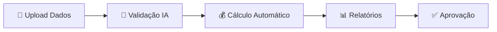
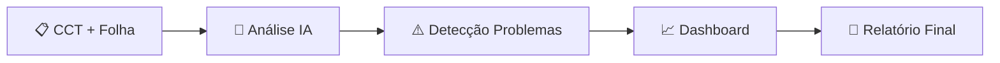
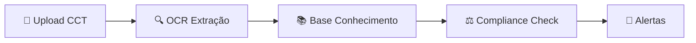

# 🎯 AUDITORIA360 - Portal de Gestão Inteligente

> **🚀 PROJETO 100% OPERACIONAL** | **[📚 Documentação Completa](../../wiki)** na Wiki | **[🚀 Início Rápido](../../wiki/user-manuals/getting-started)** para começar

Portal seguro, inteligente e integrado para centralizar, automatizar e auditar todos os processos de folha de pagamento, obrigações sindicais e convenções coletivas.

## 🎊 Status Atual - Release Candidate v1.0.0

> **🚀 RELEASE CANDIDATE v1.0.0** | **[📋 Checklist de Validação](RELEASE_VALIDATION.md)** | **[🚀 Guia de Deploy](DEPLOYMENT_GUIDE.md)** | **[📝 CHANGELOG v1.0.0](CHANGELOG.md)**

- ✅ **Sistema Core**: 100% operacional (895+ testes implementados)
- ✅ **Release Candidate**: v1.0.0 pronto para produção
- ✅ **Segurança**: Arquitetura Zero Trust implementada (LGPD compliance)
- ✅ **Arquitetura**: Microserviços com isolamento multi-tenant
- ✅ **Performance**: Cache distribuído + Blue/Green deployment
- ✅ **Observabilidade**: Stack completa (Prometheus + Grafana + OpenTelemetry)
- ✅ **IA Integrada**: GPT-4 + OCR + Assistente contextual em produção

### 🎯 Deploy em Produção
**Data Planejada**: 31 de Julho de 2025, 02:00-04:00 (Horário de Brasília)  
**Estratégia**: Blue/Green Deployment (Zero Downtime)  
**Status**: 🟡 Aguardando validação final do checklist

**📋 Documentação de Deploy:**
- **[🚀 Guia de Deploy](DEPLOYMENT_GUIDE.md)** - Procedimentos técnicos detalhados
- **[📋 Checklist de Infraestrutura](DEPLOY_CHECKLIST.md)** - **OBRIGATÓRIO** antes de qualquer deploy
- **[✅ Validação Pós-Deploy](POST_DEPLOYMENT_VALIDATION.md)** - Verificações após deploy

## 📚 **Nova Documentação Centralizada**

**🌟 A documentação foi completamente reformulada!** Toda informação agora está centralizada na **[📖 Wiki do GitHub](../../wiki)** com:

- 🚀 **[Início Rápido](../../wiki/user-manuals/getting-started)** - Configure em 5 minutos
- 📖 **[Manual do Usuário](../../wiki/user-manuals/user-guide)** - Guia completo
- 👨‍💻 **[Guias para Desenvolvedores](../../wiki/developer-guides/development-setup)** - Setup e arquitetura
- 📡 **[Documentação da API](../../wiki/api-reference/README)** - APIs completas
- 📊 **[Status do Projeto](../../wiki/strategic/project-status)** - Métricas executivas

### 🔄 **Processo de Documentação Automatizado**

⚠️ **IMPORTANTE**: A partir de agora, toda alteração de funcionalidade **DEVE** incluir atualizações na pasta `/docs-source/`. A documentação é automaticamente sincronizada com a Wiki.

📁 **Como documentar**:
1. Edite arquivos em `/docs-source/`
2. Inclua na sua Pull Request
3. Após merge na `main`, a Wiki é atualizada automaticamente

## 🎯 Objetivo

Desenvolver um portal completo que elimina processos manuais e riscos de não conformidade através de:

- **Centralização** e automação de processos de folha de pagamento
- **Gestão inteligente** de documentos e CCTs
- **Sistema avançado** de auditoria e compliance
- **IA e chatbot** para assistência especializada

## 🏗️ Arquitetura Serverless

### Stack Tecnológica

- **Frontend**: React.js + TypeScript + Material UI
- **Backend**: FastAPI (Python)
- **Banco de Dados**: Neon (PostgreSQL serverless)
- **Armazenamento**: Cloudflare R2
- **Analytics**: DuckDB (embedded)
- **OCR**: PaddleOCR
- **IA**: OpenAI GPT Integration
- **Deploy**: Vercel + GitHub Actions
- **Monitoramento**: Sentry, Grafana, Prometheus

### Segurança e Compliance

- **Autenticação**: OAuth2 + JWT
- **Criptografia**: Dados sensíveis criptografados
- **LGPD**: Consentimento explícito e anonimização
- **Backup**: Automatizado para Neon e R2
- **Firewall**: Cloudflare (DDoS protection)

## 📚 Navegação da Documentação

### 🚀 **Acesso Rápido**

- **[📋 Índice Principal](docs/content/00-INDICE_PRINCIPAL.md)** - Navegação completa da documentação
- **[🏁 Início Rápido](docs/content/01-INICIO_RAPIDO.md)** - Guia para começar em 5 minutos
- **[📊 Status do Projeto](docs/content/relatorios/status-projeto.md)** - Situação atual detalhada
- **[📁 Documentos Organizados](docs/README.md)** - Estrutura centralizada de documentação

### 👥 **Por Perfil de Usuário**

- **👤 Usuários**: [Manual do Usuário](docs/content/usuario/manual-usuario.md) | [Guia de Instalação](docs/content/usuario/guia-instalacao.md) | [FAQ](docs/content/usuario/faq.md)
- **👨‍💻 Desenvolvedores**: [Guia Dev](docs/content/tecnico/desenvolvimento/dev-guide.md) | [Módulos](docs/content/tecnico/modulos-principais.md) | [APIs](docs/content/tecnico/apis/api-documentation.md) | [**Exemplos Práticos**](docs/content/tecnico/exemplos-praticos-uso.md)
- **👔 Gestores**: [Análise Estratégica](docs/content/estrategico/analise-consolidada.md) | [Roadmap](docs/content/estrategico/roadmap-estrategico.md)
- **🔍 Auditores**: [Compliance](docs/content/compliance/auditoria/checklist-auditoria.md) | [LGPD](docs/content/compliance/lgpd/)

## 🚀 **Início Rápido para Desenvolvedores**

### **📋 Pré-requisitos**
```bash
# Ferramentas necessárias
Python 3.11+
Node.js 18+
Docker (opcional)
Git
```

### **⚡ Setup Rápido**
```bash
# 1. Clone do repositório
git clone https://github.com/Thaislaine997/AUDITORIA360.git
cd AUDITORIA360

# 2. Configurar ambiente
make install-dev

# 3. Configurar variáveis de ambiente
cp .env.template .env
# Edite .env com suas configurações

# 4. Executar testes
make test

# 5. Iniciar servidor de desenvolvimento
make run  # API em http://localhost:8000
```

### **📖 Documentação Completa**
Para setup detalhado, consulte: **[🔧 Guia de Setup](../../wiki/developer-guides/development-setup)**

## 💡 **Casos de Uso Principais**

### 🚀 **Processamento de Folha Automático**


### 🔍 **Auditoria Inteligente**


### 📋 **Gestão de CCTs**

    headers={'Authorization': 'Bearer your_token'}
)

# Acompanhar progresso
audit_id = response.json()['id']
status = requests.get(f'http://localhost:8000/api/v1/auditorias/{audit_id}/status')
```

**Fluxo no Sistema:**

1. **Auditoria** → Configurar escopo e regras
2. **Execução** → Motor de compliance automatizado
3. **Análise** → IA identifica não conformidades
4. **Relatório** → Achados com recomendações
5. **Plano de Ação** → Priorização por risco
6. **Acompanhamento** → Status de correções

### 🤖 Caso de Uso 4: Assistente de IA

```python
# Exemplo de interação com chatbot
chat_request = {
    "pergunta": "Como calcular adicional noturno para funcionário CLT?",
    "contexto": "empresa_categoria_a",
    "cct_aplicavel": "sindicato_metalurgicos_sp"
}

response = requests.post(
    'http://localhost:8000/api/v1/ai/chat',
    json=chat_request,
    headers={'Authorization': 'Bearer your_token'}
)

resposta = response.json()['resposta']
# Retorna: "Para adicional noturno CLT, aplicar 20% sobre hora normal..."
```

**Fluxo no Sistema:**

1. **Chat IA** → Pergunta sobre legislação
2. **Processamento** → IA consulta base de conhecimento
3. **Resposta** → Contextualizada com CCT específica
4. **Referências** → Links para artigos relevantes
5. **Aprendizado** → Sistema melhora com feedback

## 🔄 Fluxo de CI/CD em Ação

### Pipeline Automatizado (GitHub Actions)

```yaml
# Exemplo de execução automática
push main → Trigger Pipeline: ✅ Pre-commit hooks (formatação, linting)
  ✅ Testes unitários (205 testes, 90%+ cobertura)
  ✅ Testes integração (API + DB)
  ✅ Testes frontend (React + TypeScript)
  ✅ Build produção
  ✅ Deploy Vercel automático
  ✅ Health checks pós-deploy
  ✅ Notificação Slack/email
```

### Monitoramento Contínuo

```bash
# Comandos de monitoramento
python scripts/verificar_progresso.py  # Status geral
python scripts/health_check.py         # Saúde do sistema
python scripts/performance_monitor.py  # Métricas de performance

# Relatórios automáticos
pytest --cov=src --cov-report=html     # Cobertura de testes
make backup-db                         # Backup automático
```

### Desenvolvimento em Equipe

```bash
# Fluxo de desenvolvimento colaborativo
git checkout -b feature/nova-funcionalidade
git commit -m "feat: adicionar validação INSS"
git push origin feature/nova-funcionalidade

# PR automático disparará:
# - Testes em múltiplas versões Python (3.11, 3.12)
# - Verificação de conflitos
# - Review automático de código
# - Deploy preview no Vercel
```

## 📋 Funcionalidades Principais

### 1. 🔐 Gestão de Usuários e Permissões

- **Perfis**: Administrador, RH, Contador, Colaborador, Sindicato
- **Autenticação**: OAuth2/JWT com tokens seguros
- **Permissões**: Sistema granular por recurso e ação
- **Auditoria**: Logs completos de acesso e alterações

### 2. 💼 Gestão de Folha de Pagamento

- **Funcionários**: Cadastro completo com validação CPF/PIS
- **Competências**: Controle por ano/mês/tipo de folha
- **Cálculos**: Automação de férias, 13º, INSS, FGTS, IRRF
- **Importação**: Suporte a CSV, XLSX e API
- **Validação**: Motor de regras para detectar inconsistências
- **Relatórios**: Holerites, sintéticos e detalhados

## 📋 **Funcionalidades Principais**

### 🔐 **Gestão de Usuários e Permissões**
- **Perfis**: Administrador, RH, Contador, Colaborador, Sindicato
- **Autenticação**: OAuth2/JWT com tokens seguros
- **Permissões**: Sistema granular por recurso e ação
- **Auditoria**: Logs completos de acesso e alterações

### 💼 **Gestão de Folha de Pagamento**
- **Funcionários**: Cadastro completo com validação CPF/PIS
- **Competências**: Controle por ano/mês/tipo de folha
- **Cálculos**: Automação de férias, 13º, INSS, FGTS, IRRF
- **Importação**: Suporte a CSV, XLSX e API
- **Validação**: Motor de regras para detectar inconsistências
- **Relatórios**: Holerites, sintéticos e detalhados

### 📄 **Gestão de Documentos**
- **Upload**: Múltiplos arquivos (PDF, DOCX, XLSX, imagens)
- **Armazenamento**: Seguro no Cloudflare R2
- **OCR**: Processamento automático com PaddleOCR
- **Busca**: Indexação avançada por conteúdo e metadados

### 📝 **Base de Convenções Coletivas (CCTs)**
- **Sindicatos**: Cadastro de entidades sindicais
- **CCTs**: Gestão completa de convenções coletivas
- **Cláusulas**: Extração e indexação automática
- **Comparação**: Sistema de comparação entre CCTs

### 🔍 **Auditoria e Compliance**
- **Execuções**: Auditorias periódicas e por evento
- **Regras**: Motor configurável de compliance
- **Achados**: Detecção automática de não conformidades
- **Relatórios**: Exportação em múltiplos formatos

### 🤖 **IA e Assistente Inteligente**
- **Chatbot**: Assistente treinado com base de conhecimento
- **OpenAI**: Integração GPT-4 para respostas contextuais
- **Recomendações**: Sistema de sugestões automáticas
- **Aprendizado**: Melhoria contínua baseada em feedback

---

## 🧪 **Testes e Qualidade**

```bash
# Executar todos os testes
make test

# Cobertura de testes
pytest --cov=src --cov-report=html

# Linting e formatação
make lint
make format
```

**📊 Métricas de Qualidade:**
- **864 testes** implementados
- **90%+ cobertura** de código
- **CI/CD automatizado** com GitHub Actions
- **Deploy automático** para produção

---

## 📚 **Documentação e Recursos**

### 📖 **Documentação Principal**
- **[🏠 Home](../../wiki)** - Página inicial da documentação
- **[🚀 Início Rápido](../../wiki/user-manuals/getting-started)** - Setup em 5 minutos
- **[📖 Manual do Usuário](../../wiki/user-manuals/user-guide)** - Guia completo
- **[👨‍💻 Guias para Desenvolvedores](../../wiki/developer-guides/development-setup)** - Desenvolvimento
- **[📡 API Reference](../../wiki/api-reference/README)** - Documentação da API

### 🔗 **Links Úteis**
- **[🌐 API Docs](https://api.auditoria360.com/docs)** - Swagger interativo
- **[📊 Status Dashboard](../../wiki/strategic/project-status)** - Métricas do projeto
- **[🗺️ Roadmap](../../wiki/strategic/roadmap)** - Planejamento estratégico

---

## 🤝 **Contribuição**

Este projeto segue o **"Projeto Fênix"** - uma nova abordagem para documentação:

### 📝 **Como Contribuir**
1. **Code + Docs**: Toda PR deve incluir atualizações em `/docs-source/`
2. **Automação**: Documentação é sincronizada automaticamente com a Wiki
3. **Review**: Documentação é revisada junto com o código

**📖 Guia completo**: [🤝 Contributing Guide](../../wiki/developer-guides/contributing)

---

## 📞 **Suporte e Contato**

- **🐛 Issues**: [GitHub Issues](https://github.com/Thaislaine997/AUDITORIA360/issues)
- **💬 Discussions**: [GitHub Discussions](https://github.com/Thaislaine997/AUDITORIA360/discussions)
- **📧 Email**: dev@auditoria360.com.br
- **📖 Wiki**: [Documentação Completa](../../wiki)

---

## 📄 **Licença**

Este projeto está licenciado sob os termos da licença MIT. Veja o arquivo [LICENSE](LICENSE) para mais detalhes.

---

> **🎉 AUDITORIA360**: Transformando a gestão de auditoria trabalhista com inteligência artificial e automação total!
