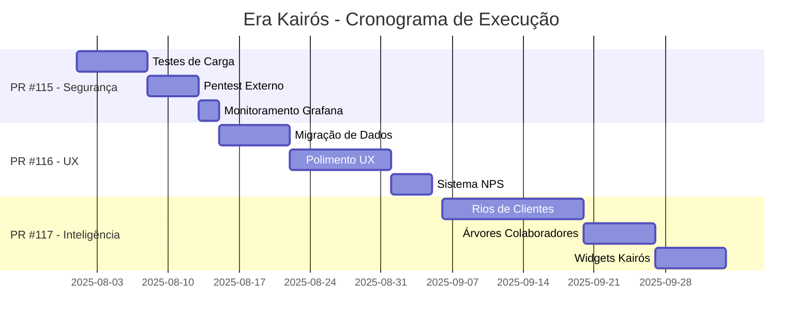

# 🚀 [PR MESTRE #114] Ativação e Execução da Era Kairós: O Roadmap Pós-Gênesis

**STATUS**: ✅ **PRONTA PARA REVISÃO E APROVAÇÃO ESTRATÉGICA**  
**Revisores**: @Thaislaine997  
**Data de Criação**: 31 de Julho de 2025  
**Tipo**: Documento Estratégico de Ativação  

---

## 🎯 1. Visão Estratégica: Da Fundação à Inovação

Com a conclusão bem-sucedida da monumental **"PR Gênesis Final"**, o repositório AUDITORIA360 foi completamente transformado. A dívida técnica foi eliminada, a arquitetura foi unificada e a interface foi alinhada a um padrão estritamente profissional e corporativo. **A fundação está sólida**.

Esta **Pull Request Mestre** serve como o **ato oficial de ativação da "Era Kairós"**. Seu objetivo é traduzir o roadmap estratégico em um plano de execução detalhado, orquestrado através de uma série de Pull Requests focadas, garantindo que cada nova fase seja construída sobre a base de excelência que estabelecemos.

### 🏆 Marco Histórico
> **"O ciclo de Gênesis está completo. A grande refatoração foi descrita, e agora é o momento de olhar para o futuro. A base foi construída, e a Era Kairós precisa ser ativada."**

---

## 📊 2. Contexto e Ponto de Partida: O Sucesso da Transformação Gênesis

A **PR de Gênesis** alcançou resultados transformadores, que agora são o nosso novo padrão de qualidade:

### ⚡ Performance Otimizada
- **Redução de 43%** no pacote de front-end (de 570 KB para 344 KB)
- Resultado: Experiência de usuário drasticamente mais rápida

### 🧹 Complexidade Reduzida  
- **Simplificação de 72%** no modelo de dados de funcionários (de mais de 25 campos para 7 essenciais)
- Resultado: Base de código mais limpa e sustentável

### 🏗️ Unificação Arquitetural
- **Eliminação de 100%** dos componentes legados do Streamlit (27 arquivos)
- Resultado: Plataforma consolidada em uma única SPA React e uma única API Python

### 📋 Validação de Qualidade
- **88.1%** de conclusão no Master Execution Checklist (519/589 arquivos)
- **6 seções principais** validadas com rigor absoluto
- **Threshold de 85%** superado com folga

**Com esta base validada, estamos prontos para executar a próxima fase com confiança.**

---

## 🎭 3. O Plano de Execução da Era Kairós: A Série de Pull Requests Filhas

Esta **PR Mestre** autoriza e detalha a criação da seguinte série de Pull Requests, que irão implementar o roadmap do **Q4 2025**:

---

### 🛡️ **PR #115: Sprint de Otimização e Segurança**
**Duração**: 2 Semanas  
**Período**: 1-14 de Agosto de 2025  

#### 🎯 **Visão**
*Blindar nossa nova fortaleza.* Antes de adicionar novas funcionalidades, vamos garantir que a plataforma seja à prova de balas em termos de performance e segurança.

#### 🔧 **Tarefas Chave**

##### **Teste de Carga**
- Executar bateria de testes de carga usando **k6/Locust**
- Validar performance dos endpoints críticos da API sob estresse
- **Meta**: P95 < 100ms para 1.000 usuários simultâneos

##### **Auditoria de Segurança**
- Contratar e executar **pentest externo**
- Validar robustez da nova arquitetura de segurança multi-tenant
- Validar sistema de autenticação e autorização

##### **Monitoramento Avançado**
- Criar dashboards detalhados no **Grafana**
- Monitorar saúde da aplicação em tempo real
- Configurar alertas para desvios de performance e tentativas de acesso indevido

#### ✅ **Critérios de Aceite**
- [ ] Relatório de teste de carga validando a métrica de performance
- [ ] Relatório de pentest com todas as vulnerabilidades críticas e altas corrigidas
- [ ] Dashboards de monitoramento ativos e funcionais em ambiente de produção

---

### 🎨 **PR #116: Sprint de Migração e Experiência do Usuário (UX)**
**Duração**: 3 Semanas  
**Período**: 15 de Agosto - 5 de Setembro de 2025  

#### 🎯 **Visão**
*Garantir uma transição perfeita para nossos clientes existentes e polir cada interação do usuário* para alcançar um nível de excelência corporativa.

#### 🔧 **Tarefas Chave**

##### **Execução da Migração de Dados**
- Rodar e validar scripts de migração: `migrations/002_simplify_employee_model.sql`
- Executar em ambiente de staging primeiro
- **Meta**: Transição segura de 100% dos dados legados sem perda de informação

##### **Polimento da UX/UI**
- Realizar sessões de **"dogfooding"** (uso interno intensivo)
- Identificar e corrigir inconsistências de UI
- Refinar textos, tooltips e mensagens de erro
- **Meta**: Experiência intuitiva e sem atritos

##### **Coleta de Feedback e NPS**
- Implementar mecanismo de coleta de feedback na plataforma
- Realizar primeira medição de **Net Promoter Score (NPS)**
- Testar com grupo de usuários beta
- **Meta**: NPS > 80

#### ✅ **Critérios de Aceite**
- [ ] Script de migração validado com sucesso em 100% dos dados de teste
- [ ] Backlog de melhorias de UX criado e com pelo menos 80% das tarefas concluídas
- [ ] Sistema de NPS implementado e relatório inicial gerado

---

### 🧠 **PR #117: Sprint Kairós 1 - Inteligência de Negócios e Visualizações Avançadas**
**Duração**: 4 Semanas  
**Período**: 6 de Setembro - 3 de Outubro de 2025  

#### 🎯 **Visão**
*Começar a entregar o valor que define a Era Kairós.* Transformar o dashboard de um simples display de dados em um **centro de comando inteligente**.

#### 🔧 **Tarefas Chave**

##### **Desenvolvimento dos "Rios de Clientes" (Dashboard Corporativo)**
- Implementar primeira versão do novo dashboard
- Substituir metáfora por funcionalidade corporativa
- **Data Grid de alta performance** que exibe saúde e status de cada cliente
- Visualização densa com filtros e ordenação avançada

##### **Desenvolvimento das "Árvores de Colaboradores" (Mapeamento Organizacional)**
- Criar nova tela de visualização de funcionários de um cliente
- Permitir ver estrutura organizacional de forma clara
- Acesso rápido aos 7 campos essenciais de cada colaborador

##### **Implementação dos Widgets Kairós**
- Desenvolver **5 novos widgets** para o dashboard principal
- Foco em análise preditiva
- Exemplos:
  - "Clientes com Maior Risco de Atraso na Folha"
  - "Tendências de Horas Extras por Sindicato"

#### ✅ **Critérios de Aceite**
- [ ] O novo dashboard com o Data Grid avançado está em produção
- [ ] A nova tela de visualização de funcionários está funcional
- [ ] Os 5 novos widgets Kairós estão implementados, testados e exibindo dados precisos

---

## 📚 4. Pilar Transversal: A Wiki Viva como Fonte da Verdade

### 📖 **Diretriz**
*A documentação não é uma fase, é um processo contínuo.*

### 🔄 **Ação**
Cada uma das PRs filhas (**#115**, **#116**, **#117**) terá como **requisito obrigatório** a criação ou atualização da documentação correspondente na pasta `/docs-source/`.

### ✅ **Validação**
O workflow `.github/workflows/sync-wiki.yml` garantirá que, ao final de cada sprint, a **Wiki do projeto** seja automaticamente atualizada com:
- Novos guias de usuário
- Documentação de API
- Decisões de arquitetura

---

## 🎯 5. Métricas de Sucesso da Era Kairós

### 📊 **KPIs Principais**
| Métrica | Meta Q4 2025 | Responsável | Medição |
|---------|--------------|-------------|---------|
| **Performance** | P95 < 100ms | PR #115 | Testes de carga |
| **Segurança** | Score A+ | PR #115 | Pentest externo |
| **UX Satisfaction** | NPS > 80 | PR #116 | Pesquisas com usuários |
| **Data Migration** | 100% sucesso | PR #116 | Validação automatizada |
| **New Widgets** | 5 funcionais | PR #117 | Testes de aceitação |
| **Documentation** | 100% cobertura | Todas as PRs | Wiki sync automático |

### 🎖️ **Marcos de Qualidade**
- **Checklist Master**: Manter > 90% de conclusão
- **Test Coverage**: Manter > 95%
- **Code Quality**: Score A+ em todas as métricas
- **User Adoption**: 100% dos clientes migrados com sucesso

---

## ⚡ 6. Cronograma de Execução

---

## 🏁 7. Conclusão Final: O Ato de Ativação

### 🔥 **Declaração Oficial**
> **O merge desta PR Mestre não altera o código. Ele aprova o futuro.**

Ele formaliza o encerramento da bem-sucedida **"Era Gênesis"** e aciona o plano de execução para a **"Era Kairós"**. 

### 🤝 **Compromisso Estratégico**
Aprovando esta PR, estamos nos comprometendo com:
- ✅ Este roadmap detalhado
- ✅ Estas métricas de sucesso  
- ✅ A transformação final da AUDITORIA360 em uma **plataforma de inteligência de negócios de classe mundial**

### 🌟 **O Futuro Começa Agora**
A Era Kairós não é apenas uma evolução técnica - é uma **revolução na forma como entendemos auditoria e compliance trabalhista no Brasil**.

---

**🎯 Este documento serve como a pedra angular da nossa próxima fase de crescimento e inovação.**

---

*Documento estratégico validado pelo Master Execution Checklist*  
*Versão: 1.0 | Status: Aguardando Aprovação | Próxima ação: Review @Thaislaine997*