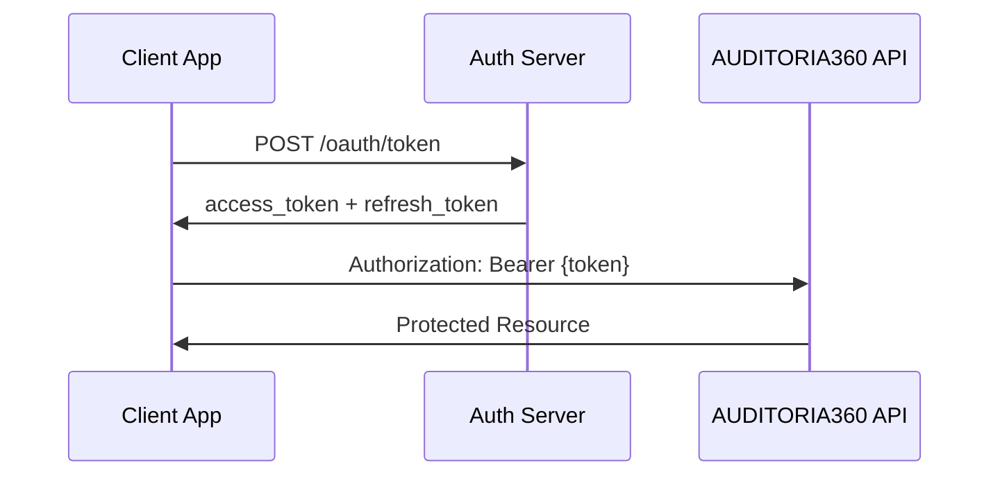

# 📡 API Documentation

> **Complete reference for AUDITORIA360 APIs**

---

## 🎯 **API Overview**

The AUDITORIA360 API provides comprehensive access to all audit, payroll, and compliance functionalities through RESTful endpoints.

### **🔗 Base URLs**
```yaml
Production: "https://api.auditoria360.com"
Staging: "https://staging-api.auditoria360.com"  
Development: "http://localhost:8001"
```

### **📋 API Characteristics**
- **Protocol**: HTTPS only
- **Format**: JSON (application/json)
- **Authentication**: OAuth2 + JWT
- **Rate Limiting**: 1000 requests/hour per user
- **Versioning**: URL-based (/api/v1/)

---

## 🔐 **Authentication**

### **OAuth2 Flow**


### **Getting Started**
1. **Register Application** in admin panel
2. **Get Client Credentials** (client_id, client_secret)
3. **Request Access Token**:

```bash
curl -X POST "https://api.auditoria360.com/oauth/token" \
  -H "Content-Type: application/x-www-form-urlencoded" \
  -d "grant_type=client_credentials" \
  -d "client_id=YOUR_CLIENT_ID" \
  -d "client_secret=YOUR_CLIENT_SECRET"
```

4. **Use Token** in requests:
```bash
curl -H "Authorization: Bearer YOUR_ACCESS_TOKEN" \
  "https://api.auditoria360.com/api/v1/audits"
```

---

## 📋 **Core Endpoints**

### **🔍 Audit Management**

#### **List Audits**
```http
GET /api/v1/audits
```

**Query Parameters:**
- `client_id` (required): Client identifier
- `status` (optional): pending, processing, completed, failed
- `type` (optional): payroll, cct, compliance
- `limit` (optional): Max results (default: 50, max: 100)
- `offset` (optional): Pagination offset

**Response:**
```json
{
  "data": [
    {
      "id": "audit_123",
      "type": "payroll",
      "status": "completed",
      "created_at": "2024-01-15T10:30:00Z",
      "completed_at": "2024-01-15T10:45:00Z",
      "client_id": "client_456",
      "metadata": {
        "period": "2024-01",
        "employees_count": 150,
        "issues_found": 3
      }
    }
  ],
  "pagination": {
    "total": 245,
    "limit": 50,
    "offset": 0,
    "has_more": true
  }
}
```

#### **Create New Audit**
```http
POST /api/v1/audits
```

**Request Body:**
```json
{
  "type": "payroll",
  "client_id": "client_456",
  "period": "2024-01",
  "documents": [
    {
      "type": "payroll_file",
      "url": "https://storage.com/file.pdf",
      "filename": "folha_janeiro_2024.pdf"
    }
  ],
  "options": {
    "auto_fix": false,
    "detailed_analysis": true
  }
}
```

**Response:**
```json
{
  "id": "audit_789",
  "status": "pending",
  "estimated_completion": "2024-01-15T11:00:00Z",
  "webhook_url": "https://api.auditoria360.com/webhooks/audit_789"
}
```

### **📊 Results and Reports**

#### **Get Audit Results**
```http
GET /api/v1/audits/{audit_id}/results
```

**Response:**
```json
{
  "audit_id": "audit_123",
  "status": "completed",
  "summary": {
    "compliance_score": 95.5,
    "issues_found": 3,
    "warnings": 7,
    "recommendations": 12
  },
  "findings": [
    {
      "id": "finding_001",
      "severity": "high",
      "category": "overtime_calculation",
      "description": "Overtime hours incorrectly calculated for employee ID 789",
      "recommendation": "Recalculate overtime using 50% rate for hours > 44/week",
      "affected_employees": ["emp_789"],
      "estimated_impact": 1250.50
    }
  ],
  "report_urls": {
    "pdf": "https://storage.com/reports/audit_123.pdf",
    "excel": "https://storage.com/reports/audit_123.xlsx"
  }
}
```

### **👥 Employee Management**

#### **List Employees**
```http
GET /api/v1/employees?client_id={client_id}
```

#### **Employee Details**
```http
GET /api/v1/employees/{employee_id}
```

### **📋 CCT Management**

#### **Search CCTs**
```http
GET /api/v1/ccts/search?union={union}&category={category}
```

#### **CCT Compliance Check**
```http
POST /api/v1/ccts/compliance-check
```

---

## 🔔 **Webhooks**

### **Event Types**
- `audit.started` - Audit processing began
- `audit.completed` - Audit finished successfully  
- `audit.failed` - Audit processing failed
- `document.processed` - Document OCR completed
- `compliance.alert` - Critical compliance issue found

### **Webhook Payload Example**
```json
{
  "event": "audit.completed",
  "timestamp": "2024-01-15T10:45:00Z",
  "data": {
    "audit_id": "audit_123",
    "client_id": "client_456",
    "status": "completed",
    "compliance_score": 95.5,
    "issues_count": 3,
    "report_url": "https://storage.com/reports/audit_123.pdf"
  },
  "signature": "sha256=abc123..."
}
```

### **Webhook Security**
Verify webhook signatures using HMAC-SHA256:

```python
import hmac
import hashlib

def verify_webhook(payload, signature, secret):
    expected = hmac.new(
        secret.encode(),
        payload.encode(),
        hashlib.sha256
    ).hexdigest()
    return hmac.compare_digest(f"sha256={expected}", signature)
```

---

## 📊 **Rate Limiting**

### **Limits**
- **Standard**: 1000 requests/hour per user
- **Premium**: 5000 requests/hour per user
- **Enterprise**: 10000 requests/hour per user

### **Headers**
```http
X-RateLimit-Limit: 1000
X-RateLimit-Remaining: 950
X-RateLimit-Reset: 1642176000
```

### **Handling Rate Limits**
```python
import time
import requests

def api_request_with_backoff(url, headers):
    response = requests.get(url, headers=headers)
    
    if response.status_code == 429:
        reset_time = int(response.headers.get('X-RateLimit-Reset', 0))
        sleep_time = max(reset_time - time.time(), 1)
        time.sleep(sleep_time)
        return api_request_with_backoff(url, headers)
    
    return response
```

---

## 🚨 **Error Handling**

### **Error Response Format**
```json
{
  "error": {
    "code": "VALIDATION_ERROR",
    "message": "The request contains invalid parameters",
    "details": [
      {
        "field": "client_id",
        "message": "This field is required"
      }
    ],
    "request_id": "req_abc123",
    "timestamp": "2024-01-15T10:30:00Z"
  }
}
```

### **Common Error Codes**
| Code | HTTP Status | Description |
|------|-------------|-------------|
| `AUTHENTICATION_ERROR` | 401 | Invalid or expired token |
| `AUTHORIZATION_ERROR` | 403 | Insufficient permissions |
| `VALIDATION_ERROR` | 400 | Invalid request parameters |
| `NOT_FOUND` | 404 | Resource not found |
| `RATE_LIMIT_EXCEEDED` | 429 | Too many requests |
| `INTERNAL_ERROR` | 500 | Server error |

---

## 💻 **SDK and Examples**

### **Python SDK**
```python
from auditoria360 import Client

# Initialize client
client = Client(
    client_id="your_client_id",
    client_secret="your_client_secret",
    base_url="https://api.auditoria360.com"
)

# Create audit
audit = client.audits.create(
    type="payroll",
    client_id="client_456",
    documents=[
        {"type": "payroll_file", "path": "/path/to/file.pdf"}
    ]
)

# Get results
results = client.audits.get_results(audit.id)
print(f"Compliance Score: {results.summary.compliance_score}%")
```

### **JavaScript SDK**
```javascript
import { Auditoria360Client } from '@auditoria360/sdk';

const client = new Auditoria360Client({
  clientId: 'your_client_id',
  clientSecret: 'your_client_secret',
  baseUrl: 'https://api.auditoria360.com'
});

// Create audit
const audit = await client.audits.create({
  type: 'payroll',
  clientId: 'client_456',
  documents: [
    { type: 'payroll_file', path: './file.pdf' }
  ]
});

// Poll for completion
const results = await client.audits.waitForCompletion(audit.id);
console.log(`Compliance Score: ${results.summary.complianceScore}%`);
```

---

## 🧪 **Testing**

### **Sandbox Environment**
- **URL**: `https://sandbox-api.auditoria360.com`
- **Test Data**: Pre-populated with sample audits
- **No Rate Limits**: For development testing

### **Test Cases**
```bash
# Test authentication
curl -X POST "https://sandbox-api.auditoria360.com/oauth/token" \
  -d "grant_type=client_credentials&client_id=test&client_secret=test"

# Test audit creation
curl -X POST "https://sandbox-api.auditoria360.com/api/v1/audits" \
  -H "Authorization: Bearer YOUR_TOKEN" \
  -H "Content-Type: application/json" \
  -d '{"type":"payroll","client_id":"test_client"}'
```

---

## 📚 **Additional Resources**

### **OpenAPI Specification**
- **Swagger UI**: [https://api.auditoria360.com/docs](https://api.auditoria360.com/docs)
- **OpenAPI JSON**: [https://api.auditoria360.com/openapi.json](https://api.auditoria360.com/openapi.json)

### **SDKs and Libraries**
- **Python**: `pip install auditoria360-sdk`
- **JavaScript**: `npm install @auditoria360/sdk`
- **PHP**: `composer require auditoria360/sdk`
- **C#**: `Install-Package Auditoria360.SDK`

### **Support**
- **📧 Email**: api-support@auditoria360.com.br
- **💬 Discord**: [AUDITORIA360 Developers](https://discord.gg/auditoria360)
- **📖 Docs**: [https://docs.auditoria360.com](https://docs.auditoria360.com)

---

> **💡 Tip**: Use the interactive Swagger UI for testing endpoints and exploring the full API specification!