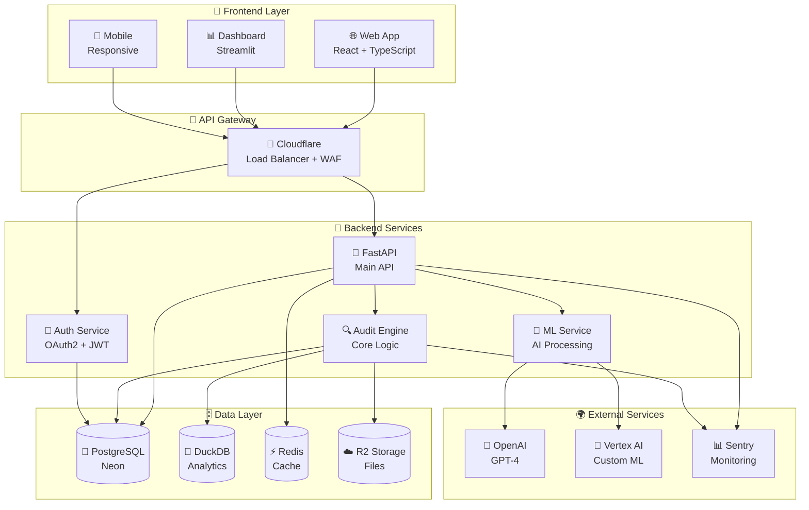
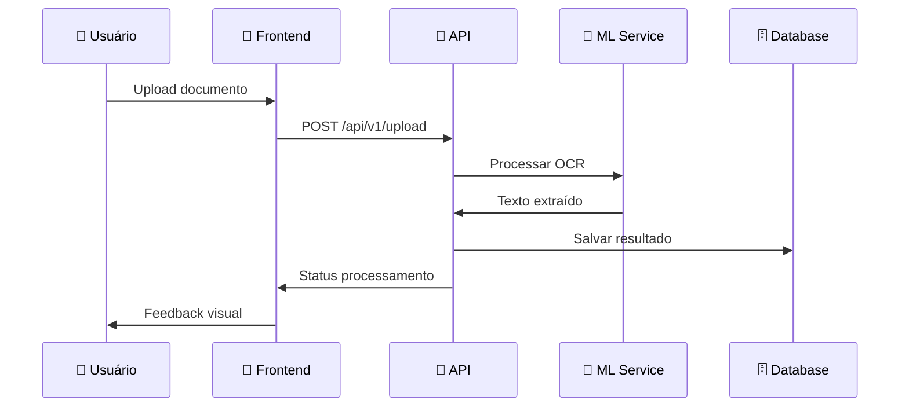
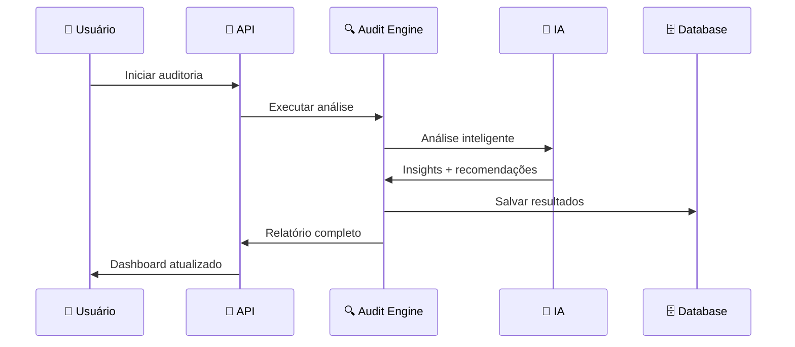
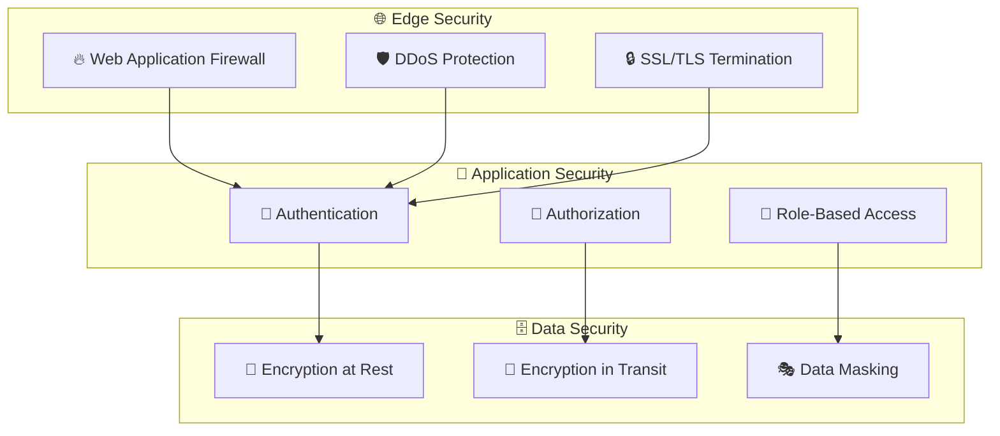
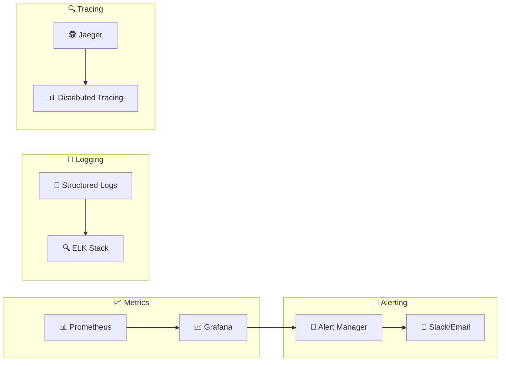
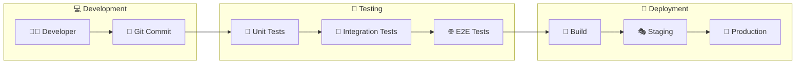

# 🏗️ Visão Geral da Arquitetura

> **Compreenda como o AUDITORIA360 foi projetado e como seus componentes interagem**

---

## 🎯 **PRINCÍPIOS ARQUITETURAIS**

### **🚀 Serverless First**
- **Zero infraestrutura gerenciada**: Foco no código, não na infraestrutura
- **Escalonamento automático**: Baseado em demanda real
- **Pay-per-use**: Custos otimizados conforme uso

### **🧩 Modularidade**
- **Microserviços**: Componentes independentes
- **APIs RESTful**: Interfaces bem definidas
- **Reutilização**: Bibliotecas compartilhadas

### **⚡ Performance**
- **Baixa latência**: < 200ms para operações críticas
- **Cache inteligente**: Múltiplas camadas
- **CDN global**: Distribuição de conteúdo

### **📈 Escalabilidade**
- **Horizontal**: Adição automática de recursos
- **Vertical**: Otimização por componente
- **Global**: Múltiplas regiões

---

## 🔧 **STACK TECNOLÓGICA**

### **🎨 Frontend**
```yaml
Framework: "React.js + TypeScript"
UI_Components: "Material-UI + Custom"
State_Management: "Redux Toolkit"
Build_Tool: "Vite"
Deployment: "Vercel"
Monitoring: "Real User Monitoring"
```

### **🔧 Backend** 
```yaml
API_Framework: "FastAPI (Python 3.12+)"
Runtime: "Serverless Functions"
Authentication: "OAuth2 + JWT"
Validation: "Pydantic v2"
Deployment: "Vercel Functions"
Monitoring: "APM + Distributed Tracing"
```

### **🗄️ Dados**
```yaml
Primary_DB: "Neon PostgreSQL (Serverless)"
Analytics_DB: "DuckDB (Embedded)"
Cache: "Redis (Upstash)"
File_Storage: "Cloudflare R2"
Search: "Full-text + Elasticsearch"
Backup: "Automated + Point-in-time Recovery"
```

### **🤖 IA e ML**
```yaml
LLM: "OpenAI GPT-4 + Custom Models"
OCR: "PaddleOCR (Self-hosted)"
ML_Platform: "Vertex AI + Scikit-learn"
Vector_DB: "Pinecone (Embeddings)"
Training: "Automated Pipelines"
Inference: "Real-time + Batch"
```

---

## 🌐 **DIAGRAMA DE ARQUITETURA GERAL**



---

## 🔄 **FLUXO DE DADOS PRINCIPAL**

### **📥 Ingestão de Dados**


### **🔍 Processamento de Auditoria**


---

## 🏛️ **ARQUITETURA POR CAMADAS**

### **1️⃣ Camada de Apresentação**
```yaml
Responsabilidades:
  - Interface do usuário
  - Validação de entrada
  - Feedback visual
  - Responsividade

Componentes:
  - React Components
  - Material-UI
  - Streamlit Dashboards
  - Progressive Web App (PWA)

Padrões:
  - Component-based Architecture
  - Atomic Design
  - Design System
```

### **2️⃣ Camada de APIs**
```yaml
Responsabilidades:
  - Roteamento de requisições
  - Autenticação e autorização
  - Validação de dados
  - Rate limiting

Componentes:
  - FastAPI Routes
  - Middleware stack
  - OpenAPI documentation
  - CORS configuration

Padrões:
  - RESTful API
  - OpenAPI 3.0
  - JWT tokens
  - API versioning
```

### **3️⃣ Camada de Lógica de Negócio**
```yaml
Responsabilidades:
  - Regras de negócio
  - Processamento de dados
  - Orquestração de serviços
  - Validação complexa

Componentes:
  - Business Services
  - Domain Models
  - Use Cases
  - Event Handlers

Padrões:
  - Domain-Driven Design (DDD)
  - Repository Pattern
  - Service Layer
  - Event Sourcing
```

### **4️⃣ Camada de Dados**
```yaml
Responsabilidades:
  - Persistência de dados
  - Consultas complexas
  - Cache e performance
  - Backup e recovery

Componentes:
  - PostgreSQL (OLTP)
  - DuckDB (OLAP)
  - Redis (Cache)
  - R2 (Files)

Padrões:
  - Repository Pattern
  - CQRS (Command Query Responsibility Segregation)
  - Data modeling
  - Connection pooling
```

---

## 🔐 **ARQUITETURA DE SEGURANÇA**

### **🛡️ Camadas de Proteção**


### **🔒 Controles de Acesso**
```yaml
Authentication:
  - OAuth2 + OpenID Connect
  - Multi-factor Authentication (MFA)
  - Social Login (Google, Microsoft)
  - Session management

Authorization:
  - Role-Based Access Control (RBAC)
  - Attribute-Based Access Control (ABAC)
  - Resource-level permissions
  - API key management

Data Protection:
  - AES-256 encryption
  - LGPD compliance
  - PII data masking
  - Audit logging
```

---

## 📊 **ARQUITETURA DE MONITORAMENTO**

### **🔍 Observabilidade Completa**


### **📊 Métricas Principais**
```yaml
Performance:
  - Response time (p95, p99)
  - Throughput (requests/second)
  - Error rate
  - Availability (SLA: 99.9%)

Business:
  - Active users
  - Audit completions
  - Document processing rate
  - Cost per transaction

Infrastructure:
  - CPU/Memory utilization
  - Database connections
  - Storage usage
  - Network latency
```

---

## 🚀 **ARQUITETURA DE DEPLOYMENT**

### **🔄 CI/CD Pipeline**


### **🌍 Estratégia Multi-Region**
```yaml
Primary_Region: "US-East-1"
Secondary_Region: "Europe-West-1"
DR_Region: "Asia-Pacific-1"

Deployment_Strategy:
  - Blue-Green Deployment
  - Canary releases
  - Feature flags
  - Rollback capability

Scaling_Strategy:
  - Auto-scaling based on metrics
  - Predictive scaling
  - Load balancing
  - CDN distribution
```

---

## 📚 **DECISÕES ARQUITETURAIS**

### **🎯 Por que Serverless?**
- **Custo**: Pay-per-execution
- **Escala**: Automática e ilimitada
- **Manutenção**: Zero overhead de infraestrutura
- **Velocidade**: Deploy instantâneo

### **🎯 Por que FastAPI?**
- **Performance**: Mais rápido que Flask/Django
- **Documentação**: OpenAPI automática
- **Type Safety**: Pydantic validation
- **Async**: Suporte nativo a operações assíncronas

### **🎯 Por que PostgreSQL + DuckDB?**
- **PostgreSQL**: OLTP confiável e performático
- **DuckDB**: OLAP rápido para analytics
- **Híbrido**: Melhor dos dois mundos

---

## 🔧 **PRÓXIMOS PASSOS**

Para entender melhor a arquitetura:

1. **[📡 API Documentation](./api-documentation)** - Endpoints e contratos
2. **[🗄️ Database Design](../architecture-decisions/database-design)** - Modelagem de dados
3. **[🔐 Security Guide](./security-guide)** - Implementação de segurança
4. **[📊 Monitoring Setup](./monitoring-guide)** - Configuração de observabilidade
5. **[🚀 Deployment Guide](./deployment-guide)** - Como fazer deploy

---

> **💡 Arquitetura Evolutiva**: Esta arquitetura é projetada para evoluir. Cada decisão pode ser revisada conforme necessidades do negócio!