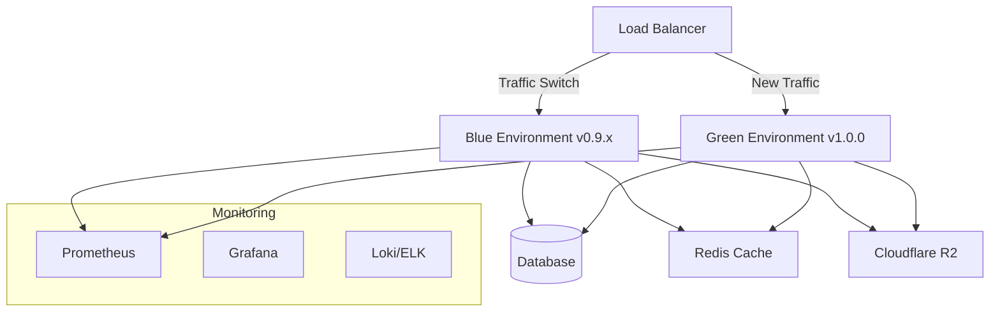

# 🚀 DEPLOYMENT GUIDE v1.0.0 - AUDITORIA360

## 📋 Visão Geral

Este guia documenta os procedimentos de deploy para o Release Candidate v1.0.0 do AUDITORIA360, implementando uma estratégia Blue/Green para garantir zero downtime durante a implantação em produção.

---

## 🎯 Estratégia de Deploy: Blue/Green

### Conceito
A estratégia Blue/Green mantém dois ambientes idênticos:
- **Blue (Ambiente Atual)**: Versão em produção atualmente
- **Green (Novo Ambiente)**: Nova versão sendo deployada

### Vantagens
- ✅ Zero downtime
- ✅ Rollback instantâneo
- ✅ Teste completo antes do switch
- ✅ Redução de riscos

---

## 🏗️ ARQUITETURA DE DEPLOY

### Componentes da Infraestrutura



### Recursos Compartilhados
- **Banco de Dados**: PostgreSQL (Neon) - Compartilhado entre ambientes
- **Cache**: Redis - Compartilhado com namespace por ambiente
- **Storage**: Cloudflare R2 - Compartilhado
- **Monitoring**: Stack compartilhado com tags por ambiente

---

## 📅 CRONOGRAMA DE DEPLOY

### Data: 31 de Julho de 2025 (Quinta-feira)
### Horário: 02:00 - 04:00 (Horário de Brasília)

| Horário | Fase | Duração | Responsável | Atividades |
|---------|------|---------|-------------|------------|
| 01:30-02:00 | Pre-Deploy | 30min | DevOps + QA | Validações finais, backup |
| 02:00-02:30 | Deploy | 30min | DevOps | Deploy Green environment |
| 02:30-03:00 | Switch | 30min | Tech Lead | Traffic switching |
| 03:00-04:00 | Validation | 60min | Full Team | Monitoring e validação |

---

## 🔧 PROCEDIMENTOS DE DEPLOY

### Fase 1: Pre-Deploy (01:30-02:00)

#### 1.1 Validações Finais
```bash
# Verificar status dos serviços
./scripts/health-check.sh production

# Validar configurações
./scripts/validate-config.sh production

# Verificar recursos de infraestrutura
./scripts/check-resources.sh production
```

#### 1.2 Backup de Segurança
```bash
# Backup completo do banco de dados
pg_dump "$PRODUCTION_DATABASE_URL" > backup_pre_v1.0.0_$(date +%Y%m%d_%H%M%S).sql

# Backup de configurações
kubectl get configmaps -n production -o yaml > configmaps_backup.yaml
kubectl get secrets -n production -o yaml > secrets_backup.yaml

# Validar integridade do backup
./scripts/validate-backup.sh backup_pre_v1.0.0_*.sql
```

#### 1.3 Notificações
```bash
# Notificar equipes
./scripts/notify-teams.sh "Deploy v1.0.0 iniciado"

# Ativar modo de monitoramento intensivo
./scripts/enable-intensive-monitoring.sh
```

### Fase 2: Deploy Green Environment (02:00-02:30)

#### 2.1 Deploy da Aplicação
```bash
# Build e tag da imagem
docker build -t auditoria360:v1.0.0 .
docker tag auditoria360:v1.0.0 registry.auditoria360.com/auditoria360:v1.0.0
docker push registry.auditoria360.com/auditoria360:v1.0.0

# Deploy no ambiente Green
kubectl apply -f k8s/green-environment/
kubectl set image deployment/auditoria360-green app=registry.auditoria360.com/auditoria360:v1.0.0
```

#### 2.2 Execução de Migrações
```bash
# Executar migrações de banco de dados
kubectl exec -it deployment/auditoria360-green -- python manage.py migrate

# Verificar status das migrações
kubectl exec -it deployment/auditoria360-green -- python manage.py showmigrations

# Validar integridade dos dados
./scripts/validate-data-integrity.sh
```

#### 2.3 Configuração de Cache
```bash
# Warm-up do cache Redis
kubectl exec -it deployment/auditoria360-green -- python scripts/cache-warmup.py

# Configurar namespace do cache
kubectl exec -it deployment/auditoria360-green -- redis-cli CONFIG SET save "900 1 300 10"
```

### Fase 3: Validação Green Environment (02:15-02:30)

#### 3.1 Health Checks
```bash
# Verificar saúde dos pods
kubectl get pods -n production -l version=green

# Executar health checks
curl -f http://green.auditoria360.internal/health
curl -f http://green.auditoria360.internal/api/v1/status

# Validar conectividade com banco
./scripts/test-db-connectivity.sh green
```

#### 3.2 Smoke Tests
```bash
# Executar suite de smoke tests
pytest tests/smoke/ --environment=green

# Validar APIs críticas
./scripts/api-smoke-tests.sh green

# Testar integração com serviços externos
./scripts/test-external-integrations.sh green
```

### Fase 4: Traffic Switch (02:30-03:00)

#### 4.1 Switch Gradual (Canary)
```bash
# Redirecionar 10% do tráfego para Green
./scripts/traffic-switch.sh --percentage=10 --target=green

# Aguardar 5 minutos e monitorar métricas
sleep 300
./scripts/monitor-metrics.sh --duration=300

# Redirecionar 50% do tráfego
./scripts/traffic-switch.sh --percentage=50 --target=green

# Aguardar mais 5 minutos
sleep 300
./scripts/monitor-metrics.sh --duration=300

# Redirecionar 100% do tráfego
./scripts/traffic-switch.sh --percentage=100 --target=green
```

#### 4.2 Validação Pós-Switch
```bash
# Validar roteamento
curl -H "Host: auditoria360.com" http://load-balancer/api/v1/version

# Executar testes funcionais críticos
pytest tests/critical/ --environment=production

# Validar métricas em tempo real
./scripts/validate-production-metrics.sh
```

### Fase 5: Validação Final (03:00-04:00)

#### 5.1 Monitoramento Intensivo
```bash
# Monitor error rates
./scripts/monitor-errors.sh --duration=3600

# Monitor response times
./scripts/monitor-response-times.sh --duration=3600

# Monitor resource usage
./scripts/monitor-resources.sh --duration=3600
```

#### 5.2 Validação Funcional
```bash
# Executar suite completa de testes E2E
pytest tests/e2e/ --environment=production

# Validar funcionalidades críticas
./scripts/validate-critical-functions.sh

# Testar fluxos de usuário principais
./scripts/user-journey-tests.sh
```

---

## 🔄 PROCEDIMENTOS DE ROLLBACK

### Critérios para Rollback Automático
- Error rate > 5%
- Response time médio > 500ms por 5 minutos consecutivos
- Availability < 99%
- Falha crítica em funcionalidade essencial
- Problema de segurança identificado

### Rollback Rápido (< 5 minutos)

#### 1. Rollback de Tráfego
```bash
# Reverter 100% do tráfego para Blue (versão anterior)
./scripts/traffic-switch.sh --percentage=100 --target=blue

# Validar switch
curl -H "Host: auditoria360.com" http://load-balancer/api/v1/version
```

#### 2. Rollback de Banco de Dados (se necessário)
```bash
# Parar aplicação
kubectl scale deployment/auditoria360-blue --replicas=0

# Restaurar backup (APENAS se mudanças críticas)
psql "$PRODUCTION_DATABASE_URL" < backup_pre_v1.0.0_*.sql

# Reiniciar aplicação
kubectl scale deployment/auditoria360-blue --replicas=3
```

#### 3. Validação Pós-Rollback
```bash
# Executar smoke tests
pytest tests/smoke/ --environment=production

# Validar métricas
./scripts/validate-rollback-metrics.sh

# Notificar equipes
./scripts/notify-teams.sh "Rollback executado com sucesso"
```

### Rollback Completo (para problemas complexos)

#### 1. Análise de Impacto
```bash
# Capturar logs de erro
kubectl logs -l app=auditoria360-green --since=30m > rollback_analysis.log

# Capturar métricas
./scripts/capture-metrics.sh --since=deploy-start > metrics_analysis.json

# Análise de root cause
./scripts/analyze-failure.sh rollback_analysis.log metrics_analysis.json
```

#### 2. Restauração Completa
```bash
# Rollback de aplicação
kubectl apply -f k8s/blue-environment/

# Rollback de banco (se necessário)
./scripts/database-rollback.sh backup_pre_v1.0.0_*.sql

# Rollback de configurações
kubectl apply -f configmaps_backup.yaml
kubectl apply -f secrets_backup.yaml

# Limpeza do ambiente Green
kubectl delete -f k8s/green-environment/
```

---

## 📊 MONITORAMENTO DURANTE DEPLOY

### Métricas Críticas a Monitorar

#### 1. Application Metrics
- **Response Time**: < 200ms (p95)
- **Error Rate**: < 1%
- **Throughput**: > 1000 req/s
- **Availability**: > 99.9%

#### 2. Infrastructure Metrics
- **CPU Usage**: < 70%
- **Memory Usage**: < 80%
- **Disk Usage**: < 85%
- **Network Latency**: < 50ms

#### 3. Business Metrics
- **User Sessions**: Estável
- **API Calls**: Crescimento normal
- **Transaction Volume**: Sem anomalias
- **Error Types**: Dentro do baseline

### Dashboards de Monitoramento
- **Grafana**: http://monitoring.auditoria360.internal/dashboard/deploy
- **Prometheus**: http://monitoring.auditoria360.internal/prometheus
- **Logs**: http://monitoring.auditoria360.internal/logs

---

## 🚨 PLANO DE COMUNICAÇÃO

### Antes do Deploy
- **T-24h**: Notificação para clientes sobre janela de manutenção
- **T-4h**: Confirmação final para equipes internas
- **T-1h**: Ativação do centro de comando

### Durante o Deploy
- **Status Updates**: A cada 15 minutos via Slack #deploy-status
- **Escalation**: Imediata para qualquer problema crítico

### Após o Deploy
- **T+1h**: Confirmação de sucesso para stakeholders
- **T+24h**: Relatório completo de deploy
- **T+48h**: Post-mortem (se necessário)

### Canais de Comunicação
- **Slack**: #deploy-v1-0-0
- **Email**: deploy-team@auditoria360.com
- **Phone**: [Emergency contact list]

---

## 📋 CHECKLIST FINAL DE DEPLOY

### Pre-Deploy ✅
- [ ] Todos os testes passando
- [ ] Backup realizado e validado
- [ ] Equipes notificadas
- [ ] Ambiente Green preparado
- [ ] Monitoramento ativo

### Durante Deploy ✅
- [ ] Deploy Green executado
- [ ] Migrações aplicadas
- [ ] Health checks OK
- [ ] Traffic switch realizado
- [ ] Validações funcionais OK

### Post-Deploy ✅
- [ ] Métricas estáveis
- [ ] Testes E2E passando
- [ ] Clientes notificados
- [ ] Ambiente Blue em standby
- [ ] Documentação atualizada

---

## 📞 CONTATOS DE EMERGÊNCIA

### Equipe Principal
- **Tech Lead**: [Nome] - [Telefone] - [Slack: @tech-lead]
- **DevOps Engineer**: [Nome] - [Telefone] - [Slack: @devops]
- **QA Lead**: [Nome] - [Telefone] - [Slack: @qa-lead]

### Escalation
- **CTO**: [Nome] - [Telefone] - [Slack: @cto]
- **Engineering Manager**: [Nome] - [Telefone] - [Slack: @eng-manager]

### Suporte 24/7
- **Emergency Hotline**: +55 11 XXXX-XXXX
- **Support Email**: emergency@auditoria360.com

---

> **🎯 Deploy v1.0.0**: Este guia garante um deploy seguro, monitorado e com capacidade de rollback rápido para o AUDITORIA360.

**Última atualização**: 30 de Julho de 2025
**Versão do documento**: 1.0
**Próxima revisão**: Pós-deploy review