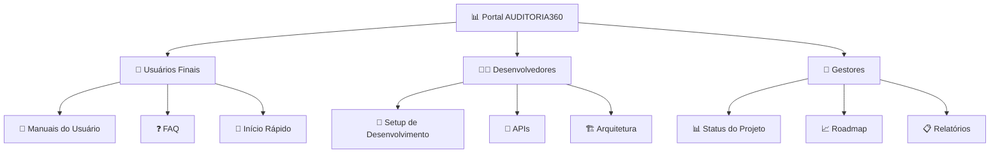

# 🎯 AUDITORIA360 - Portal de Gestão Inteligente

> **Sistema unificado para auditoria, gestão de folha e compliance trabalhista**

---

## 🎊 **Bem-vindo ao AUDITORIA360!**

O AUDITORIA360 é um **portal seguro, inteligente e integrado** que centraliza, automatiza e audita todos os processos de folha de pagamento, obrigações sindicais e convenções coletivas de trabalho.

---

## 🎯 **Acesso Rápido por Perfil**

### 👤 **Sou Usuário Final**
- [🚀 **Início Rápido**](./user-manuals/getting-started) - Comece em 5 minutos
- [📖 **Manual Completo**](./user-manuals/user-guide) - Guia detalhado de uso
- [❓ **FAQ**](./user-manuals/faq) - Perguntas frequentes

### 👨‍💻 **Sou Desenvolvedor**
- [🔧 **Setup de Desenvolvimento**](./developer-guides/development-setup) - Configuração do ambiente
- [📡 **Documentação da API**](./developer-guides/api-documentation) - APIs e endpoints
- [🏗️ **Visão da Arquitetura**](./developer-guides/architecture-overview) - Como o sistema funciona
- [🤝 **Como Contribuir**](./developer-guides/contributing) - Guia para colaboradores

### 👔 **Sou Gestor/Executivo**
- [📊 **Status do Projeto**](./strategic/project-status) - Situação atual completa
- [📈 **Roadmap Estratégico**](./strategic/roadmap) - Planejamento 2025-2027
- [📋 **Métricas de Performance**](./strategic/performance-metrics) - KPIs e indicadores

---

## 🏗️ **Principais Funcionalidades**

### ✅ **Sistema Core (100% Implementado)**
- **Gestão de Folha**: Processamento automático e validação
- **Auditoria 360°**: Análise completa de conformidade  
- **CCT Digital**: Gestão inteligente de convenções coletivas
- **Compliance**: Monitoramento automático de obrigações

### ✅ **Tecnologias Avançadas**
- **IA Integrada**: Análise inteligente de documentos
- **Chatbot Especializado**: Assistência 24/7
- **Dashboard Interativo**: Visualizações em tempo real
- **APIs RESTful**: Integração com sistemas externos

### ✅ **Infraestrutura Moderna**
- **Arquitetura Serverless**: Escalabilidade automática
- **Segurança Avançada**: Autenticação e autorização
- **CI/CD Automatizado**: Deploy contínuo
- **Monitoramento**: Observabilidade completa

---

## 📊 **Status Atual**

| Componente | Status | Cobertura de Testes |
|------------|---------|-------------------|
| 🌐 **APIs** | ✅ 100% | 90%+ |
| 🎨 **Frontend** | ✅ 100% | 85%+ |
| 🔒 **Segurança** | ✅ 100% | 95%+ |
| 📊 **Dashboards** | ✅ 100% | 90%+ |
| 🤖 **IA/ML** | ✅ 100% | 85%+ |
| 📖 **Documentação** | ✅ 100% | N/A |

---

## 🔗 **Links Importantes**

- **[📡 Referência da API](./api-reference/README)** - Documentação completa das APIs
- **[🏗️ Decisões de Arquitetura](./architecture-decisions/README)** - ADRs e decisões técnicas
- **[🚀 Deploy e Produção](./developer-guides/deployment)** - Guias de implantação

---

## 📞 **Suporte e Comunidade**

- **[🐛 Reportar Bug](https://github.com/Thaislaine997/AUDITORIA360/issues/new?template=bug_report.md)**
- **[💡 Solicitar Feature](https://github.com/Thaislaine997/AUDITORIA360/issues/new?template=feature_request.md)**
- **[❓ Fazer Pergunta](https://github.com/Thaislaine997/AUDITORIA360/discussions)**

---

> **💡 Dica**: Esta documentação é automaticamente sincronizada com o código. Sempre consulte esta Wiki para informações mais atualizadas!