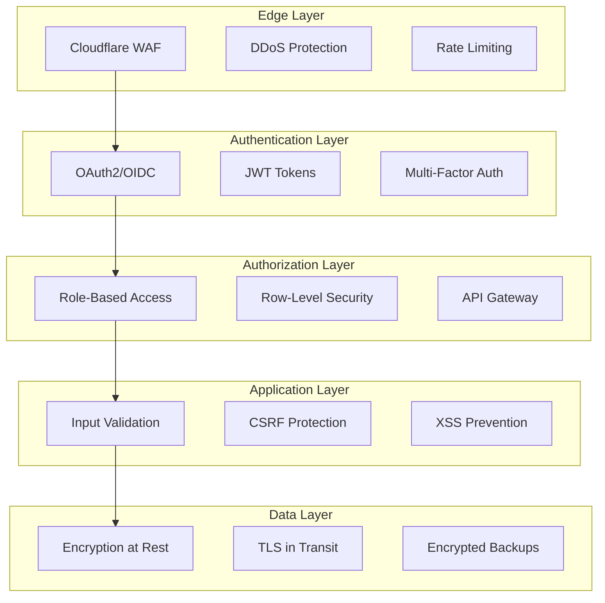

# 🔐 SECURITY CONFIGURATION - v1.0.0

## 📋 Visão Geral

Este documento descreve a configuração de segurança implementada no AUDITORIA360 v1.0.0, seguindo os princípios de **Security by Design** e **Zero Trust Architecture**.

---

## 🏗️ ARQUITETURA DE SEGURANÇA

### Princípios Fundamentais
- **Zero Trust**: Nunca confie, sempre verifique
- **Defense in Depth**: Múltiplas camadas de proteção
- **Least Privilege**: Acesso mínimo necessário
- **Fail Secure**: Falha de forma segura
- **Security by Design**: Segurança integrada desde o design

### Modelo de Segurança



---

## 🔑 GESTÃO DE IDENTIDADE E ACESSO

### 1. Autenticação

#### OAuth2 + OpenID Connect
```yaml
# Configuração OAuth2
oauth2:
  provider: "custom"
  client_id: "${OAUTH_CLIENT_ID}"
  client_secret: "${OAUTH_CLIENT_SECRET}"
  authorization_url: "https://auth.auditoria360.com/oauth/authorize"
  token_url: "https://auth.auditoria360.com/oauth/token"
  userinfo_url: "https://auth.auditoria360.com/oauth/userinfo"
  scopes: ["openid", "profile", "email"]
```

#### JWT Configuration
```yaml
# JWT Settings
jwt:
  algorithm: "RS256"
  access_token_expire_minutes: 30
  refresh_token_expire_days: 7
  issuer: "auditoria360.com"
  audience: "auditoria360-api"
  public_key_url: "https://auth.auditoria360.com/.well-known/jwks.json"
```

#### Multi-Factor Authentication (MFA)
```yaml
# MFA Configuration
mfa:
  enabled: true
  required_for_roles: ["admin", "auditor", "manager"]
  methods:
    - "totp"
    - "sms"
    - "email"
  backup_codes: true
  grace_period_hours: 24
```

### 2. Autorização

#### Role-Based Access Control (RBAC)
```python
# Roles e Permissões
ROLES = {
    "admin": {
        "permissions": ["*"],
        "description": "Acesso completo ao sistema"
    },
    "auditor": {
        "permissions": [
            "audit:read", "audit:create", "audit:execute",
            "reports:read", "reports:create",
            "documents:read"
        ],
        "description": "Acesso a funcionalidades de auditoria"
    },
    "hr_manager": {
        "permissions": [
            "payroll:read", "payroll:create", "payroll:update",
            "employees:read", "employees:create", "employees:update",
            "reports:read"
        ],
        "description": "Gestão de RH e folha de pagamento"
    },
    "accountant": {
        "permissions": [
            "payroll:read", "reports:read", "reports:create",
            "documents:read", "compliance:read"
        ],
        "description": "Acesso contábil e relatórios"
    },
    "employee": {
        "permissions": [
            "profile:read", "profile:update",
            "payslip:read", "documents:read_own"
        ],
        "description": "Acesso limitado para funcionários"
    },
    "union_rep": {
        "permissions": [
            "cct:read", "cct:create", "cct:update",
            "compliance:read", "reports:read"
        ],
        "description": "Representante sindical"
    }
}
```

#### Row-Level Security (RLS)
```sql
-- Política RLS para isolamento de tenants
CREATE POLICY tenant_isolation ON folhas_pagamento
    USING (tenant_id = current_setting('app.tenant_id')::uuid);

CREATE POLICY tenant_isolation ON funcionarios
    USING (tenant_id = current_setting('app.tenant_id')::uuid);

CREATE POLICY tenant_isolation ON auditorias
    USING (tenant_id = current_setting('app.tenant_id')::uuid);

-- Ativar RLS em todas as tabelas principais
ALTER TABLE folhas_pagamento ENABLE ROW LEVEL SECURITY;
ALTER TABLE funcionarios ENABLE ROW LEVEL SECURITY;
ALTER TABLE auditorias ENABLE ROW LEVEL SECURITY;
```

---

## 🛡️ PROTEÇÃO DE APLICAÇÃO

### 1. Input Validation & Sanitization

#### Validação de Entrada
```python
# Esquemas de validação Pydantic
from pydantic import BaseModel, validator, EmailStr
from typing import Optional
import re

class EmployeeCreate(BaseModel):
    name: str
    email: EmailStr
    cpf: str
    role: str
    
    @validator('name')
    def validate_name(cls, v):
        if not v or len(v.strip()) < 2:
            raise ValueError('Nome deve ter pelo menos 2 caracteres')
        # Remove caracteres perigosos
        return re.sub(r'[<>&"\']', '', v.strip())
    
    @validator('cpf')
    def validate_cpf(cls, v):
        # Validação de CPF
        cpf = re.sub(r'[^0-9]', '', v)
        if len(cpf) != 11:
            raise ValueError('CPF deve ter 11 dígitos')
        return cpf
```

#### Sanitização SQL
```python
# Uso de query parametrizadas
def get_employee_by_id(employee_id: int, tenant_id: str):
    query = """
    SELECT * FROM funcionarios 
    WHERE id = %s AND tenant_id = %s
    """
    return db.execute(query, (employee_id, tenant_id))
```

### 2. CSRF Protection

#### Configuração CSRF
```python
# FastAPI CSRF Middleware
from fastapi_csrf_protect import CsrfProtect

@app.middleware("http")
async def csrf_middleware(request: Request, call_next):
    if request.method in ["POST", "PUT", "DELETE", "PATCH"]:
        # Verificar token CSRF
        csrf_token = request.headers.get("X-CSRF-Token")
        if not csrf_token or not validate_csrf_token(csrf_token):
            raise HTTPException(status_code=403, detail="CSRF token missing or invalid")
    
    response = await call_next(request)
    return response
```

### 3. XSS Prevention

#### Content Security Policy (CSP)
```python
# Headers de segurança
SECURITY_HEADERS = {
    "Content-Security-Policy": (
        "default-src 'self'; "
        "script-src 'self' 'unsafe-inline' https://cdnjs.cloudflare.com; "
        "style-src 'self' 'unsafe-inline' https://fonts.googleapis.com; "
        "img-src 'self' data: https:; "
        "font-src 'self' https://fonts.gstatic.com; "
        "connect-src 'self' https://api.auditoria360.com; "
        "frame-ancestors 'none';"
    ),
    "X-Content-Type-Options": "nosniff",
    "X-Frame-Options": "DENY",
    "X-XSS-Protection": "1; mode=block",
    "Strict-Transport-Security": "max-age=31536000; includeSubDomains",
    "Referrer-Policy": "strict-origin-when-cross-origin"
}
```

---

## 🔐 CRIPTOGRAFIA E PROTEÇÃO DE DADOS

### 1. Encryption at Rest

#### Database Encryption
```yaml
# Neon PostgreSQL - Encryption at Rest
database:
  provider: "neon"
  encryption:
    enabled: true
    algorithm: "AES-256"
    key_management: "neon-managed"
    tde: true  # Transparent Data Encryption
```

#### File Storage Encryption
```yaml
# Cloudflare R2 - Server-Side Encryption
storage:
  provider: "cloudflare-r2"
  encryption:
    sse: "AES256"
    kms_key_id: "${R2_KMS_KEY_ID}"
    bucket_encryption: true
```

### 2. Encryption in Transit

#### TLS Configuration
```yaml
# TLS Settings
tls:
  minimum_version: "1.2"
  preferred_version: "1.3"
  cipher_suites:
    - "TLS_AES_256_GCM_SHA384"
    - "TLS_CHACHA20_POLY1305_SHA256"
    - "TLS_AES_128_GCM_SHA256"
  hsts:
    enabled: true
    max_age: 31536000
    include_subdomains: true
```

### 3. Sensitive Data Encryption

#### Application-Level Encryption
```python
# Criptografia de dados sensíveis
from cryptography.fernet import Fernet
import os

class DataEncryption:
    def __init__(self):
        self.key = os.environ.get('ENCRYPTION_KEY').encode()
        self.fernet = Fernet(self.key)
    
    def encrypt_sensitive_data(self, data: str) -> str:
        """Criptografa dados sensíveis como CPF, salários"""
        return self.fernet.encrypt(data.encode()).decode()
    
    def decrypt_sensitive_data(self, encrypted_data: str) -> str:
        """Descriptografa dados sensíveis"""
        return self.fernet.decrypt(encrypted_data.encode()).decode()

# Uso em models
class Employee(BaseModel):
    name: str
    email: str
    _cpf: str  # Campo criptografado
    
    @property
    def cpf(self) -> str:
        return encryption.decrypt_sensitive_data(self._cpf)
    
    @cpf.setter
    def cpf(self, value: str):
        self._cpf = encryption.encrypt_sensitive_data(value)
```

---

## 🗝️ GESTÃO DE SEGREDOS

### 1. HashiCorp Vault Integration

#### Vault Configuration
```yaml
# Vault Settings
vault:
  address: "https://vault.auditoria360.com"
  auth_method: "kubernetes"
  mount_path: "secret"
  namespace: "auditoria360"
  rotation:
    enabled: true
    interval: "24h"
```

#### Secret Management
```python
# Integração com Vault
import hvac

class VaultManager:
    def __init__(self):
        self.client = hvac.Client(url=os.environ['VAULT_ADDR'])
        self.client.token = os.environ['VAULT_TOKEN']
    
    def get_secret(self, path: str) -> dict:
        """Recupera segredo do Vault"""
        response = self.client.secrets.kv.v2.read_secret_version(path=path)
        return response['data']['data']
    
    def rotate_secret(self, path: str, new_value: str):
        """Rotaciona segredo no Vault"""
        self.client.secrets.kv.v2.create_or_update_secret(
            path=path,
            secret={'value': new_value}
        )

# Uso de segredos
vault = VaultManager()
db_password = vault.get_secret('database/password')['value']
api_key = vault.get_secret('external/openai-api-key')['value']
```

### 2. Secret Rotation

#### Automated Rotation
```bash
#!/bin/bash
# Script de rotação automática de senhas

# Rotacionar senha do banco de dados
./scripts/rotate-db-password.sh

# Rotacionar chaves de API
./scripts/rotate-api-keys.sh

# Rotacionar certificados TLS
./scripts/rotate-tls-certs.sh

# Atualizar aplicações
kubectl rollout restart deployment/auditoria360
```

---

## 🔍 AUDITORIA E LOGGING

### 1. Audit Trail

#### Security Events Logging
```python
# Sistema de auditoria
import logging
import json
from datetime import datetime

class SecurityAuditLogger:
    def __init__(self):
        self.logger = logging.getLogger('security_audit')
        self.logger.setLevel(logging.INFO)
    
    def log_auth_event(self, user_id: str, event: str, success: bool, ip: str):
        """Log eventos de autenticação"""
        audit_event = {
            'timestamp': datetime.utcnow().isoformat(),
            'event_type': 'authentication',
            'user_id': user_id,
            'event': event,
            'success': success,
            'ip_address': ip,
            'user_agent': request.headers.get('User-Agent')
        }
        self.logger.info(json.dumps(audit_event))
    
    def log_data_access(self, user_id: str, resource: str, action: str):
        """Log acesso a dados sensíveis"""
        audit_event = {
            'timestamp': datetime.utcnow().isoformat(),
            'event_type': 'data_access',
            'user_id': user_id,
            'resource': resource,
            'action': action,
            'tenant_id': get_current_tenant()
        }
        self.logger.info(json.dumps(audit_event))

# Uso em endpoints
@app.post("/api/v1/employees")
async def create_employee(employee: EmployeeCreate, current_user: User):
    audit_logger.log_data_access(
        user_id=current_user.id,
        resource="employees",
        action="create"
    )
    # ... lógica de criação
```

### 2. Security Monitoring

#### Métricas de Segurança
```yaml
# Prometheus metrics para segurança
security_metrics:
  - name: "failed_login_attempts"
    type: "counter"
    help: "Number of failed login attempts"
    labels: ["user_id", "ip_address"]
  
  - name: "privilege_escalation_attempts"
    type: "counter"
    help: "Attempts to access unauthorized resources"
    labels: ["user_id", "resource", "action"]
  
  - name: "data_access_events"
    type: "counter"
    help: "Access to sensitive data"
    labels: ["user_id", "data_type", "tenant_id"]
```

---

## 🚨 DETECÇÃO DE AMEAÇAS

### 1. Anomaly Detection

#### Behavioral Analysis
```python
# Detecção de anomalias comportamentais
class AnomalyDetector:
    def __init__(self):
        self.baseline_profiles = {}
    
    def check_login_anomaly(self, user_id: str, ip: str, time: datetime):
        """Verifica anomalias em login"""
        profile = self.baseline_profiles.get(user_id, {})
        
        # Verificar localização geográfica
        if self.is_unusual_location(ip, profile.get('usual_locations', [])):
            self.alert_unusual_location(user_id, ip)
        
        # Verificar horário de acesso
        if self.is_unusual_time(time, profile.get('usual_hours', [])):
            self.alert_unusual_time(user_id, time)
    
    def check_data_access_anomaly(self, user_id: str, resource: str, volume: int):
        """Verifica anomalias em acesso a dados"""
        if volume > self.get_baseline_volume(user_id, resource) * 3:
            self.alert_data_exfiltration_attempt(user_id, resource, volume)
```

### 2. Intrusion Detection

#### Rate Limiting
```python
# Rate limiting para prevenção de ataques
from slowapi import Limiter, _rate_limit_exceeded_handler
from slowapi.util import get_remote_address

limiter = Limiter(key_func=get_remote_address)

@app.route("/api/v1/auth/login")
@limiter.limit("5/minute")
async def login(request: Request):
    # Lógica de login
    pass

@app.route("/api/v1/payroll")
@limiter.limit("100/hour")
async def get_payroll(request: Request):
    # Acesso a dados sensíveis com limite
    pass
```

---

## 📋 COMPLIANCE & GOVERNANÇA

### 1. LGPD/GDPR Compliance

#### Data Subject Rights
```python
# Implementação dos direitos dos titulares
class DataSubjectRights:
    def export_user_data(self, user_id: str) -> dict:
        """Exporta todos os dados do usuário"""
        user_data = {
            'personal_info': self.get_personal_info(user_id),
            'payroll_data': self.get_payroll_data(user_id),
            'audit_logs': self.get_audit_logs(user_id),
            'documents': self.get_documents(user_id)
        }
        return user_data
    
    def anonymize_user_data(self, user_id: str):
        """Anonimiza dados do usuário"""
        # Manter dados necessários para auditoria, anonimizar o resto
        self.anonymize_personal_info(user_id)
        self.anonymize_payroll_data(user_id)
        self.mark_as_anonymized(user_id)
    
    def delete_user_data(self, user_id: str):
        """Deleta dados do usuário (quando permitido)"""
        if self.can_delete_user_data(user_id):
            self.delete_all_user_data(user_id)
        else:
            # Se não pode deletar (retenção legal), anonimizar
            self.anonymize_user_data(user_id)
```

### 2. Security Policies

#### Password Policy
```yaml
# Política de senhas
password_policy:
  min_length: 12
  require_uppercase: true
  require_lowercase: true
  require_numbers: true
  require_special_chars: true
  prevent_reuse: 12  # Últimas 12 senhas
  max_age_days: 90
  lockout_attempts: 5
  lockout_duration_minutes: 30
```

#### Session Management
```yaml
# Gestão de sessões
session_policy:
  timeout_minutes: 30
  absolute_timeout_hours: 8
  concurrent_sessions: 3
  secure_cookies: true
  httponly_cookies: true
  samesite: "strict"
```

---

## 🔧 CONFIGURAÇÃO DE PRODUÇÃO

### 1. Environment Variables

#### Security Environment Variables
```bash
# Autenticação e autorização
OAUTH_CLIENT_ID=your_oauth_client_id
OAUTH_CLIENT_SECRET=your_oauth_client_secret
JWT_PRIVATE_KEY_PATH=/secrets/jwt_private_key.pem
JWT_PUBLIC_KEY_PATH=/secrets/jwt_public_key.pem

# Criptografia
ENCRYPTION_KEY=your_32_byte_encryption_key
DATABASE_ENCRYPTION_KEY=your_db_encryption_key

# Vault
VAULT_ADDR=https://vault.auditoria360.com
VAULT_TOKEN=your_vault_token
VAULT_NAMESPACE=auditoria360

# Security Headers
SECURITY_HEADERS_ENABLED=true
CSP_ENABLED=true
HSTS_ENABLED=true

# Monitoring
SECURITY_MONITORING_ENABLED=true
AUDIT_LOGGING_ENABLED=true
```

### 2. Security Checklist

#### Pre-Production Security Checklist
- [ ] Todos os segredos movidos para Vault
- [ ] TLS 1.3 configurado e funcionando
- [ ] Headers de segurança configurados
- [ ] Rate limiting implementado
- [ ] Input validation em todos os endpoints
- [ ] SQL injection prevention verificado
- [ ] XSS prevention verificado
- [ ] CSRF protection ativo
- [ ] MFA obrigatório para admins
- [ ] Audit logging funcionando
- [ ] Anomaly detection ativo
- [ ] Backup encryption verificado
- [ ] RLS policies ativas
- [ ] Security monitoring dashboards configurados

---

## 📞 CONTATOS DE SEGURANÇA

### Security Team
- **CISO**: [Nome] - [Email] - [Telefone]
- **Security Engineer**: [Nome] - [Email] - [Telefone]
- **Compliance Officer**: [Nome] - [Email] - [Telefone]

### Emergency Contacts
- **Security Hotline**: +55 11 XXXX-XXXX
- **Security Email**: security@auditoria360.com
- **Incident Response**: incident-response@auditoria360.com

---

> **🔐 Security v1.0.0**: Configuração de segurança de classe mundial para proteger dados sensíveis e garantir conformidade total.

**Última atualização**: 30 de Julho de 2025
**Próxima revisão**: 30 de Outubro de 2025