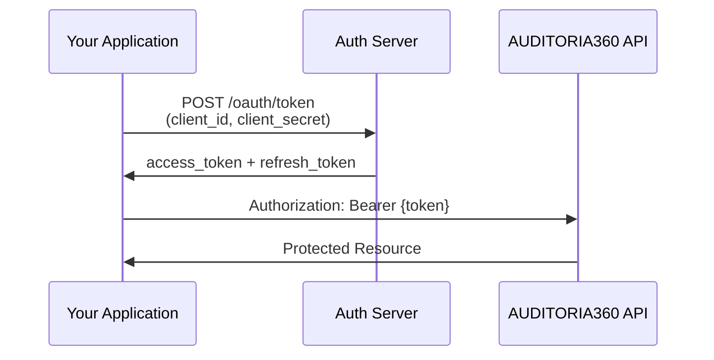
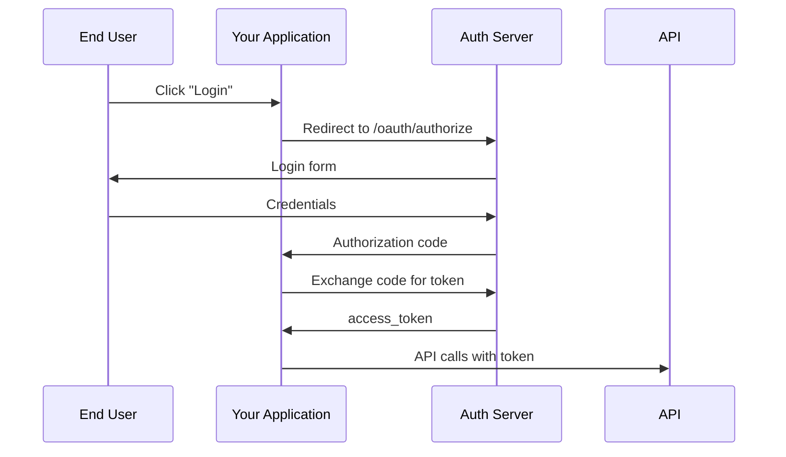

# 🔐 Authentication Guide

> **Secure authentication and authorization for AUDITORIA360 APIs**

---

## 🎯 **Authentication Overview**

AUDITORIA360 uses **OAuth2** with **JWT Bearer tokens** for secure API access. All API requests must be authenticated except for public health checks.

### **🔐 Security Features**
- **OAuth2 Client Credentials** flow
- **JWT tokens** with expiration
- **Refresh token** rotation
- **Scope-based permissions**
- **Rate limiting** per client
- **Request signing** for webhooks

---

## 🚀 **Quick Start**

### **1. Register Your Application**
Contact the API team to register your application:
- **Application Name**: Your application identifier
- **Redirect URIs**: For OAuth flows (if applicable)
- **Scopes**: Required permissions

You'll receive:
```yaml
client_id: "your_client_id_here"
client_secret: "your_client_secret_here"
```

### **2. Obtain Access Token**
```bash
curl -X POST "https://api.auditoria360.com/oauth/token" \
  -H "Content-Type: application/x-www-form-urlencoded" \
  -d "grant_type=client_credentials" \
  -d "client_id=YOUR_CLIENT_ID" \
  -d "client_secret=YOUR_CLIENT_SECRET" \
  -d "scope=audit:read audit:write"
```

**Response:**
```json
{
  "access_token": "eyJhbGciOiJIUzI1NiIsInR5cCI6IkpXVCJ9...",
  "token_type": "Bearer",
  "expires_in": 3600,
  "refresh_token": "def50200a1b2c3d4e5f6...",
  "scope": "audit:read audit:write"
}
```

### **3. Use Token in Requests**
```bash
curl -H "Authorization: Bearer YOUR_ACCESS_TOKEN" \
  "https://api.auditoria360.com/api/v1/audits"
```

---

## 🔑 **OAuth2 Flows**

### **Client Credentials Flow (Recommended)**
For server-to-server communication:



**When to use:**
- ✅ Server-to-server integration
- ✅ Backend services
- ✅ Automated processes
- ✅ Microservices

### **Authorization Code Flow**
For user-facing applications (future support):



---

## 🛡️ **Token Management**

### **Access Tokens**
```yaml
Type: "JWT (JSON Web Token)"
Algorithm: "HS256"
Expiration: "1 hour"
Format: "Bearer {token}"
```

**Token Structure:**
```json
{
  "header": {
    "alg": "HS256",
    "typ": "JWT"
  },
  "payload": {
    "sub": "client_id",
    "iss": "auditoria360.com",
    "aud": "api.auditoria360.com",
    "exp": 1640995200,
    "iat": 1640991600,
    "scope": "audit:read audit:write",
    "client_id": "your_client_id"
  }
}
```

### **Refresh Tokens**
```yaml
Type: "Opaque string"
Expiration: "30 days"
Single_Use: true
Rotation: "New refresh token on each use"
```

### **Token Refresh**
```bash
curl -X POST "https://api.auditoria360.com/oauth/token" \
  -H "Content-Type: application/x-www-form-urlencoded" \
  -d "grant_type=refresh_token" \
  -d "refresh_token=YOUR_REFRESH_TOKEN" \
  -d "client_id=YOUR_CLIENT_ID" \
  -d "client_secret=YOUR_CLIENT_SECRET"
```

---

## 🎯 **Scopes and Permissions**

### **Available Scopes**
| Scope | Description | Access Level |
|-------|-------------|--------------|
| `audit:read` | Read audit data | View audits, results, reports |
| `audit:write` | Create and modify audits | All audit operations |
| `user:read` | Read user information | View user profiles, settings |
| `user:write` | Modify user information | Update users, preferences |
| `admin` | Administrative access | Full system access |
| `webhook:manage` | Webhook management | Create, update webhooks |

### **Permission Matrix**
| Resource | Read | Write | Delete | Admin |
|----------|------|-------|--------|-------|
| Audits | `audit:read` | `audit:write` | `audit:write` | `admin` |
| Users | `user:read` | `user:write` | `admin` | `admin` |
| Reports | `audit:read` | `audit:write` | `audit:write` | `admin` |
| Webhooks | `webhook:manage` | `webhook:manage` | `webhook:manage` | `admin` |

### **Scope Validation**
```python
# Example: Check if token has required scope
def check_scope(token, required_scope):
    payload = jwt.decode(token, verify=False)
    scopes = payload.get('scope', '').split()
    return required_scope in scopes or 'admin' in scopes
```

---

## 🔒 **Security Best Practices**

### **🛡️ Token Security**
- ✅ **Store tokens securely** (encrypted storage)
- ✅ **Use HTTPS only** for token transmission
- ✅ **Implement token refresh** before expiration
- ✅ **Revoke tokens** when no longer needed
- ❌ **Never log tokens** in application logs
- ❌ **Don't expose tokens** in URLs or client-side code

### **🔐 Client Security**
- ✅ **Protect client secrets** like passwords
- ✅ **Rotate secrets** regularly
- ✅ **Use environment variables** for secrets
- ✅ **Implement proper error handling**
- ❌ **Never hardcode secrets** in source code
- ❌ **Don't share secrets** between environments

### **📊 Monitoring and Auditing**
- ✅ **Monitor API usage** and rate limits
- ✅ **Log authentication events**
- ✅ **Track token usage** patterns
- ✅ **Alert on suspicious activity**

---

## ⚠️ **Error Handling**

### **Common Authentication Errors**
| Error Code | Description | Solution |
|------------|-------------|----------|
| `401` | **Unauthorized** | Token missing or invalid |
| `403` | **Forbidden** | Insufficient permissions |
| `429` | **Rate Limited** | Too many requests |

### **Error Response Format**
```json
{
  "error": {
    "code": "INVALID_TOKEN",
    "message": "The access token is invalid or expired",
    "details": {
      "reason": "token_expired",
      "expires_at": "2024-01-15T10:30:00Z"
    },
    "request_id": "req_abc123"
  }
}
```

### **Error Handling Example**
```python
import requests
from requests.exceptions import HTTPError

def api_request(url, token):
    headers = {"Authorization": f"Bearer {token}"}
    
    try:
        response = requests.get(url, headers=headers)
        response.raise_for_status()
        return response.json()
        
    except HTTPError as e:
        if e.response.status_code == 401:
            # Token expired, refresh token
            token = refresh_access_token()
            return api_request(url, token)
        elif e.response.status_code == 403:
            # Insufficient permissions
            raise PermissionError("Insufficient API permissions")
        else:
            raise
```

---

## 🧪 **Testing Authentication**

### **Test Endpoints**
```bash
# Test token validity
curl -H "Authorization: Bearer YOUR_TOKEN" \
  "https://api.auditoria360.com/oauth/tokeninfo"

# Test permissions
curl -H "Authorization: Bearer YOUR_TOKEN" \
  "https://api.auditoria360.com/api/v1/user/me"
```

### **Development Tokens**
For development and testing:
```yaml
Sandbox_Endpoint: "https://sandbox-api.auditoria360.com"
Test_Client_ID: "test_client_123"
Test_Client_Secret: "test_secret_456"
Rate_Limits: "None (for testing)"
```

---

## 💻 **Code Examples**

### **Python Example**
```python
import requests
import jwt
from datetime import datetime, timedelta

class Auditoria360Auth:
    def __init__(self, client_id, client_secret, base_url):
        self.client_id = client_id
        self.client_secret = client_secret
        self.base_url = base_url
        self.access_token = None
        self.refresh_token = None
        self.expires_at = None
    
    def authenticate(self):
        """Get initial access token"""
        data = {
            'grant_type': 'client_credentials',
            'client_id': self.client_id,
            'client_secret': self.client_secret,
            'scope': 'audit:read audit:write'
        }
        
        response = requests.post(f'{self.base_url}/oauth/token', data=data)
        response.raise_for_status()
        
        token_data = response.json()
        self.access_token = token_data['access_token']
        self.refresh_token = token_data.get('refresh_token')
        
        # Calculate expiration time
        expires_in = token_data.get('expires_in', 3600)
        self.expires_at = datetime.now() + timedelta(seconds=expires_in - 60)
    
    def get_valid_token(self):
        """Get a valid access token, refreshing if necessary"""
        if not self.access_token or datetime.now() >= self.expires_at:
            if self.refresh_token:
                self.refresh_access_token()
            else:
                self.authenticate()
        
        return self.access_token
    
    def refresh_access_token(self):
        """Refresh the access token"""
        data = {
            'grant_type': 'refresh_token',
            'refresh_token': self.refresh_token,
            'client_id': self.client_id,
            'client_secret': self.client_secret
        }
        
        response = requests.post(f'{self.base_url}/oauth/token', data=data)
        response.raise_for_status()
        
        token_data = response.json()
        self.access_token = token_data['access_token']
        self.refresh_token = token_data.get('refresh_token')
        
        expires_in = token_data.get('expires_in', 3600)
        self.expires_at = datetime.now() + timedelta(seconds=expires_in - 60)
    
    def api_request(self, method, endpoint, **kwargs):
        """Make authenticated API request"""
        token = self.get_valid_token()
        headers = kwargs.get('headers', {})
        headers['Authorization'] = f'Bearer {token}'
        kwargs['headers'] = headers
        
        url = f'{self.base_url}{endpoint}'
        response = requests.request(method, url, **kwargs)
        response.raise_for_status()
        return response.json()

# Usage
auth = Auditoria360Auth(
    client_id="your_client_id",
    client_secret="your_client_secret", 
    base_url="https://api.auditoria360.com"
)

# Make authenticated requests
audits = auth.api_request('GET', '/api/v1/audits')
```

### **JavaScript Example**
```javascript
class Auditoria360Auth {
  constructor(clientId, clientSecret, baseUrl) {
    this.clientId = clientId;
    this.clientSecret = clientSecret;
    this.baseUrl = baseUrl;
    this.accessToken = null;
    this.refreshToken = null;
    this.expiresAt = null;
  }

  async authenticate() {
    const response = await fetch(`${this.baseUrl}/oauth/token`, {
      method: 'POST',
      headers: {
        'Content-Type': 'application/x-www-form-urlencoded',
      },
      body: new URLSearchParams({
        grant_type: 'client_credentials',
        client_id: this.clientId,
        client_secret: this.clientSecret,
        scope: 'audit:read audit:write'
      })
    });

    if (!response.ok) {
      throw new Error('Authentication failed');
    }

    const tokenData = await response.json();
    this.accessToken = tokenData.access_token;
    this.refreshToken = tokenData.refresh_token;
    
    const expiresIn = tokenData.expires_in || 3600;
    this.expiresAt = new Date(Date.now() + (expiresIn - 60) * 1000);
  }

  async getValidToken() {
    if (!this.accessToken || new Date() >= this.expiresAt) {
      if (this.refreshToken) {
        await this.refreshAccessToken();
      } else {
        await this.authenticate();
      }
    }
    return this.accessToken;
  }

  async apiRequest(method, endpoint, options = {}) {
    const token = await this.getValidToken();
    
    const response = await fetch(`${this.baseUrl}${endpoint}`, {
      method,
      headers: {
        'Authorization': `Bearer ${token}`,
        'Content-Type': 'application/json',
        ...options.headers
      },
      ...options
    });

    if (!response.ok) {
      throw new Error(`API request failed: ${response.status}`);
    }

    return response.json();
  }
}

// Usage
const auth = new Auditoria360Auth(
  'your_client_id',
  'your_client_secret',
  'https://api.auditoria360.com'
);

// Make authenticated requests
const audits = await auth.apiRequest('GET', '/api/v1/audits');
```

---

## 🔗 **Related Resources**

- **[API Reference](./README)** - Complete API documentation
- **[Developer Guide](../developer-guides/api-documentation)** - Integration examples
- **[Security Best Practices](../developer-guides/security-guide)** - Security guidelines

---

> **🔐 Security Note**: Always follow security best practices when implementing authentication. Never expose credentials in client-side code or public repositories!