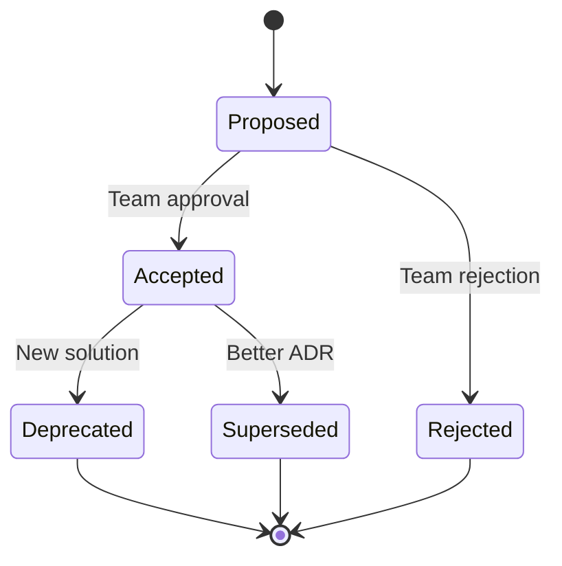

# 🏗️ Architecture Decision Records (ADRs)

> **Documenting key architectural decisions for AUDITORIA360**

---

## 📋 **What are ADRs?**

Architecture Decision Records (ADRs) document important architectural decisions made during the development of AUDITORIA360. Each ADR captures:

- **Context**: Why was this decision needed?
- **Decision**: What was decided?
- **Consequences**: What are the trade-offs?

---

## 📚 **ADR Index**

### **🎯 Strategic Decisions**
- [ADR-001: Serverless Architecture](./001-serverless-architecture.md)
- [ADR-002: Multi-tenant Design](./002-multi-tenant-design.md)
- [ADR-003: Technology Stack Selection](./003-technology-stack.md)

### **🔧 Technical Decisions**
- [ADR-004: Database Strategy](./004-database-strategy.md)
- [ADR-005: Authentication & Authorization](./005-auth-strategy.md)
- [ADR-006: API Design Principles](./006-api-design.md)

### **🤖 AI/ML Decisions**
- [ADR-007: AI Provider Selection](./007-ai-provider-selection.md)
- [ADR-008: OCR Strategy](./008-ocr-strategy.md)
- [ADR-009: ML Model Deployment](./009-ml-deployment.md)

### **📊 Data Decisions**
- [ADR-010: Data Pipeline Architecture](./010-data-pipeline.md)
- [ADR-011: LGPD Compliance Strategy](./011-lgpd-compliance.md)
- [ADR-012: Backup and Recovery](./012-backup-recovery.md)

---

## 📝 **ADR Template**

Use this template when creating new ADRs:

```markdown
# ADR-XXX: [Title]

**Date**: YYYY-MM-DD  
**Status**: [Proposed | Accepted | Deprecated | Superseded]  
**Deciders**: [List of decision makers]  

## Context

[Describe the context and problem statement]

## Decision

[Describe the decision made]

## Consequences

### Positive
- [List positive consequences]

### Negative  
- [List negative consequences]

### Neutral
- [List neutral consequences]

## Alternative Considered

[List alternatives that were considered but not chosen]

## Implementation Notes

[Any specific implementation details or constraints]

## References

[Links to related documentation, discussions, or resources]
```

---

## 🔄 **ADR Lifecycle**



### **Status Definitions**
- **Proposed**: Under discussion
- **Accepted**: Approved and implemented
- **Deprecated**: No longer recommended
- **Superseded**: Replaced by newer ADR
- **Rejected**: Decided against

---

## 📊 **Decision Categories**

### **🎯 Strategic (Business Impact)**
Decisions that significantly impact business outcomes, user experience, or long-term viability.

### **🔧 Technical (Implementation)**
Decisions about specific technologies, frameworks, or implementation approaches.

### **📊 Data (Information Architecture)**
Decisions about data modeling, storage, processing, and governance.

### **🔐 Security (Risk Management)**
Decisions related to security, privacy, compliance, and risk mitigation.

---

## 🤝 **Decision Process**

### **1. Identify Need**
- Technical challenge or architectural choice
- Multiple viable options exist
- Decision has significant impact

### **2. Research & Analysis**
- Gather requirements and constraints
- Research available options
- Analyze trade-offs

### **3. Proposal**
- Create ADR with template
- Present to architecture team
- Gather feedback and iterate

### **4. Decision**
- Team discussion and consensus
- Document final decision
- Update status to "Accepted"

### **5. Implementation**
- Implement the decision
- Monitor consequences
- Update ADR if needed

---

## 📈 **Decision Tracking**

### **Active ADRs (Accepted)**
| ADR | Title | Date | Impact |
|-----|-------|------|---------|
| 001 | Serverless Architecture | 2024-01-15 | High |
| 003 | Technology Stack | 2024-01-20 | High |
| 005 | Auth Strategy | 2024-02-01 | Medium |

### **Recent Changes**
- **2024-01-15**: ADR-001 Serverless Architecture accepted
- **2024-01-20**: ADR-003 Technology Stack finalized
- **2024-02-01**: ADR-005 Authentication strategy implemented

---

## 🔍 **Review Process**

### **Regular Reviews**
- **Monthly**: Review active ADRs for relevance
- **Quarterly**: Assess consequences and impacts
- **Annually**: Major architectural review

### **Trigger Events**
- New technology adoption
- Performance issues
- Security incidents
- Compliance requirements

---

## 📚 **Best Practices**

### **Writing ADRs**
- ✅ Be concise but comprehensive
- ✅ Focus on "why" not just "what"
- ✅ Include concrete examples
- ✅ Consider future implications

### **Decision Making**
- ✅ Involve relevant stakeholders
- ✅ Consider multiple alternatives
- ✅ Document assumptions clearly
- ✅ Plan for reversibility when possible

### **Maintenance**
- ✅ Update status as decisions evolve
- ✅ Link related ADRs
- ✅ Archive outdated decisions
- ✅ Learn from consequences

---

## 🔗 **Related Resources**

- **[Architecture Overview](../developer-guides/architecture-overview)** - System architecture details
- **[Technical Documentation](../developer-guides/README)** - Implementation guides
- **[API Documentation](../developer-guides/api-documentation)** - API design decisions
- **[Security Guide](../developer-guides/security-guide)** - Security implementations

---

> **💡 Remember**: ADRs are living documents. Keep them updated as decisions evolve and new information becomes available!