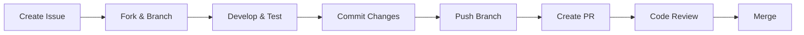

# 🤝 Contributing to AUDITORIA360

> **Guide for contributing to the AUDITORIA360 project**

---

## 🎯 **Welcome Contributors!**

We're excited to have you contribute to AUDITORIA360! This guide will help you get started with contributing code, documentation, or reporting issues.

---

## 📋 **Ways to Contribute**

### **💻 Code Contributions**
- 🐛 Bug fixes
- ✨ New features
- ⚡ Performance improvements
- 🔧 Refactoring

### **📚 Documentation**
- 📝 Improve existing docs
- 📖 Write new guides
- 🌍 Translations
- 📹 Video tutorials

### **🧪 Testing**
- 🔍 Report bugs
- ✅ Write tests
- 🧪 Manual testing
- 📊 Performance testing

### **🎨 Design & UX**
- 🎨 UI improvements
- 📱 UX enhancements
- 🔍 Accessibility
- 📐 Design systems

---

## 🚀 **Getting Started**

### **1. Fork & Clone**
```bash
# Fork the repository on GitHub, then:
git clone https://github.com/YOUR_USERNAME/AUDITORIA360.git
cd AUDITORIA360

# Add upstream remote
git remote add upstream https://github.com/Thaislaine997/AUDITORIA360.git
```

### **2. Setup Development Environment**
```bash
# Follow the development setup guide
# See: docs-source/developer-guides/development-setup.md

# Install dependencies
make install-dev

# Run tests to verify setup
make test
```

### **3. Create a Branch**
```bash
# Create feature branch
git checkout -b feature/your-feature-name

# Or bug fix branch
git checkout -b fix/bug-description
```

---

## 📝 **Development Workflow**

### **🔄 Standard Workflow**


### **📋 Pre-commit Checklist**
Before committing, ensure:
- [ ] Tests pass (`make test`)
- [ ] Code is formatted (`make format`)
- [ ] Linting passes (`make lint`)
- [ ] Documentation updated
- [ ] Commit message follows convention

### **✅ Running Tests**
```bash
# Run all tests
make test

# Run specific test suite
pytest tests/unit/
pytest tests/integration/
pytest tests/e2e/

# Run with coverage
pytest --cov=src --cov-report=html
```

---

## 📝 **Commit Convention**

We use **Conventional Commits** for clear commit history:

### **📋 Format**
```
<type>(<scope>): <description>

<body>

<footer>
```

### **🎯 Types**
- `feat`: New feature
- `fix`: Bug fix
- `docs`: Documentation changes
- `style`: Code style changes (formatting)
- `refactor`: Code refactoring
- `test`: Test changes
- `chore`: Build/tool changes

### **📝 Examples**
```bash
feat(auth): add OAuth2 authentication

Implements OAuth2 flow with JWT tokens for secure API access.
Includes refresh token rotation and proper scope validation.

Closes #123

fix(audit): resolve memory leak in document processing

The document processor was not properly releasing memory after
OCR completion, causing gradual memory buildup.

Fixes #456

docs(api): update authentication examples

Add Python and JavaScript examples for OAuth2 flow.
Include error handling and token refresh patterns.
```

---

## 🐛 **Bug Reports**

### **📋 Before Reporting**
- [ ] Search existing issues
- [ ] Use latest version
- [ ] Check documentation
- [ ] Reproduce the bug

### **📝 Bug Report Template**
```markdown
## 🐛 Bug Description
Clear description of the bug

## 🔄 Steps to Reproduce
1. Go to '...'
2. Click on '....'
3. Scroll down to '....'
4. See error

## ✅ Expected Behavior
What you expected to happen

## ❌ Actual Behavior
What actually happened

## 🖥️ Environment
- OS: [e.g., Windows 10]
- Browser: [e.g., Chrome 91]
- Version: [e.g., 1.2.3]

## 📎 Additional Context
Screenshots, logs, etc.
```

---

## 💡 **Feature Requests**

### **📋 Feature Request Template**
```markdown
## 🎯 Feature Description
Clear description of the proposed feature

## 💭 Motivation
Why is this feature needed?

## 📋 Detailed Requirements
- Requirement 1
- Requirement 2
- Requirement 3

## 🎨 Proposed Solution
How should this feature work?

## 🔄 Alternative Solutions
Any alternative approaches considered?

## 📊 Impact Assessment
- Users affected:
- Complexity:
- Timeline:
```

---

## 📚 **Documentation Contributions**

### **📖 Documentation Types**
- **User Guides**: Help end users
- **Developer Docs**: Technical implementation
- **API Reference**: Endpoint documentation
- **Tutorials**: Step-by-step guides

### **📝 Documentation Standards**
- Use clear, concise language
- Include code examples
- Add screenshots for UI changes
- Test all examples
- Follow existing style/tone

### **🔄 Documentation Workflow**
```bash
# Documentation is in docs-source/
cd docs-source/

# Make changes
edit user-manuals/your-guide.md

# Preview locally (if using MkDocs)
mkdocs serve

# Commit changes
git add docs-source/
git commit -m "docs: update user guide with new feature"
```

---

## 🔍 **Code Review Process**

### **👀 What We Look For**
- **Functionality**: Does it work as intended?
- **Tests**: Are there adequate tests?
- **Performance**: Any performance implications?
- **Security**: Are there security concerns?
- **Documentation**: Is documentation updated?

### **📋 Review Checklist**
- [ ] Code follows style guidelines
- [ ] Tests pass and have good coverage
- [ ] Documentation is updated
- [ ] No breaking changes (or properly documented)
- [ ] Performance impact considered
- [ ] Security implications reviewed

### **⏱️ Review Timeline**
- **Small PRs**: 24-48 hours
- **Medium PRs**: 2-4 days
- **Large PRs**: 4-7 days
- **Breaking changes**: 1-2 weeks

---

## 🛡️ **Security Guidelines**

### **🔒 Security Best Practices**
- Never commit secrets or credentials
- Use environment variables for config
- Validate all inputs
- Follow OWASP guidelines
- Report security issues privately

### **🚨 Reporting Security Issues**
**DO NOT** open public issues for security vulnerabilities.

Instead:
1. Email: security@auditoria360.com.br
2. Include detailed description
3. Provide steps to reproduce
4. We'll acknowledge within 24 hours

---

## 🎨 **Style Guidelines**

### **🐍 Python Style**
- Follow PEP 8
- Use Black for formatting
- Use type hints
- Document with docstrings

```python
def process_audit(audit_id: str, options: Dict[str, Any]) -> AuditResult:
    """Process an audit with the given options.
    
    Args:
        audit_id: Unique identifier for the audit
        options: Processing options and parameters
        
    Returns:
        AuditResult: The processed audit result
        
    Raises:
        ValueError: If audit_id is invalid
        ProcessingError: If processing fails
    """
    pass
```

### **🟨 JavaScript Style**
- Use TypeScript when possible
- Follow Prettier formatting
- Use meaningful variable names
- Add JSDoc comments

```javascript
/**
 * Creates a new audit with the specified parameters
 * @param {string} type - The type of audit to create
 * @param {Object} options - Configuration options
 * @returns {Promise<Audit>} The created audit
 */
async function createAudit(type: string, options: CreateAuditOptions): Promise<Audit> {
  // Implementation
}
```

---

## 🏆 **Recognition**

### **🌟 Contributor Recognition**
- Contributors listed in CONTRIBUTORS.md
- Monthly contributor spotlight
- Special Discord badges
- Conference speaking opportunities

### **📊 Contribution Metrics**
- Commits and PRs merged
- Issues resolved
- Documentation improved
- Community help provided

---

## 📞 **Getting Help**

### **💬 Communication Channels**
- **Discord**: [AUDITORIA360 Community](https://discord.gg/auditoria360)
- **Email**: dev@auditoria360.com.br
- **GitHub Discussions**: Ask questions and share ideas

### **📅 Community Events**
- **Weekly Office Hours**: Thursdays 2pm UTC
- **Monthly Contributor Call**: First Friday of each month
- **Quarterly Planning**: Roadmap discussions

---

## 📋 **Issue Labels**

| Label | Description |
|-------|-------------|
| `good first issue` | Perfect for newcomers |
| `help wanted` | Community contributions welcome |
| `bug` | Something isn't working |
| `enhancement` | New feature or improvement |
| `documentation` | Documentation changes |
| `question` | General questions |
| `duplicate` | Already reported |
| `wontfix` | Not planned to be fixed |

---

## 🎉 **Thank You!**

Your contributions make AUDITORIA360 better for everyone. Whether you're fixing typos, adding features, or helping other users, every contribution matters!

---

> **💡 Remember**: Contributing is not just about code. Documentation, testing, design, and community support are equally valuable!