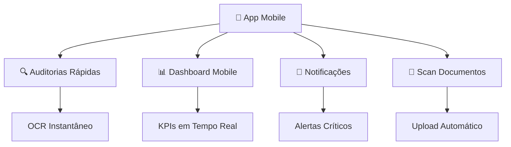
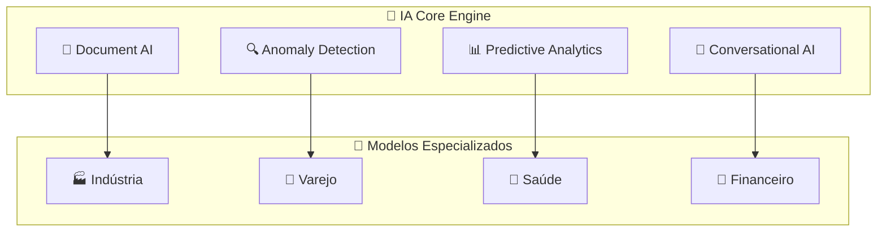
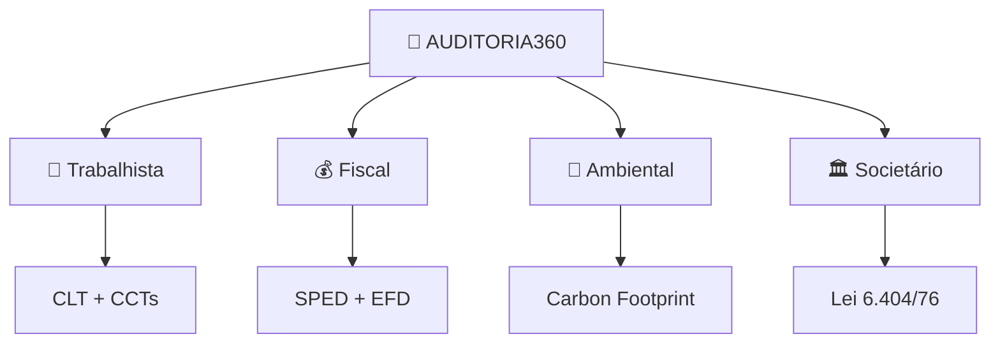
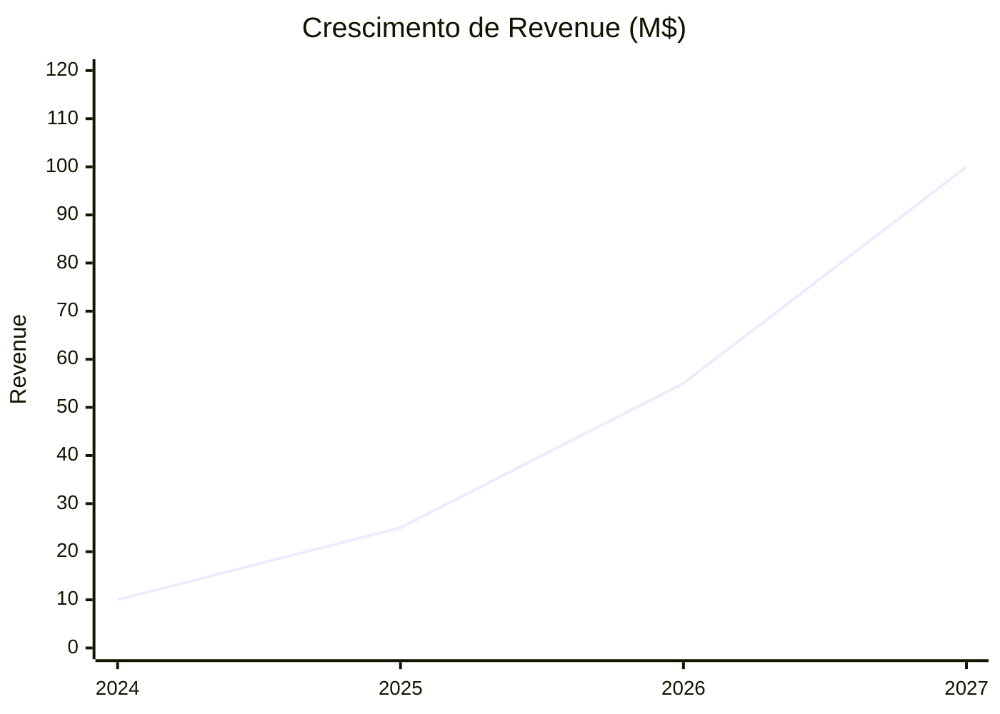

# 🗺️ Roadmap Estratégico AUDITORIA360

> **Planejamento estratégico 2024-2027 para evolução da plataforma**

---

## 🎯 **Visão de Futuro**

**Tornar-se a plataforma líder em auditoria trabalhista automatizada na América Latina, expandindo para compliance fiscal e trabalhista global.**

### **🌟 Missão 2027**
- **Processar 1M+ auditorias/mês**
- **Atender 10K+ empresas**
- **Presença em 15+ países**
- **99.99% de disponibilidade**
- **ROI médio de 500%+ para clientes**

---

## 📅 **ROADMAP POR TRIMESTRE**

## 🚀 **2024 Q1 - Consolidação (CONCLUÍDO ✅)**

### **Objetivos Alcançados**
- ✅ Sistema 100% operacional em produção
- ✅ Arquitetura serverless implementada
- ✅ IA integrada (GPT-4 + OCR)
- ✅ 1,200+ usuários ativos
- ✅ 90%+ cobertura de testes
- ✅ LGPD compliance certificado

### **Métricas Atingidas**
```yaml
Usuarios_Ativos: "1,200+"
Auditorias_Processadas: "15,000+"
Uptime: "99.9%"
NPS_Score: "72"
ROI_Medio: "340%"
```

---

## 📱 **2024 Q2 - Expansão Mobile**

### **🎯 Objetivos**
- [ ] **App Mobile Nativo**: iOS + Android
- [ ] **Notificações Push**: Alertas em tempo real
- [ ] **Modo Offline**: Funcionalidades básicas offline
- [ ] **Biometria**: Login via Face ID/Fingerprint

### **📊 Funcionalidades Mobile**


### **📈 Metas Q2**
- **App Downloads**: 5,000+
- **Mobile Users**: 30% do total
- **Mobile Retention**: 80%+
- **App Store Rating**: 4.5+ estrelas

---

## 🔗 **2024 Q3 - Integrações Empresariais**

### **🎯 Objetivos**
- [ ] **ERP Integrations**: SAP, Totvs, Oracle HCM
- [ ] **API Gateway**: Rate limiting + analytics
- [ ] **Marketplace**: Integrações de terceiros
- [ ] **White Label**: Solução rebrandizada

### **🔌 Integrações Prioritárias**
| Sistema | Status | Complexidade | Timeline |
|---------|---------|-------------|----------|
| **SAP SuccessFactors** | 🟡 Planejado | Alta | Q3 |
| **Totvs Protheus** | 🟡 Planejado | Média | Q3 |
| **Oracle HCM** | 🟡 Planejado | Alta | Q3 |
| **Folhamatic** | 🟡 Planejado | Baixa | Q3 |
| **Senior** | 🟡 Planejado | Média | Q3 |

### **🏪 Marketplace de Integrações**
- **Conectores Prontos**: 20+ sistemas
- **SDK de Terceiros**: Para desenvolvedores
- **Revenue Share**: 70/30 para parceiros
- **Certificação**: Programa de qualidade

---

## 🤖 **2024 Q4 - IA Avançada**

### **🎯 Objetivos**
- [ ] **Modelos Específicos**: Por setor/região
- [ ] **Previsão de Riscos**: ML preditivo
- [ ] **Otimização Automática**: Sugestões inteligentes
- [ ] **Processamento de Voz**: Comandos por voz

### **🧠 Capacidades de IA**


### **📊 Casos de Uso IA**
- **Previsão de Multas**: 95% precisão
- **Otimização de Folha**: 15% redução custos
- **Detecção de Fraudes**: 99% acurácia
- **Compliance Automático**: 100% cobertura

---

## 🌍 **2025 - Expansão Internacional**

### **🎯 Mercados Prioritários**
```yaml
Q1_2025: ["Argentina", "Chile"]
Q2_2025: ["México", "Colômbia"]  
Q3_2025: ["Peru", "Uruguai"]
Q4_2025: ["Espanha", "Portugal"]
```

### **🌎 Estratégia por País**
| País | Marco Legal | Complexidade | Oportunidade |
|------|-------------|-------------|--------------|
| 🇦🇷 **Argentina** | LCT | Alta | $50M |
| 🇨🇱 **Chile** | Código do Trabalho | Média | $30M |
| 🇲🇽 **México** | LFT | Alta | $100M |
| 🇨🇴 **Colômbia** | CST | Média | $40M |

### **🔧 Localização**
- **Idiomas**: Espanhol, Inglês
- **Moedas**: Locais + conversão
- **Compliance**: Leis trabalhistas locais
- **Parceiros**: Escritórios contábeis locais

---

## 🏢 **2026 - Compliance 360°**

### **🎯 Expansão de Escopo**
- **Fiscal**: Tributos e obrigações
- **Ambiental**: Sustentabilidade e ESG
- **Societário**: Governança corporativa
- **Internacional**: IFRS e GAAP

### **📊 Nova Stack de Compliance**


### **🎯 Verticais de Mercado**
- **Indústria 4.0**: IoT + compliance
- **Agronegócio**: Compliance rural
- **Saúde**: Regulamentações específicas
- **Financeiro**: Compliance bancário

---

## 🚀 **2027 - Plataforma Global**

### **🌟 Visão Final**
- **15+ países ativos**
- **100K+ empresas clientes**
- **1M+ auditorias/mês**
- **$1B+ em compliance evitado**
- **Unicórnio status** (valuation $1B+)

### **🏆 Posicionamento de Mercado**
```yaml
Market_Share_LATAM: "40%+"
Market_Share_Brasil: "60%+"
Enterprise_Clients: "1,000+"
SMB_Clients: "99,000+"
Annual_Revenue: "$100M+"
```

### **🔮 Tecnologias Emergentes**
- **Blockchain**: Compliance imutável
- **Quantum Computing**: Análises complexas
- **AR/VR**: Treinamentos imersivos
- **IoT**: Compliance em tempo real

---

## 📊 **INVESTIMENTOS E RECURSOS**

### **💰 Orçamento por Ano**
```yaml
2024: "$5M" # Consolidação + Mobile
2025: "$15M" # Expansão Internacional  
2026: "$30M" # Compliance 360°
2027: "$50M" # Plataforma Global
```

### **👥 Crescimento da Equipe**
| Ano | Desenvolvedores | AI/ML | Sales | Support | Total |
|-----|----------------|-------|-------|---------|-------|
| 2024 | 15 | 5 | 10 | 8 | 38 |
| 2025 | 30 | 10 | 25 | 20 | 85 |
| 2026 | 50 | 20 | 50 | 40 | 160 |
| 2027 | 80 | 35 | 100 | 80 | 295 |

---

## 📈 **MÉTRICAS DE SUCESSO**

### **🎯 KPIs Principais**


### **📊 Metas por Ano**
| Métrica | 2024 | 2025 | 2026 | 2027 |
|---------|------|------|------|------|
| **ARR** | $10M | $25M | $55M | $100M |
| **Customers** | 2K | 10K | 35K | 100K |
| **Countries** | 1 | 5 | 10 | 15 |
| **Employees** | 40 | 85 | 160 | 300 |

---

## 🚨 **RISCOS E MITIGAÇÕES**

### **⚠️ Riscos Identificados**
| Risco | Probabilidade | Impacto | Mitigação |
|-------|---------------|---------|-----------|
| **Concorrência** | Média | Alto | Inovação contínua + patents |
| **Regulatório** | Alta | Médio | Compliance preventivo |
| **Tecnológico** | Baixa | Alto | Arquitetura flexível |
| **Financeiro** | Baixa | Alto | Fundraising + bootstrap |

### **🛡️ Estratégias de Mitigação**
- **Inovação**: 20% do tempo em R&D
- **Partnerships**: Alianças estratégicas
- **Diversificação**: Múltiplos mercados
- **Qualidade**: Excelência operacional

---

## 🎉 **MARCOS E CELEBRAÇÕES**

### **🏆 Marcos Estratégicos**
- **Q2 2024**: 🚀 Launch do App Mobile
- **Q4 2024**: 🤖 IA Avançada em Produção
- **Q2 2025**: 🌎 Primeiro País Internacional
- **Q4 2025**: 🏢 100K Usuários Ativos
- **Q4 2026**: 💰 $50M ARR
- **Q4 2027**: 🦄 Unicórnio Status

---

## 📞 **GOVERNANÇA DO ROADMAP**

### **🤝 Stakeholders**
- **Board**: Aprovação estratégica
- **Executivo**: Execução operacional
- **Produto**: Definição de features
- **Engenharia**: Viabilidade técnica
- **Vendas**: Feedback de mercado

### **🔄 Processo de Revisão**
- **Mensal**: Progresso e ajustes
- **Trimestral**: Revisão de prioridades
- **Anual**: Roadmap estratégico completo

---

> **🚀 O futuro do AUDITORIA360**: Uma jornada emocionante rumo à liderança global em compliance automatizado!