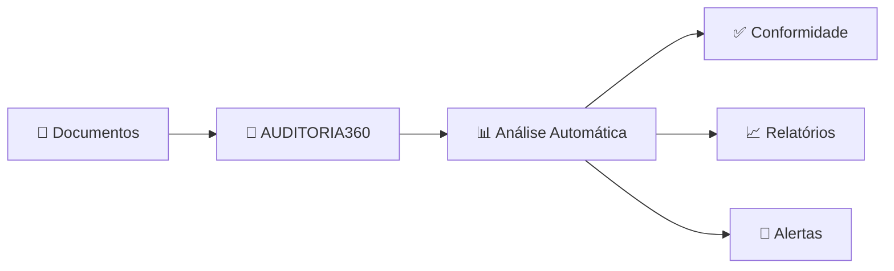
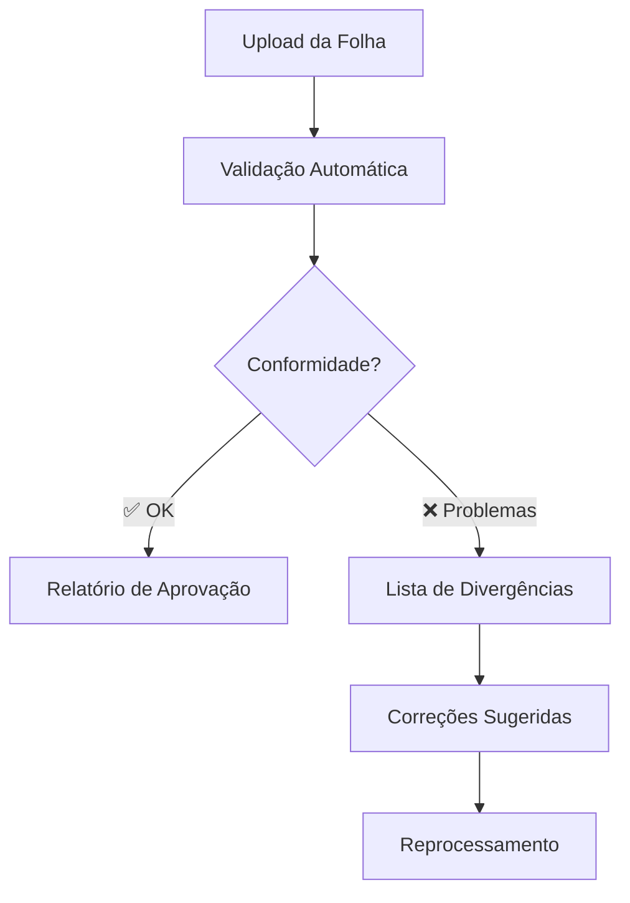
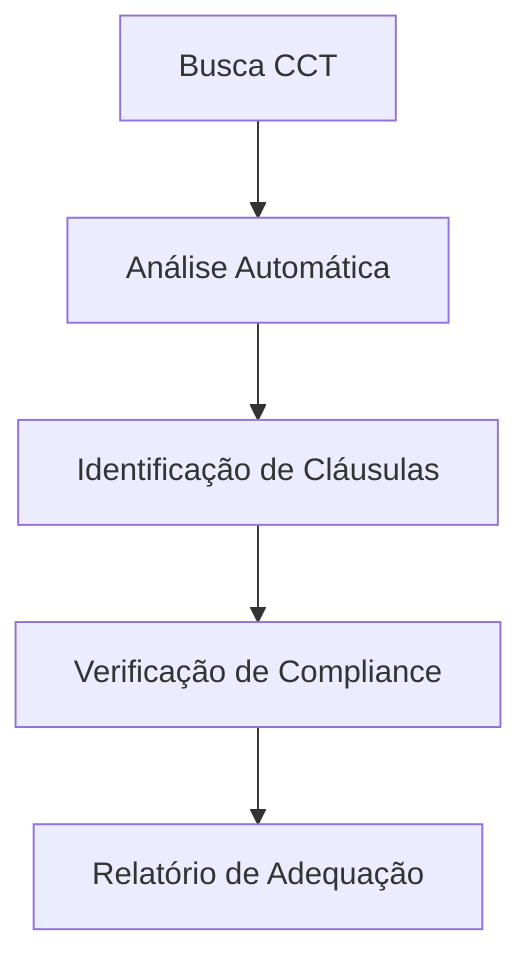

# 🚀 Início Rápido - AUDITORIA360

> **Configure e use o AUDITORIA360 em menos de 5 minutos!**

---

## 🎯 **O que é o AUDITORIA360?**

O AUDITORIA360 é um **portal inteligente e automatizado** que revoluciona a gestão de:

- ✅ **Folha de Pagamento**: Processamento e validação automática
- ✅ **Auditoria 360°**: Análise completa de conformidade  
- ✅ **CCT Digital**: Gestão inteligente de convenções coletivas
- ✅ **Compliance**: Monitoramento de obrigações trabalhistas



---

## ⚡ **Início em 3 Passos**

### **Passo 1: Acesso** 🔐
```bash
# URL do Portal (configurar conforme ambiente)
https://auditoria360.suaempresa.com.br

# Credenciais fornecidas pelo administrador
Usuario: seu.email@empresa.com.br
Senha: [fornecida pelo admin]
```

### **Passo 2: Dashboard Principal** 📊
Após login, você verá:

- **🎯 Visão Geral**: Status geral dos processos
- **📈 Métricas**: KPIs em tempo real  
- **🚨 Alertas**: Itens que precisam de atenção
- **📋 Tarefas**: Pendências prioritárias

### **Passo 3: Primeira Auditoria** 🔍
1. Clique em **"Nova Auditoria"**
2. Selecione o **tipo de análise**
3. Faça **upload dos documentos**
4. Aguarde o **processamento automático**
5. Revise os **resultados e recomendações**

---

## 🎯 **Fluxos Principais**

### 📄 **Auditoria de Folha**


### 📋 **Gestão de CCT**


---

## 🔧 **Funcionalidades Principais**

| Funcionalidade | Descrição | Status |
|---|---|---|
| 🤖 **IA Integrada** | Análise inteligente de documentos | ✅ Ativo |
| 📊 **Dashboard** | Visualizações interativas em tempo real | ✅ Ativo |
| 🔍 **Auditoria 360°** | Análise completa de conformidade | ✅ Ativo |
| 📱 **Mobile Ready** | Interface responsiva | ✅ Ativo |
| 🔒 **Segurança** | Criptografia e compliance LGPD | ✅ Ativo |
| 🤝 **Integrações** | APIs para sistemas externos | ✅ Ativo |

---

## 📱 **Interface do Sistema**

### **Tela Principal**
- **Header**: Logo, menu principal, perfil do usuário
- **Sidebar**: Navegação rápida por módulos
- **Dashboard Central**: Cards com métricas principais
- **Área de Trabalho**: Conteúdo específico por módulo

### **Navegação Rápida**
| Ícone | Módulo | Função |
|---|---|---|
| 📊 | **Dashboard** | Visão geral e métricas |
| 🔍 | **Auditoria** | Iniciar nova auditoria |
| 📋 | **CCT** | Gestão de convenções |
| 📈 | **Relatórios** | Histórico e análises |
| ⚙️ | **Configurações** | Preferências do sistema |

---

## 💡 **Dicas Essenciais**

### ⚡ **Produtividade**
- Use **atalhos de teclado** (`Ctrl+/` para ajuda)
- Configure **alertas personalizados**
- Aproveite os **templates pré-definidos**
- Use **filtros avançados** nas buscas

### 🎯 **Melhores Práticas**
- **📅 Agende auditorias** regulares
- **📋 Revise relatórios** sistematicamente  
- **🔄 Mantenha dados** sempre atualizados
- **📚 Consulte documentação** para dúvidas

---

## 🆘 **Precisa de Ajuda?**

### 🔗 **Links Úteis**
- **[📖 Manual Completo](./user-guide)** - Guia detalhado
- **[❓ FAQ](./faq)** - Perguntas frequentes
- **[🛠️ Troubleshooting](../developer-guides/troubleshooting)** - Solução de problemas

### 📞 **Suporte**
- **Email**: suporte@auditoria360.com.br
- **Chat**: Disponível no canto inferior direito
- **Telefone**: 0800-XXX-XXXX (horário comercial)

---

> **🎉 Parabéns!** Você está pronto para usar o AUDITORIA360. Explore os recursos e descubra como automatizar seus processos de auditoria!