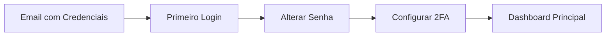
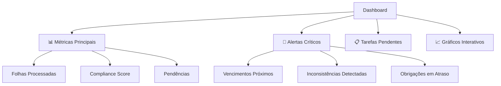
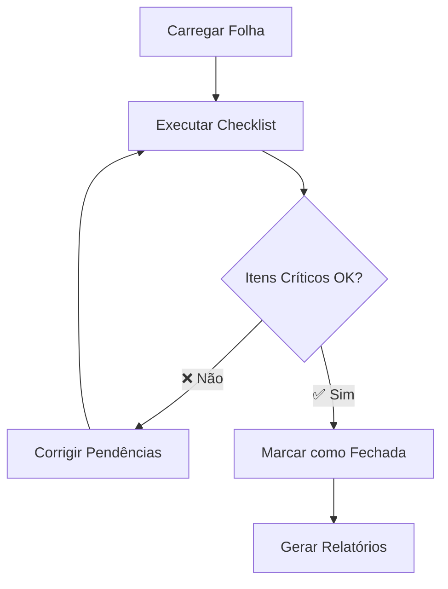

# 📖 Manual do Usuário - AUDITORIA360

> **Guia completo para usar todas as funcionalidades do sistema**

---

## 🎯 **Visão Geral**

O AUDITORIA360 é um sistema inteligente que automatiza e centraliza todos os processos relacionados à:

- **Gestão de Folha de Pagamento**
- **Auditoria e Compliance**
- **Convenções Coletivas de Trabalho**
- **Obrigações Trabalhistas**

---

## 🔐 **1. Acesso ao Sistema**

### **Login**
1. Acesse: `https://app.auditoria360.com`
2. Insira seu **email corporativo**
3. Digite sua **senha** 
4. Clique em **"Entrar"**

### **Primeiro Acesso**
- Você receberá credenciais temporárias por email
- **Obrigatório** alterar a senha no primeiro login
- Configure autenticação em dois fatores (recomendado)

---

## 👥 **2. Perfis de Usuário**

| Perfil | Permissões | Principais Funcionalidades |
|--------|------------|---------------------------|
| 🔧 **Administrador** | Total | Configurações, usuários, relatórios completos |
| 👥 **RH** | Gestão de pessoal | Folha, funcionários, benefícios |
| 📊 **Contador** | Fiscais e financeiro | Relatórios, compliance, obrigações |
| 👤 **Colaborador** | Consulta pessoal | Holerites, dados pessoais, benefícios |
| 🤝 **Sindicato** | CCTs | Convenções coletivas, negociações |

---

## 🏠 **3. Dashboard Principal**

### **Visão Geral**
O dashboard é personalizado conforme seu perfil:

### **Navegação**
- **Header Superior**: Logo, busca global, notificações, perfil
- **Menu Lateral**: Módulos principais (retrátil)
- **Área Central**: Conteúdo específico
- **Footer**: Links úteis e informações do sistema

---

## 📋 **4. Módulos Principais**

### **4.1 Gestão de Folha**

#### **Processamento de Folha**
1. Acesse **"Folha de Pagamento"** > **"Nova Folha"**
2. Selecione o **período** (mensal/semanal)
3. **Importe dados** ou digite manualmente
4. Execute **validação automática**
5. Revise **inconsistências** detectadas
6. **Confirme processamento**

#### **Checklist de Fechamento**

**Como usar o Checklist:**
1. Selecione a folha processada
2. Clique em **"Carregar Checklist"**
3. Para cada item:
   - **Status**: Pendente → Em Andamento → Concluído
   - **Notas**: Adicione observações
   - **Responsável**: Atribua a um colaborador
   - **💡 Dicas de IA**: Use para orientações
4. **Itens críticos** devem estar concluídos
5. Confirme e **"Marcar Folha como Fechada"**

### **4.2 Auditoria e Compliance**

#### **Nova Auditoria**
1. **"Auditoria"** > **"Nova Análise"**
2. Escolha o **tipo**:
   - 📄 Folha de Pagamento
   - 🏛️ Obrigações Acessórias
   - 📋 Convenções Coletivas
   - 🔍 Compliance Geral
3. **Upload** de documentos
4. Aguarde **processamento automático**
5. Analise **resultados** e **recomendações**

#### **Resultados da Auditoria**
- **✅ Conformidade**: Itens aprovados
- **⚠️ Alertas**: Pontos de atenção  
- **❌ Não Conformidades**: Correções obrigatórias
- **📝 Recomendações**: Melhorias sugeridas

### **4.3 Convenções Coletivas (CCT)**

#### **Busca e Consulta**
1. **"CCT"** > **"Buscar Convenção"**
2. Filtros disponíveis:
   - **Sindicato**
   - **Categoria**
   - **Região**
   - **Vigência**
3. Visualize **cláusulas importantes**
4. Verifique **compliance automático**

#### **Análise de Adequação**
- Sistema compara folha vs. CCT automaticamente
- Destaca **divergências** encontradas
- Sugere **correções** necessárias

---

## 📊 **5. Relatórios e Exportações**

### **Tipos de Relatórios**
- 📈 **Gerenciais**: Visão estratégica
- 📋 **Operacionais**: Detalhes de processos
- 🔍 **Auditoria**: Compliance e conformidade
- 📊 **Analíticos**: Tendências e insights

### **Como Gerar**
1. **"Relatórios"** > Escolha o tipo
2. Configure **filtros**:
   - Período
   - Departamento
   - Tipo de funcionário
   - Localização
3. Selecione **formato**:
   - 📄 PDF
   - 📊 Excel
   - 📋 CSV
   - 🌐 Online
4. **Gerar** e **baixar**

---

## ⚙️ **6. Configurações Pessoais**

### **Perfil do Usuário**
- **"Configurações"** > **"Meu Perfil"**
- Altere dados pessoais
- Defina foto do perfil
- Configure preferências de idioma

### **Segurança**
- **Alterar senha**: Mínimo 8 caracteres
- **2FA**: Ative autenticação em dois fatores
- **Sessões ativas**: Monitore dispositivos conectados

### **Notificações**
Configure quando receber alertas:
- 📧 **Email**: Resumos diários/semanais
- 🔔 **Sistema**: Notificações em tempo real
- 📱 **Push**: Alertas críticos

---

## 🎯 **7. Dicas de Produtividade**

### **⌨️ Atalhos de Teclado**
| Atalho | Função |
|--------|--------|
| `Ctrl + /` | Menu de ajuda |
| `Ctrl + K` | Busca global |
| `Alt + 1` | Dashboard |
| `Alt + 2` | Folha |
| `Alt + 3` | Auditoria |
| `Alt + 4` | Relatórios |

### **🎯 Melhores Práticas**
- **📅 Agende auditorias** mensalmente
- **🔄 Mantenha dados** atualizados
- **📋 Use templates** para agilizar
- **🔍 Configure alertas** personalizados
- **📚 Consulte documentação** regularmente

### **📱 Acesso Mobile**
- Interface **responsiva** funciona em tablets
- **App móvel** em desenvolvimento
- **Notificações push** disponíveis

---

## 🆘 **8. Solução de Problemas**

### **Problemas Comuns**

#### **❌ Não consigo fazer login**
1. Verifique **email** e **senha**
2. Tente **recuperar senha**
3. Limpe **cache** do navegador
4. Contate **suporte** se persistir

#### **⚠️ Erro ao carregar folha**
1. Verifique **formato** do arquivo
2. Confirme **tamanho** (máx. 50MB)
3. Teste com **arquivo menor**
4. Consulte **templates** disponíveis

#### **🐌 Sistema lento**
1. Verifique **conexão** de internet
2. Feche **abas desnecessárias**
3. Atualize o **navegador**
4. Tente em **horário alternativo**

### **📞 Canais de Suporte**
- **📧 Email**: suporte@auditoria360.com.br
- **💬 Chat**: Canto inferior direito (horário comercial)
- **📞 Telefone**: 0800-XXX-XXXX
- **🎫 Ticket**: Dentro do sistema > "Ajuda"

---

## 📚 **9. Recursos Adicionais**

### **🎓 Treinamentos**
- **Webinars** quinzenais
- **Tutoriais** em vídeo
- **Certificação** de usuários
- **Workshops** presenciais

### **📖 Documentação**
- **[❓ FAQ](./faq)** - Perguntas frequentes
- **[🔧 Troubleshooting](../developer-guides/troubleshooting)** - Resolução de problemas
- **[📱 Novidades](../strategic/changelog)** - Atualizações do sistema

---

> **💡 Importante**: Este manual é atualizado automaticamente. Para informações sempre atualizadas, consulte esta documentação online!