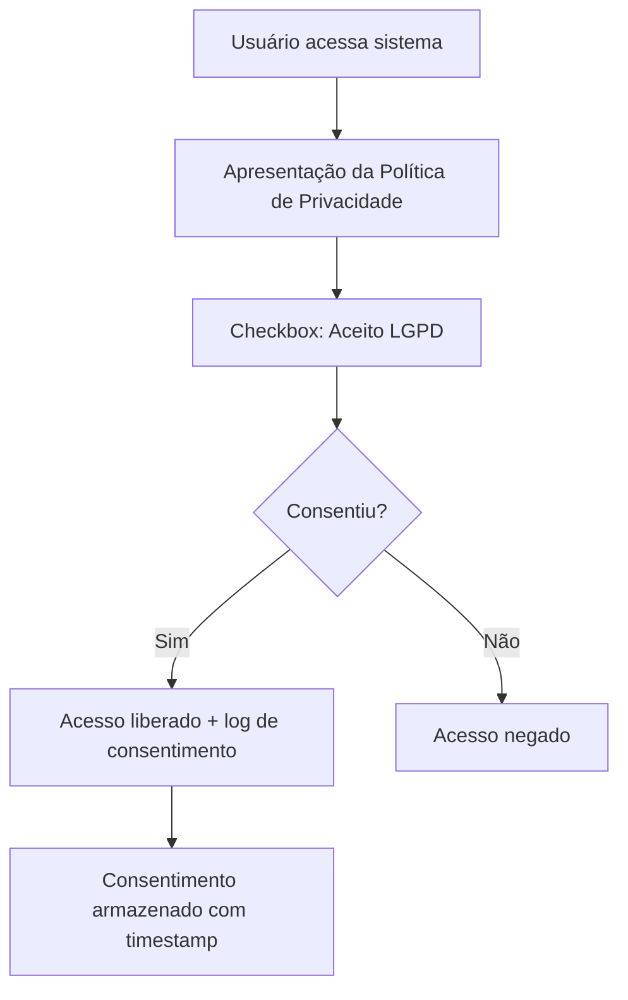

# 🔐 AUDITORIA360 - Guia de Conformidade e Segurança

*Garantindo LGPD, segurança e compliance em ambiente multi-tenant*

---

## 🎯 Visão Geral de Segurança

### Princípios Fundamentais
- **Isolamento Multi-Tenant**: Dados completamente segregados por contabilidade
- **Least Privilege**: Acesso mínimo necessário por usuário
- **Defense in Depth**: Múltiplas camadas de segurança
- **Audit Trail**: Rastreabilidade completa de todas as operações
- **Data Encryption**: Criptografia em trânsito e em repouso

---

## 🏛️ Arquitetura de Segurança Multi-Tenant

### Row Level Security (RLS) - Implementação
```sql
-- Política RLS para isolamento por contabilidade
CREATE POLICY "isolamento_contabilidade" ON public.usuarios
  USING (contabilidade_id = current_setting('app.current_contabilidade_id')::uuid);

-- Aplicada em todas as tabelas principais:
- usuarios
- clientes_finais  
- auditorias
- relatorios
- documentos
```

### Níveis de Acesso
| Perfil | Permissões | Escopo |
|--------|------------|---------|
| **Super Admin** | CRUD completo | Todas contabilidades |
| **Admin Contabilidade** | CRUD contabilidade própria | Contabilidade específica |
| **Operador** | Leitura + auditorias | Clientes atribuídos |
| **Cliente Final** | Leitura relatórios próprios | Dados próprios apenas |

---

## ⚖️ Conformidade LGPD

### Checklist de Compliance LGPD

#### 📋 Mapeamento de Dados Pessoais
- [x] **Dados Identificadores**
  - CPF/CNPJ dos clientes finais
  - Nomes completos de funcionários
  - Emails e telefones de contato
  - Endereços completos

- [x] **Dados Sensíveis** 
  - Dados bancários (contas salário)
  - Informações médicas (afastamentos)
  - Dados sindicais
  - Informações salariais detalhadas

- [x] **Dados de Localização**
  - Endereços de trabalho
  - IPs de acesso ao sistema
  - Logs de geolocalização (opcional)

#### ✅ Consentimento e Base Legal

##### Fluxo de Consentimento no Onboarding


##### Bases Legais Utilizadas
- **Consentimento**: Para dados não necessários ao serviço
- **Execução de Contrato**: Para dados essenciais à auditoria
- **Legítimo Interesse**: Para melhorias do sistema
- **Cumprimento Legal**: Para obrigações trabalhistas

#### 🛡️ Direitos dos Titulares

##### Implementação dos Direitos LGPD
```http
# Portabilidade de dados
GET /api/lgpd/portabilidade/{user_id}
Authorization: Bearer <token>

# Retificação de dados
PUT /api/lgpd/retificacao/{user_id}
{
  "campo": "email",
  "valor_novo": "novo@email.com",
  "justificativa": "Email incorreto"
}

# Exclusão de dados (Right to be forgotten)
DELETE /api/lgpd/exclusao/{user_id}
{
  "motivo": "Solicitação do titular",
  "manter_logs_legais": true
}

# Histórico de processamento
GET /api/lgpd/historico/{user_id}
```

##### Processo de Anonimização
```python
def anonimizar_usuario(user_id: str):
    """Anonimiza dados do usuário mantendo integridade referencial"""
    updates = {
        'nome': f'Usuário Anonimizado {hash(user_id)[:8]}',
        'email': f'anonimizado_{hash(user_id)[:8]}@exemplo.com',
        'cpf': None,
        'telefone': None,
        'endereco': 'Endereço removido por solicitação LGPD',
        'data_anonimizacao': datetime.now(),
        'status': 'anonimizado'
    }
    # Manter referências para integridade do sistema
    # Logs de auditoria permanecem para compliance legal
```

---

## 🔒 Implementação de Segurança Técnica

### Checklist de Segurança Técnica

#### 🔐 Autenticação e Autorização
- [x] **JWT Tokens** com expiração configurável
- [x] **Refresh Tokens** para renovação automática
- [x] **Rate Limiting** para prevenir brute force
- [x] **2FA** (implementação opcional)
- [x] **Session Management** com timeout automático

```python
# Configuração JWT
JWT_SECRET_KEY = os.getenv("JWT_SECRET_KEY")  # 256-bit key
JWT_ALGORITHM = "HS256"
ACCESS_TOKEN_EXPIRE_MINUTES = 60
REFRESH_TOKEN_EXPIRE_DAYS = 7

# Rate Limiting
@limiter.limit("5 per minute")
@router.post("/auth/login")
async def login():
    # Implementação com tentativas limitadas
```

#### 🛡️ Proteção de Dados
- [x] **Encryption at Rest**: Banco Supabase com criptografia AES-256
- [x] **Encryption in Transit**: HTTPS/TLS 1.3 obrigatório
- [x] **Hashing Senhas**: bcrypt com salt único
- [x] **API Keys** criptografadas no banco
- [x] **Backup Criptografado**: Backups com chaves separadas

```python
# Hash de senhas
from passlib.context import CryptContext
pwd_context = CryptContext(schemes=["bcrypt"], deprecated="auto")

# Criptografia de dados sensíveis  
from cryptography.fernet import Fernet
cipher_suite = Fernet(ENCRYPTION_KEY)
dados_criptografados = cipher_suite.encrypt(dados_sensíveis.encode())
```

#### 🚨 Monitoramento e Auditoria
- [x] **Logs de Auditoria** para todas operações CRUD
- [x] **Failed Login Tracking** com bloqueio automático
- [x] **Data Access Logs** com timestamp e user ID
- [x] **Anomaly Detection** para padrões suspeitos
- [x] **Export de Logs** para auditoria externa

```python
# Log de auditoria
@audit_log
def criar_cliente(cliente_data: dict, current_user: User):
    log_entry = {
        'timestamp': datetime.now(),
        'user_id': current_user.id,
        'contabilidade_id': current_user.contabilidade_id,
        'action': 'CREATE_CLIENT',
        'resource_id': new_client.id,
        'details': 'Cliente criado com sucesso',
        'ip_address': request.client.host
    }
    audit_logger.info(log_entry)
```

---

## 🔧 Configurações de Segurança por Ambiente

### Ambiente de Desenvolvimento
```yaml
# .env.development
ENVIRONMENT=development
JWT_SECRET_KEY=dev-secret-key-256bit
DATABASE_SSL_MODE=prefer
RATE_LIMIT_ENABLED=false
DEBUG_MODE=true
CORS_ORIGINS=["http://localhost:3000", "http://localhost:5173"]
```

### Ambiente de Produção
```yaml
# .env.production (exemplo - usar secrets manager)
ENVIRONMENT=production
JWT_SECRET_KEY=${SECRETS_MANAGER_JWT_KEY}
DATABASE_SSL_MODE=require
RATE_LIMIT_ENABLED=true
DEBUG_MODE=false
CORS_ORIGINS=["https://auditoria360.com"]
HTTPS_ONLY=true
SECURE_COOKIES=true
```

---

## 📊 Monitoramento de Compliance

### Métricas de Segurança
```python
# Métricas importantes para acompanhar
security_metrics = {
    'failed_logins_per_hour': 0,
    'data_breach_attempts': 0,
    'unauthorized_access_attempts': 0,
    'lgpd_requests_pending': 0,
    'data_retention_violations': 0,
    'ssl_certificate_expiry_days': 90
}
```

### Dashboard de Compliance
- **🔍 Auditoria em Tempo Real**: Visualização de logs críticos
- **📊 Métricas LGPD**: Requests de portabilidade, exclusão, etc.
- **🚨 Alertas de Segurança**: Notificações automáticas
- **📈 Relatórios Periódicos**: Relatórios mensais/trimestrais

---

## 🚨 Plano de Resposta a Incidentes

### Processo de Resposta a Data Breach

#### Fase 1: Detecção (0-1 hora)
1. **Alerta Automático**: Sistema detecta anomalia
2. **Verificação**: Equipe confirma incidente
3. **Isolamento**: Bloqueio imediato do vetor de ataque
4. **Comunicação Interna**: Notificação da equipe de segurança

#### Fase 2: Contenção (1-4 horas)  
1. **Análise de Impacto**: Identificar dados afetados
2. **Contenção**: Parar propagação do incidente
3. **Preservação**: Backup de evidências forenses
4. **Comunicação**: Notificar stakeholders internos

#### Fase 3: Notificação (4-72 horas)
1. **ANPD**: Notificação obrigatória (72h)
2. **Titulares**: Comunicação aos afetados
3. **Autoridades**: Se necessário, polícia/MP
4. **Mídia**: Se impacto significativo

#### Fase 4: Recuperação e Lições
1. **Recuperação**: Restaurar sistemas seguros
2. **Análise**: Root cause analysis
3. **Melhorias**: Implementar correções
4. **Documentação**: Relatório final

```python
# Template de resposta a incidentes
incident_response = {
    'incident_id': 'INC-2025-001',
    'detection_time': datetime.now(),
    'severity': 'HIGH',  # LOW, MEDIUM, HIGH, CRITICAL
    'affected_data': ['emails', 'names'],
    'affected_users_count': 150,
    'containment_actions': [
        'Blocked suspicious IP',
        'Revoked compromised tokens',
        'Enabled additional monitoring'
    ],
    'notifications_sent': {
        'anpd': True,
        'users': True,
        'internal_team': True
    }
}
```

---

## 📋 Checklist Final de Conformidade

### Implementação Técnica
- [x] RLS implementado em todas tabelas
- [x] Criptografia de dados sensíveis
- [x] HTTPS obrigatório
- [x] Logs de auditoria completos
- [x] Backup criptografado
- [ ] Penetration testing realizado
- [ ] Vulnerability assessment atualizado

### Processos e Documentação
- [x] Política de Privacidade atualizada
- [x] Termos de Uso adequados à LGPD  
- [x] Processo de consentimento implementado
- [x] Fluxo de direitos dos titulares
- [ ] Treinamento LGPD para equipe
- [ ] DPO (Data Protection Officer) designado

### Monitoramento e Resposta
- [x] Alertas de segurança configurados
- [x] Dashboard de compliance
- [x] Plano de resposta a incidentes
- [x] Métricas de segurança definidas
- [ ] Testes regulares do plano de resposta
- [ ] Auditoria externa agendada

---

## 🎯 Próximos Passos

### Curto Prazo (30 dias)
1. **Completar penetration testing**
2. **Designar DPO oficial**
3. **Realizar treinamento LGPD da equipe**
4. **Implementar 2FA opcional**

### Médio Prazo (90 dias)
1. **Auditoria externa completa**
2. **Certificação ISO 27001** (considerar)
3. **Implementar SIEM** (Security Information and Event Management)
4. **Automated compliance checking**

### Longo Prazo (1 ano)
1. **Certificações de segurança adicionais**
2. **Zero-trust architecture** implementation
3. **Advanced threat detection** com ML
4. **Compliance automation** completo

---

**Esta documentação deve ser revisada trimestralmente e atualizada conforme mudanças na legislação e na arquitetura do sistema.**