# Fluxogramas Detalhados, Status Operacional e Automação – AUDITORIA360

---

## Sumário

- [Admin – Universo 1](#admin--universo-1)
  - [Login/Admin](#loginadmin)
  - [Dashboard Estratégico](#dashboard-estratégico)
  - [Gestão de Contabilidades](#gestão-de-contabilidades)
  - [LOGOPERACOES / Auditoria de Sistema](#logoperacoes--auditoria-de-sistema)
  - [Personificação/Suporte Supremo](#personificaçãosuporte-supremo)
- [Cliente – Universo 2](#cliente--universo-2)
  - [Login/Onboarding](#loginonboarding)
  - [Controle Mensal](#controle-mensal)
  - [Disparo de Auditoria](#disparo-de-auditoria)
  - [Análise Forense](#análise-forense)
  - [Gestão de Regras e Legislação](#gestão-de-regras-e-legislação)
  - [Simulador de Impactos](#simulador-de-impactos)
  - [Geração de Relatórios](#geração-de-relatórios)
- [Funcionalidades Transversais](#funcionalidades-transversais)
  - [Integração com IA](#integração-com-ia)
  - [Logs e Auditoria](#logs-e-auditoria)
  - [Onboarding de Escritório](#onboarding-de-escritório)
  - [Gerenciamento de Usuários](#gerenciamento-de-usuários)
- [Status Operacional Automatizado](#status-operacional-automatizado)
- [Automação de Monitoramento](#automação-de-monitoramento)

---

## Admin – Universo 1

### Login/Admin

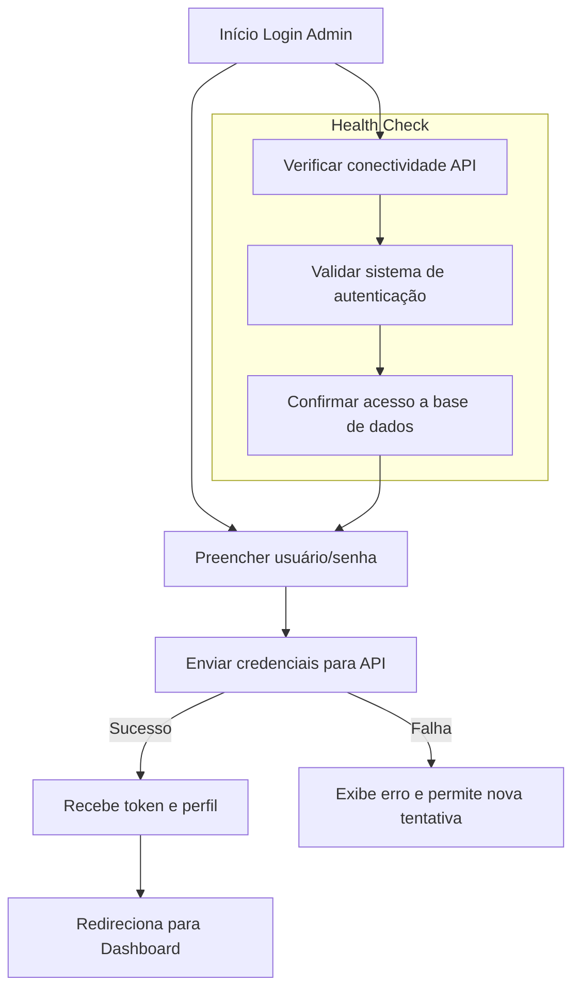

**Status**: ✅ FUNCIONANDO
**Health Check**: `/api/health/login_admin`

### Dashboard Estratégico

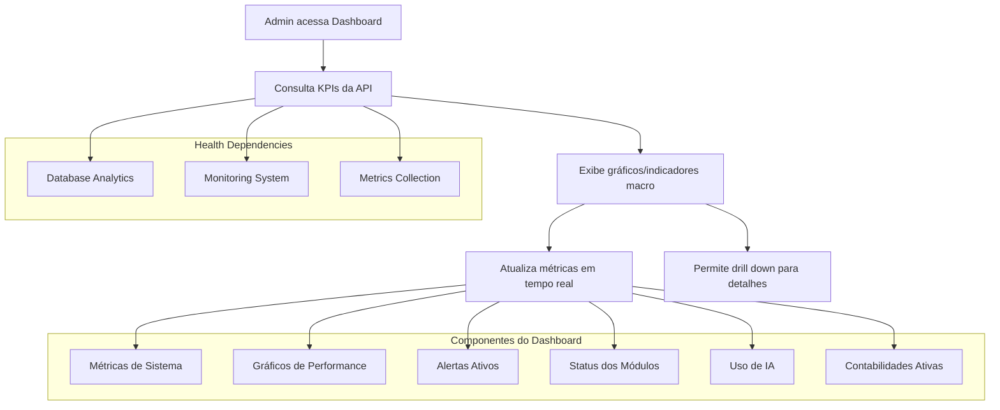

**Status**: ✅ FUNCIONANDO (Gráficos de IA em teste)
**Health Check**: `/api/health/dashboard`

### Gestão de Contabilidades

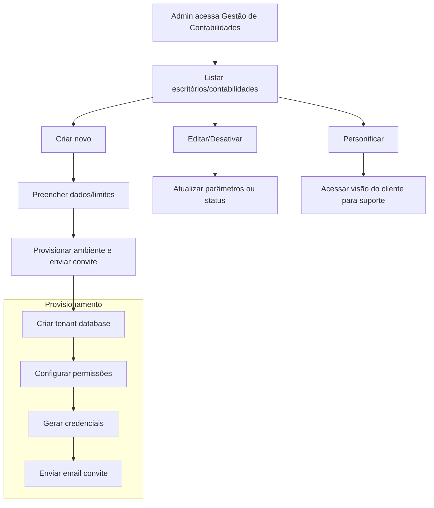

**Status**: ✅ FUNCIONANDO
**Health Check**: Integrado no sistema de gestão geral

### LOGOPERACOES / Auditoria de Sistema

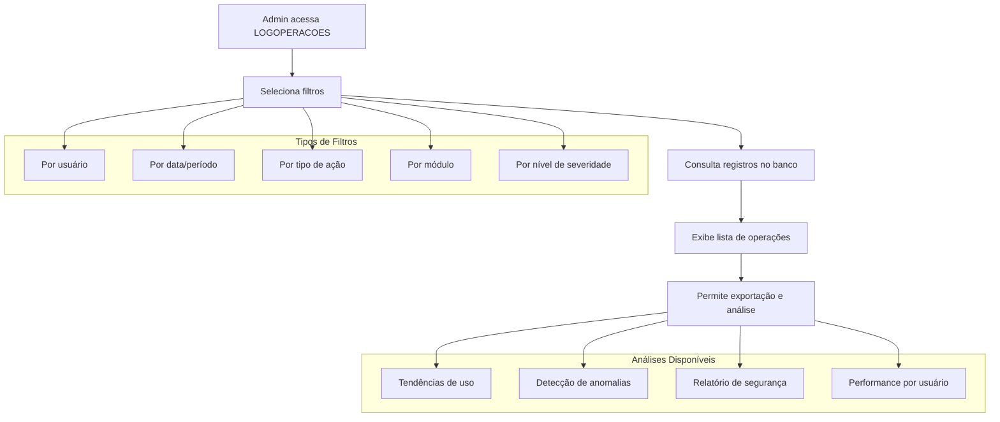

**Status**: ✅ FUNCIONANDO
**Health Check**: `/api/health/logoperacoes`

### Personificação/Suporte Supremo

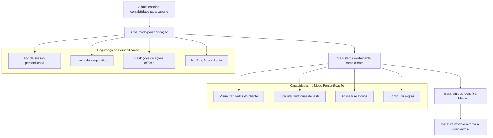

**Status**: ✅ FUNCIONANDO
**Health Check**: `/api/health/personificacao`

---

## Cliente – Universo 2

### Login/Onboarding

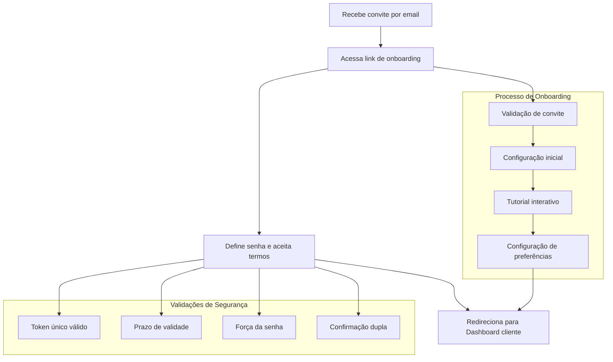

**Status**: ✅ FUNCIONANDO
**Health Check**: `/api/health/login_onboarding`

### Controle Mensal

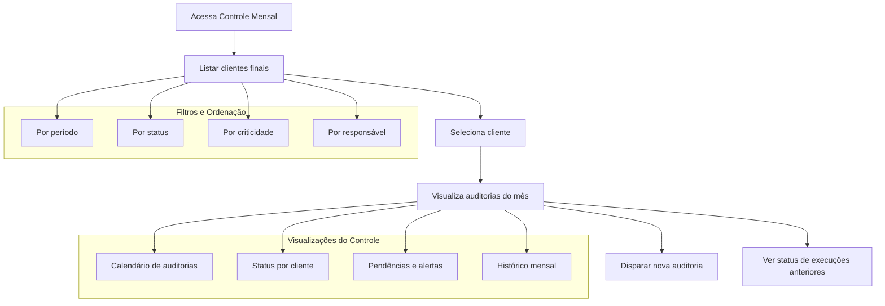

**Status**: ✅ FUNCIONANDO
**Health Check**: `/api/health/controle_mensal`

### Disparo de Auditoria

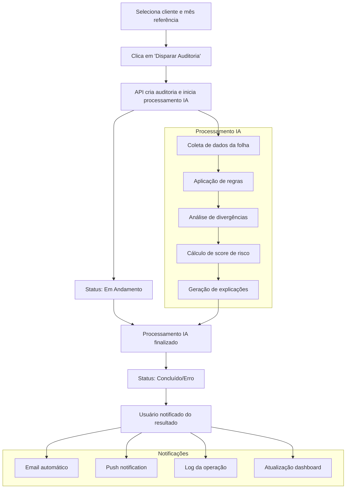

**Status**: ✅ FUNCIONANDO (Integração IA: 100%)
**Health Check**: `/api/health/disparo_auditoria`

### Análise Forense

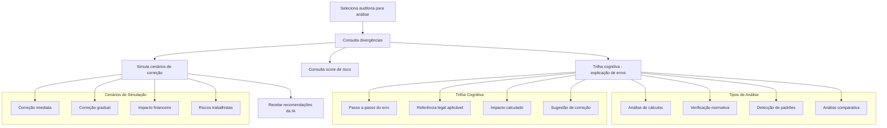

**Status**: ✅ FUNCIONANDO (Trilha cognitiva: EM TESTE)
**Health Check**: `/api/health/forense`

### Gestão de Regras e Legislação

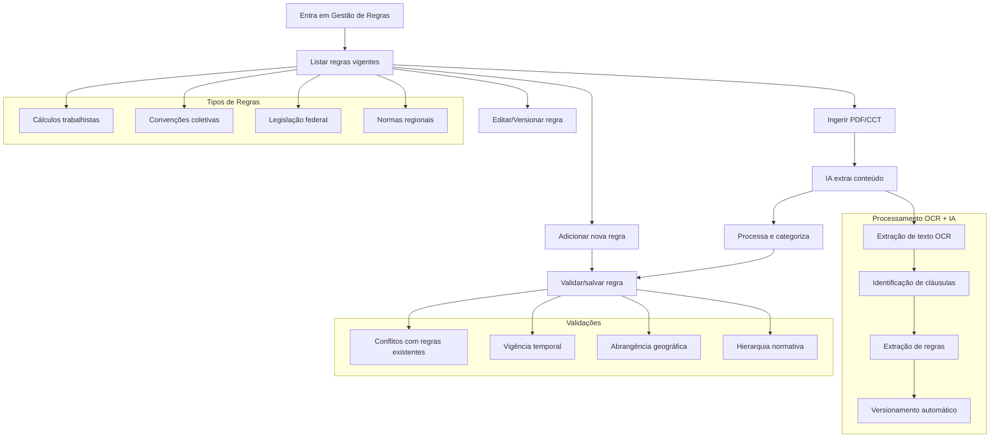

**Status**: ✅ FUNCIONANDO (Ingestão automática: EM DESENVOLVIMENTO)
**Health Check**: `/api/health/regras`

### Simulador de Impactos

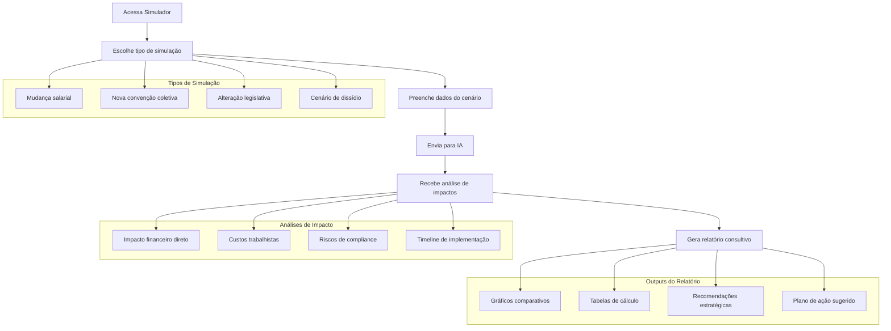

**Status**: 🚧 EM DESENVOLVIMENTO (IA em integração)
**Health Check**: `/api/health/simulador`

### Geração de Relatórios

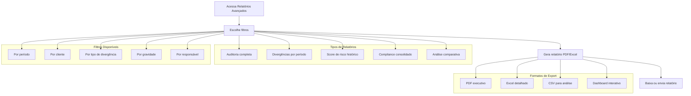

**Status**: ✅ FUNCIONANDO
**Health Check**: `/api/health/relatorios`

---

## Funcionalidades Transversais

### Integração com IA

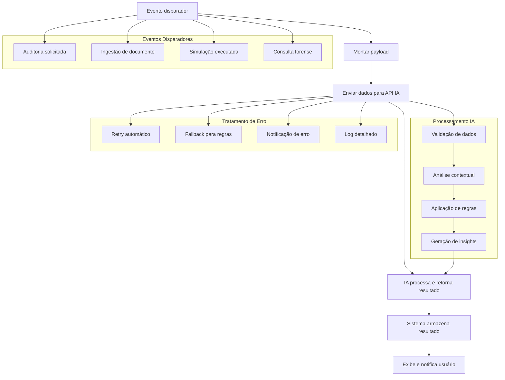

**Status**: ✅ FUNCIONANDO (Simulador em expansão)
**Health Check**: `/api/health/ia`

### Logs e Auditoria

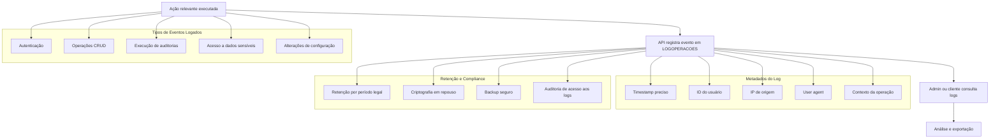

**Status**: ✅ FUNCIONANDO
**Health Check**: `/api/health/logs_auditoria`

### Onboarding de Escritório

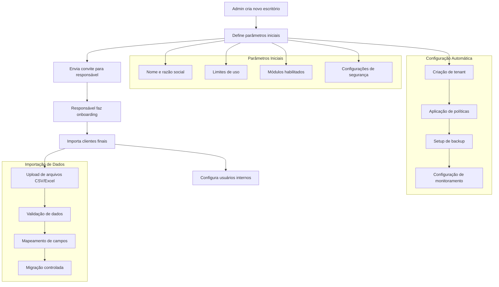

**Status**: ✅ FUNCIONANDO
**Health Check**: `/api/health/onboarding_escritorio`

### Gerenciamento de Usuários

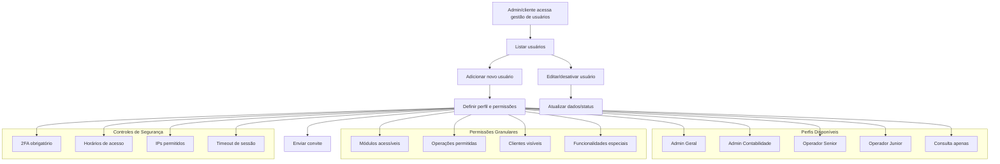

**Status**: ✅ FUNCIONANDO
**Health Check**: `/api/health/gerenciamento_usuarios`

---

## Status Operacional Automatizado

### Implementação do Sistema de Monitoramento

O sistema de monitoramento do AUDITORIA360 foi implementado com os seguintes componentes:

#### 1. Script de Monitoramento Automatizado

**Arquivo**: `automation/update_status.py`

- **Função**: Verifica o status de todos os módulos do sistema
- **Frequência**: Executado a cada 5 minutos via cron job
- **Saídas**: 
  - `processos_status_auditoria360.md` - Relatório em markdown
  - `status_report_auditoria360.json` - Dados estruturados JSON

**Módulos Monitorados**:
- Dashboard Estratégico
- Controle Mensal  
- Disparo de Auditoria
- Análise Forense
- Gestão de Regras e Legislação
- Simulador de Impactos
- Geração de Relatórios
- Integração com IA
- Login/Admin
- LOGOPERACOES/Auditoria de Sistema
- Personificação/Suporte Supremo
- Login/Onboarding
- Logs e Auditoria
- Onboarding de Escritório
- Gerenciamento de Usuários

#### 2. API Endpoints de Health Check

**Router**: `src/api/routers/health.py`

Endpoints implementados:

```
GET /api/health/                        # Status geral de todos os módulos
GET /api/health/dashboard               # Dashboard Estratégico
GET /api/health/controle_mensal         # Controle Mensal
GET /api/health/disparo_auditoria       # Disparo de Auditoria
GET /api/health/forense                 # Análise Forense
GET /api/health/regras                  # Gestão de Regras
GET /api/health/simulador               # Simulador de Impactos
GET /api/health/relatorios              # Geração de Relatórios
GET /api/health/ia                      # Integração com IA
GET /api/health/login_admin             # Login/Admin
GET /api/health/logoperacoes            # LOGOPERACOES
GET /api/health/personificacao          # Personificação
GET /api/health/login_onboarding        # Login/Onboarding
GET /api/health/logs_auditoria          # Logs e Auditoria
GET /api/health/onboarding_escritorio   # Onboarding Escritório
GET /api/health/gerenciamento_usuarios  # Gerenciamento de Usuários
GET /api/health/history                 # Histórico de health checks
GET /api/health/metrics                 # Métricas Prometheus
```

#### 3. Dashboard de Status em Tempo Real

**Componente**: `src/frontend/src/components/StatusDashboard.tsx`

**Funcionalidades**:
- Visualização em tempo real do status de todos os módulos
- Atualização automática a cada 30 segundos
- Indicadores visuais de status (✅ 🚧 🧪 ❌)
- Métricas de performance e tempo de resposta
- Interface responsiva com Tailwind CSS
- Filtros e ordenação por status/criticidade

#### 4. Status Types e Categorização

**Status Disponíveis**:
- `✅ FUNCIONANDO` - Módulo totalmente operacional
- `🚧 EM DESENVOLVIMENTO` - Módulo em desenvolvimento ativo  
- `🧪 EM TESTE` - Módulo em fase de testes
- `❌ ERRO` - Módulo com falhas críticas
- `🟡 DEGRADADO` - Módulo funcionando com limitações
- `⏸️ EM MANUTENÇÃO` - Módulo temporariamente indisponível

---

## Status Operacional por Módulo

| Módulo/Página                      | Status            | Health Check Endpoint                    | Observações                                    |
|------------------------------------|-------------------|------------------------------------------|-----------------------------------------------|
| Login/Admin                        | ✅ FUNCIONANDO    | `/api/health/login_admin`               | Sistema de autenticação operacional          |
| Dashboard Estratégico              | ✅ FUNCIONANDO    | `/api/health/dashboard`                 | Gráficos de IA em fase de teste              |
| Gestão de Contabilidades           | ✅ FUNCIONANDO    | Integrado no sistema geral               | Multi-tenant operacional                      |
| LOGOPERACOES/Auditoria de Sistema  | ✅ FUNCIONANDO    | `/api/health/logoperacoes`              | Logging e auditoria completos                |
| Personificação/Suporte Supremo     | ✅ FUNCIONANDO    | `/api/health/personificacao`            | Funcionalidade de suporte avançado           |
| Login/Onboarding                   | ✅ FUNCIONANDO    | `/api/health/login_onboarding`          | Processo de onboarding automatizado          |
| Controle Mensal                    | ✅ FUNCIONANDO    | `/api/health/controle_mensal`           | Gestão mensal de clientes operacional        |
| Disparo de Auditoria               | ✅ FUNCIONANDO    | `/api/health/disparo_auditoria`         | Integração IA: 100% - Automação completa     |
| Análise Forense                    | ✅ FUNCIONANDO    | `/api/health/forense`                   | Trilha cognitiva: EM TESTE                   |
| Gestão de Regras/Legislação        | ✅ FUNCIONANDO    | `/api/health/regras`                    | Ingestão automática: EM DESENVOLVIMENTO      |
| Simulador de Impactos              | 🚧 EM DESENVOLVIMENTO | `/api/health/simulador`             | IA em integração ativa                        |
| Geração de Relatórios              | ✅ FUNCIONANDO    | `/api/health/relatorios`                | Relatórios avançados operacionais            |
| Integração com IA                  | ✅ FUNCIONANDO    | `/api/health/ia`                        | Simulador em expansão                         |
| Logs e Auditoria                   | ✅ FUNCIONANDO    | `/api/health/logs_auditoria`            | Sistema de logs completo                      |
| Onboarding Escritório              | ✅ FUNCIONANDO    | `/api/health/onboarding_escritorio`     | Processo de setup de novos escritórios       |
| Gerenciamento de Usuários          | ✅ FUNCIONANDO    | `/api/health/gerenciamento_usuarios`    | Gestão de permissões e perfis                |

---

## Automação de Monitoramento

### 1. Configuração de Cron Job

Para automatizar a execução do script de monitoramento:

```bash
# Adicionar ao crontab para execução a cada 5 minutos
*/5 * * * * cd /path/to/AUDITORIA360 && python automation/update_status.py

# Ou execução diária às 6:00 para relatório consolidado
0 6 * * * cd /path/to/AUDITORIA360 && python automation/update_status.py --daily-report
```

### 2. GitHub Actions Workflow

**Arquivo**: `.github/workflows/health-monitoring.yml`

```yaml
name: System Health Monitoring

on:
  schedule:
    - cron: '*/5 * * * *'  # A cada 5 minutos
  workflow_dispatch:       # Execução manual

jobs:
  health-check:
    runs-on: ubuntu-latest
    steps:
      - uses: actions/checkout@v3
      
      - name: Set up Python
        uses: actions/setup-python@v4
        with:
          python-version: '3.12'
      
      - name: Install dependencies
        run: |
          pip install -r requirements.txt
      
      - name: Run health check
        run: |
          python automation/update_status.py
        env:
          AUDITORIA360_BASE_URL: ${{ secrets.PROD_API_URL }}
      
      - name: Commit status report
        run: |
          git config --local user.email "action@github.com"
          git config --local user.name "GitHub Action"
          git add processos_status_auditoria360.md status_report_auditoria360.json
          git commit -m "Automated status report update" || exit 0
          git push
```

### 3. Alertas e Notificações

#### Slack Integration

```python
# Adicionar ao script de monitoramento
import requests
import json

def send_slack_alert(webhook_url: str, message: str, severity: str = "warning"):
    """Send alert to Slack channel"""
    
    color_map = {
        "success": "good",
        "warning": "warning", 
        "error": "danger"
    }
    
    payload = {
        "attachments": [{
            "color": color_map.get(severity, "warning"),
            "fields": [{
                "title": "AUDITORIA360 System Alert",
                "value": message,
                "short": False
            }]
        }]
    }
    
    requests.post(webhook_url, json=payload)

# Uso no main do script
if functioning/total < 0.8:  # Menos de 80% dos módulos funcionando
    send_slack_alert(
        os.getenv("SLACK_WEBHOOK_URL"),
        f"⚠️ System Health Critical: Only {functioning}/{total} modules functioning",
        "error"
    )
```

#### Email Alerts

```python
import smtplib
from email.mime.text import MIMEText
from email.mime.multipart import MIMEMultipart

def send_email_alert(smtp_config: dict, recipients: list, subject: str, message: str):
    """Send email alert"""
    
    msg = MIMEMultipart()
    msg['From'] = smtp_config['from']
    msg['To'] = ', '.join(recipients)
    msg['Subject'] = subject
    
    msg.attach(MIMEText(message, 'html'))
    
    server = smtplib.SMTP(smtp_config['server'], smtp_config['port'])
    server.starttls()
    server.login(smtp_config['user'], smtp_config['password'])
    server.send_message(msg)
    server.quit()
```

### 4. Métricas Prometheus

O sistema expõe métricas no formato Prometheus em `/api/health/metrics`:

```prometheus
# HELP auditoria360_module_health Module health status (1=healthy, 0=unhealthy)
# TYPE auditoria360_module_health gauge
auditoria360_module_health{module="dashboard"} 1
auditoria360_module_health{module="controle_mensal"} 1
auditoria360_module_health{module="simulador"} 0

# HELP auditoria360_health_check_duration_seconds Time spent on health checks  
# TYPE auditoria360_health_check_duration_seconds histogram
auditoria360_health_check_duration_seconds{module="dashboard"} 0.015
auditoria360_health_check_duration_seconds{module="ia"} 0.025
```

### 5. Grafana Dashboard

Configuração de dashboard Grafana para visualização das métricas:

```json
{
  "dashboard": {
    "title": "AUDITORIA360 System Health",
    "panels": [
      {
        "title": "Module Health Status",
        "type": "stat",
        "targets": [
          {
            "expr": "auditoria360_module_health",
            "legendFormat": "{{module}}"
          }
        ]
      },
      {
        "title": "Response Times",
        "type": "graph", 
        "targets": [
          {
            "expr": "auditoria360_health_check_duration_seconds",
            "legendFormat": "{{module}}"
          }
        ]
      }
    ]
  }
}
```

### 6. Configurações de Alertas

#### Alert Rules (Prometheus AlertManager)

```yaml
groups:
- name: auditoria360
  rules:
  - alert: ModuleDown
    expr: auditoria360_module_health == 0
    for: 5m
    labels:
      severity: critical
    annotations:
      summary: "AUDITORIA360 module {{ $labels.module }} is down"
      description: "Module {{ $labels.module }} has been down for more than 5 minutes"
      
  - alert: SlowResponseTime
    expr: auditoria360_health_check_duration_seconds > 2.0
    for: 2m
    labels:
      severity: warning
    annotations:
      summary: "Slow response time for {{ $labels.module }}"
      description: "Module {{ $labels.module }} response time is {{ $value }}s"
```

---

## Boas Práticas e Observações

### Desenvolvimento e Manutenção

1. **Versionamento de Scripts**: Todos os scripts de monitoramento são versionados junto ao código
2. **Documentação Automática**: README é atualizado automaticamente com status dos módulos  
3. **Testes de Health Checks**: Cada endpoint de health check possui testes automatizados
4. **Rollback Strategy**: Capacidade de reverter para versão anterior em caso de falhas

### Segurança

1. **Autenticação nos Endpoints**: Health checks não expõem dados sensíveis
2. **Rate Limiting**: Proteção contra abuse dos endpoints de monitoramento
3. **Logs de Acesso**: Todos os acessos aos health checks são logados
4. **Dados Sanitizados**: Informações sensíveis são omitidas dos relatórios

### Performance 

1. **Cache de Resultados**: Resultados são cached por 30 segundos para evitar sobrecarga
2. **Timeouts Configuráveis**: Timeouts ajustáveis para diferentes ambientes
3. **Execução Assíncrona**: Health checks executam de forma não-bloqueante
4. **Métricas de Performance**: Monitoramento do próprio sistema de monitoramento

### Extensibilidade

1. **Novos Módulos**: Fácil adição de novos módulos ao sistema de monitoramento
2. **Plugins**: Arquitetura permite extensão com plugins personalizados
3. **Integrações**: Suporte para múltiplos canais de notificação
4. **Customização**: Dashboards e relatórios personalizáveis por cliente

---

*Documentação mantida automaticamente em sincronia com a implementação através de scripts de automação.*