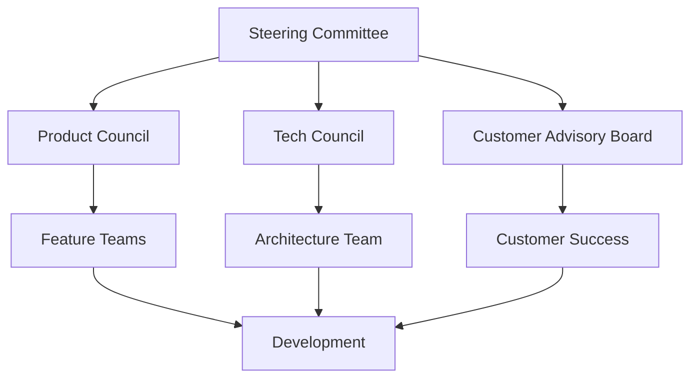

# 🏛️ AUDITORIA360 - Framework de Governança

*Estrutura de governança, feedback e melhoria contínua*

---

## 🎯 Visão Geral da Governança

### Princípios Fundamentais
1. **Transparência**: Comunicação aberta sobre decisões e progresso
2. **Responsabilidade**: Ownership claro de entregas e resultados  
3. **Melhoria Contínua**: Feedback loop constante para evolução
4. **Customer-Centricity**: Decisões baseadas em valor para o cliente
5. **Data-Driven**: Decisões fundamentadas em dados e métricas

### Estrutura de Governança


---

## 👥 Estrutura Organizacional

### 🎖️ Steering Committee
**Frequência**: Mensal  
**Participantes**: CEO, CTO, CPO, Head of Sales  
**Responsabilidades**:
- Definir estratégia e prioridades de alto nível
- Aprovar investimentos significativos
- Resolver conflitos entre áreas
- Acompanhar OKRs e métricas chave

**Artefatos**:
- Atas de reunião mensais
- Decisões estratégicas documentadas
- Revisão trimestral de OKRs
- Budget planning anual

### 🛠️ Product Council
**Frequência**: Quinzenal  
**Participantes**: CPO, Product Managers, UX Lead, Engineering Lead  
**Responsabilidades**:
- Priorização do backlog de produtos
- Definição de roadmap trimestral
- Aprovação de novas features
- Análise de métricas de produto

**Ferramentas**:
- Productboard para roadmap
- Mixpanel para analytics
- Slack para comunicação
- Notion para documentação

### 💻 Tech Council
**Frequência**: Semanal  
**Participantes**: CTO, Tech Leads, DevOps, Security  
**Responsabilidades**:
- Decisões arquiteturais
- Padrões de desenvolvimento
- Segurança e compliance
- Performance e scalability

**Processos**:
- Architecture Decision Records (ADRs)
- Code review standards
- Security assessments
- Tech debt prioritization

### 🤝 Customer Advisory Board
**Frequência**: Trimestral  
**Participantes**: 8-10 clientes estratégicos, Customer Success, Product  
**Responsabilidades**:
- Feedback sobre roadmap
- Validação de novas features
- Insights de mercado
- Advocacy e referências

**Benefícios para Clientes**:
- Early access a novas features
- Influência direta no roadmap
- Networking com outros clientes
- Desconto especial (10% no plano anual)

---

## 📢 Canais de Feedback

### 🎯 Feedback dos Usuários

#### 1. In-App Feedback
**Implementação**: Widget no canto inferior direito  
**Tipos**: Bug report, feature request, general feedback  
**SLA**: Resposta em até 24h para bugs críticos

```javascript
// Exemplo de implementação
<FeedbackWidget 
  onSubmit={handleFeedback}
  categories={['bug', 'feature', 'general']}
  screenshotEnabled={true}
  priority={['low', 'medium', 'high', 'critical']}
/>
```

#### 2. NPS Surveys
**Frequência**: Trimestral  
**Canal**: Email + in-app notification  
**Follow-up**: Entrevistas 1:1 com detratores e promotores

**Current NPS**: 42 (Q2/2025)  
**Target**: 60+ (Q4/2025)

#### 3. User Interviews
**Frequência**: 4-6 por mês  
**Duração**: 30-45 minutos  
**Foco**: Workflow analysis, pain points, feature validation

**Processo**:
1. Recrutar via Customer Success
2. Incentivo: R$ 100 gift card
3. Gravação com consentimento
4. Síntese em insights document

#### 4. Beta Testing Program
**Participantes**: 20-30 usuários avançados  
**Processo**:
- Features em staging environment
- Feedback via Slack channel dedicado
- Weekly sync calls
- Early access a novas funcionalidades

### 📊 Analytics e Métricas

#### Product Analytics
**Ferramenta**: Mixpanel + Custom dashboards  
**Métricas Principais**:
- Daily/Monthly Active Users (DAU/MAU)
- Feature adoption rates
- Session duration
- Drop-off points
- Error rates

#### Business Metrics
**Ferramenta**: Custom BI dashboard  
**Métricas KPI**:
- MRR/ARR growth
- Customer churn rate
- Customer Acquisition Cost (CAC)
- Lifetime Value (LTV)
- Support ticket volume

#### Technical Metrics
**Ferramentas**: Datadog + Custom monitoring  
**Métricas SLI/SLO**:
- Response time (P95 < 500ms)
- Uptime (>99.5%)
- Error rate (<0.1%)
- Deployment frequency
- Mean time to recovery

---

## 📋 Processos de Melhoria Contínua

### 🔄 Sprint Retrospectives
**Frequência**: Final de cada sprint (2 semanas)  
**Participantes**: Product team (8-12 pessoas)  
**Formato**: Start-Stop-Continue + Action items

**Template Retrospective**:
```markdown
## Sprint Retrospective - Sprint XX

### What went well? ✅
- Lista de sucessos e pontos positivos

### What didn't go well? ⚠️  
- Problemas e impedimentos encontrados

### What can we improve? 🔧
- Ações específicas para o próximo sprint

### Action Items 📋
- [ ] Item 1 - Responsável: @nome - Prazo: data
- [ ] Item 2 - Responsável: @nome - Prazo: data
```

### 📈 Monthly Reviews
**Frequência**: Primeira sexta-feira do mês  
**Participantes**: Toda empresa (All-hands)  
**Agenda**:
1. Metrics review (15 min)
2. Feature releases (10 min)  
3. Customer spotlight (10 min)
4. Team highlights (10 min)
5. Next month priorities (10 min)
6. Q&A (5 min)

### 🎯 Quarterly Business Reviews (QBRs)
**Frequência**: Fim de cada trimestre  
**Participantes**: Leadership + board members  
**Duração**: 3 horas  

**Agenda QBR**:
1. **Business Performance** (45 min)
   - Revenue and growth metrics
   - Customer metrics and cohort analysis
   - Market position and competition

2. **Product & Engineering** (45 min)
   - Roadmap progress and updates
   - Technical achievements and challenges
   - Quality metrics and performance

3. **Customer Success** (30 min)
   - Customer health scores
   - Success stories and case studies
   - Churn analysis and retention

4. **Strategy & Planning** (60 min)  
   - Next quarter priorities
   - Resource allocation
   - Risk assessment and mitigation

---

## 🔧 Ferramentas de Gestão

### 📊 Project Management
**Ferramenta Principal**: Linear  
**Uso**:
- Epic/Story/Task hierarchy
- Sprint planning e tracking
- Bug tracking e triage
- Release planning

**Processo de Issues**:
1. **Triage**: Daily review de novos issues
2. **Prioritization**: Product Council decision
3. **Assignment**: Tech leads distribute
4. **Review**: Peer review antes do merge
5. **QA**: Dedicated testing before release

### 📝 Documentation
**Stack de Documentação**:
- **Notion**: Company wiki e processes
- **GitBook**: Public documentation
- **Confluence**: Technical documentation
- **GitHub**: Code documentation e ADRs

**Documentation Standards**:
- Toda feature deve ter doc de produto
- APIs devem ter OpenAPI spec atualizada
- ADRs obrigatórias para decisões técnicas
- Onboarding docs atualizadas trimestralmente

### 💬 Communication
**Ferramentas**:
- **Slack**: Comunicação diária
- **Google Meet**: Meetings e calls
- **Loom**: Async video communication
- **Linear**: Status updates e progress

**Communication Guidelines**:
- Slack para urgente (<4h response)
- Email para formal e external
- Linear comments para project-related
- All-hands para company-wide announcements

---

## 🎯 OKRs e Accountability

### 📋 OKR Framework
**Ciclo**: Trimestral com check-ins mensais  
**Níveis**: Company → Team → Individual  
**Scoring**: 0.0 - 1.0 scale

#### Company OKRs Q3/2025
**Objetivo**: Estabelecer liderança técnica em auditoria DP

**Key Results**:
- KR1: 25 contabilidades ativas (Target: 1.0)
- KR2: NPS >30 com 90% response rate (Target: 1.0)
- KR3: P95 response time <500ms (Target: 1.0)  
- KR4: 99.5% uptime com <3 incidents (Target: 1.0)

#### Product Team OKRs Q3/2025
**Objetivo**: Entregar experiência superior ao usuário

**Key Results**:
- KR1: Lançar mobile app MVP (Target: 1.0)
- KR2: 80% feature adoption rate nas últimas 3 releases (Target: 1.0)
- KR3: <5% support tickets relacionados a UX (Target: 1.0)

#### Engineering OKRs Q3/2025  
**Objetivo**: Construir plataforma escalável e confiável

**Key Results**:
- KR1: 95% test coverage em código crítico (Target: 1.0)
- KR2: Deploy em produção em <10min (Target: 1.0)
- KR3: Zero security vulnerabilities críticas (Target: 1.0)

### 📊 OKR Tracking
**Dashboard**: Real-time OKR dashboard no Notion  
**Updates**: Weekly progress updates pelos DRIs  
**Reviews**: Monthly reviews com leadership

**OKR Template**:
```markdown
## Q3 2025 OKRs - [Team Name]

### Objective: [Clear, inspiring goal]
**DRI**: @responsible_person

#### Key Result 1: [Measurable outcome]  
- **Current**: X.X / 1.0
- **Trend**: ↗️ On track / ⚠️ At risk / 🔴 Behind
- **Last Update**: [Date] - [Brief status]

#### Key Result 2: [Measurable outcome]
- **Current**: X.X / 1.0  
- **Trend**: ↗️ On track / ⚠️ At risk / 🔴 Behind
- **Last Update**: [Date] - [Brief status]
```

---

## 📞 Escalation & Issue Resolution

### 🚨 Escalation Matrix
| Issue Type | L1 Response | L2 Escalation | L3 Critical |
|------------|-------------|---------------|-------------|
| **Customer Bug** | Support team (2h) | Engineering (4h) | CTO (1h) |
| **System Down** | DevOps (15min) | CTO (30min) | CEO (1h) |
| **Security** | Security team (1h) | CTO (2h) | CEO (4h) |
| **Customer Churn Risk** | CS team (24h) | Head of CS (48h) | CEO (72h) |

### 🔄 Issue Resolution Process
1. **Detection**: Automated alerts ou customer report
2. **Triage**: Initial assessment e priority assignment  
3. **Assignment**: Route to appropriate team/person
4. **Resolution**: Fix implementation e testing
5. **Communication**: Update stakeholders e customers
6. **Post-mortem**: Root cause analysis (se P0/P1)

### 📋 Post-Mortem Template
```markdown
# Post-Mortem: [Issue Title]

**Date**: [YYYY-MM-DD]  
**Severity**: P0/P1/P2  
**Duration**: [Start - End time]  
**Affected**: [Number of users/customers]

## Summary
Brief description of what happened.

## Timeline  
- **[Time]**: Initial detection
- **[Time]**: Issue confirmed  
- **[Time]**: Mitigation started
- **[Time]**: Issue resolved

## Root Cause
Technical root cause analysis.

## Impact
- Customer impact
- Business impact  
- Technical impact

## Action Items
- [ ] Action 1 - @owner - Due: [date]
- [ ] Action 2 - @owner - Due: [date]

## Prevention
How we'll prevent this in the future.
```

---

## 📊 Performance Reviews & Development

### 👤 Individual Performance Management
**Ciclo**: Semestral com 1:1s semanais  
**Framework**: Goals + Values + Growth  
**Tool**: BambooHR integration com Slack

#### Performance Dimensions
1. **Results**: Delivery against OKRs e goals
2. **Behavior**: Alignment com company values
3. **Growth**: Skill development e learning
4. **Collaboration**: Teamwork e communication

#### Career Development  
- **Growth Plans**: Individual development plans
- **Mentorship**: Internal mentor program
- **Learning Budget**: R$ 3.000/ano per person
- **Conference Budget**: R$ 5.000/ano para palestras

### 🏆 Recognition Programs
#### Peer Recognition
- **Kudos System**: Slack integration para reconhecimento
- **Monthly MVP**: Voted by team, R$ 500 bonus
- **Values Awards**: Quarterly recognition per value

#### Achievement Rewards
- **Milestone Bonuses**: Major release launches
- **Innovation Rewards**: Patent filings, etc.
- **Learning Rewards**: Certification completions

---

## 📈 Innovation & Continuous Learning

### 🧪 Innovation Process
**20% Time**: Engenheiros podem dedicar 1 dia/semana para projetos pessoais  
**Hackathons**: Trimestrais, 24h, com implementação dos melhores  
**Innovation Fund**: R$ 50k/trimestre para experimentos  

#### Innovation Pipeline
1. **Ideation**: Qualquer pessoa pode submeter ideias
2. **Validation**: Product council avalia viabilidade  
3. **Prototyping**: 1-2 weeks proof of concept
4. **Testing**: Beta testing com clientes selecionados
5. **Implementation**: Integration ao produto principal

### 📚 Learning & Development
**Company Learning Goals**:
- 40h/ano minimum learning per person
- 2 internal tech talks/mês
- 1 external conference/trimestre por pessoa
- Book club mensal

**Learning Resources**:
- Pluralsight subscriptions
- O'Reilly Learning Platform  
- Conference budgets
- Internal knowledge sharing

---

## 🎯 Customer Success Framework

### 📊 Customer Health Score
**Componentes** (100 points total):
- **Usage** (40 pts): Daily/weekly active usage
- **Adoption** (30 pts): Feature adoption rate  
- **Support** (15 pts): Support ticket frequency
- **Payment** (10 pts): Payment history
- **Engagement** (5 pts): Response to communications

**Health Categories**:
- **Green** (80-100): Healthy, expansion opportunity
- **Yellow** (60-79): At risk, needs attention
- **Red** (0-59): Critical, churn risk

### 🔄 Customer Journey
#### Onboarding (Days 0-30)
- [ ] Welcome email sequence
- [ ] Initial setup call  
- [ ] First audit completed
- [ ] Training materials accessed
- [ ] Key features adopted

#### Growth (Days 31-90)
- [ ] Advanced features introduced
- [ ] Integration with existing tools
- [ ] ROI measurement started
- [ ] Feedback collection
- [ ] Expansion opportunity identified

#### Retention (Days 90+)
- [ ] Regular business reviews
- [ ] Success metrics tracked
- [ ] Referral program participation
- [ ] Advisory board invitation
- [ ] Long-term contract negotiation

### 📞 Support Structure
**Tiers**:
- **L1 Support**: General questions, basic troubleshooting
- **L2 Support**: Technical issues, integration help
- **L3 Support**: Complex technical problems, escalations

**SLAs**:
- **Critical**: 1 hour response, 4 hour resolution
- **High**: 4 hour response, 24 hour resolution  
- **Medium**: 24 hour response, 72 hour resolution
- **Low**: 72 hour response, 1 week resolution

---

## 📋 Checklist de Governança

### 🔄 Monthly Checklist
- [ ] OKR progress updated
- [ ] Customer health scores reviewed
- [ ] Financial metrics analyzed
- [ ] Product metrics dashboard updated
- [ ] Team retrospectives conducted
- [ ] All-hands meeting held
- [ ] Innovation projects reviewed

### 📈 Quarterly Checklist  
- [ ] QBR conducted with full analysis
- [ ] OKRs finalized for next quarter
- [ ] Customer Advisory Board meeting
- [ ] Roadmap updated and communicated
- [ ] Team performance reviews
- [ ] Budget reforecast
- [ ] Risk assessment updated
- [ ] Compliance audit completed

### 🎯 Annual Checklist
- [ ] Annual strategic planning session
- [ ] Company values and culture review
- [ ] Compensation and benefits review
- [ ] Board meeting with annual results
- [ ] Employee engagement survey
- [ ] Security audit and certifications
- [ ] Legal and regulatory compliance review

---

**Este framework de governança é revisado semestralmente e atualizado conforme o crescimento e evolução da empresa.**