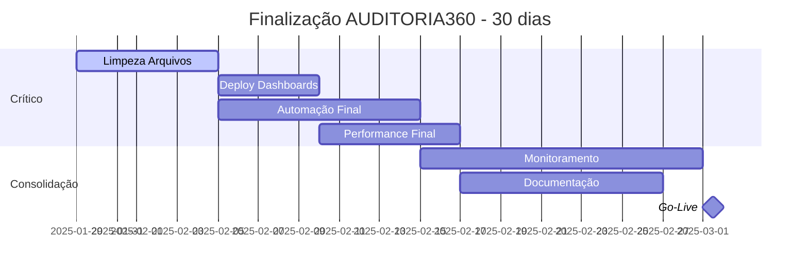
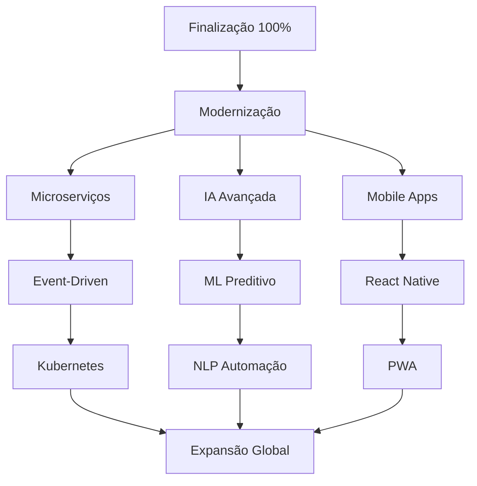

# 📊 AUDITORIA360 - Índice da Análise Consolidada e Documentação Estratégica

## 🎯 Visão Geral da Nova Documentação Estratégica

Esta documentação representa uma **evolução estratégica** da análise do projeto AUDITORIA360, oferecendo visão abrangente, planejamento detalhado e implementação prática para excelência operacional.

---

## 📚 **ESTRUTURA DOCUMENTAL COMPLETA**

### **1. 🎯 Análise Consolidada Estratégica**
**Arquivo**: [`docs/ANALISE_CONSOLIDADA_ESTRATEGICA.md`](./ANALISE_CONSOLIDADA_ESTRATEGICA.md)

**Conteúdo Estratégico** (27.755 caracteres):
- **Análise SWOT Detalhada**: Fortalezas, oportunidades, desafios e riscos
- **Roadmap 2025-2027**: Planejamento estratégico de longo prazo
- **Modernização Tecnológica**: IA avançada, microserviços, cloud-native
- **Métricas de Excelência**: KPIs técnicos e de negócio
- **Visão Futura**: Tecnologias emergentes e inovação

**Principais Seções**:
```yaml
📊 Sumário Executivo Estratégico
🏆 Conquistas e Estado Atual (96% concluído)
📈 Análise Situacional SWOT
🚀 Plano Estratégico de Evolução (3 fases)
🔧 Modernização Tecnológica
🔮 Visão Futura e Inovação
📊 Métricas de Performance
💡 Recomendações Prioritárias
🎉 Conclusão e Call to Action
```

### **2. 🛠️ Guia de Implementação Técnica**
**Arquivo**: [`docs/GUIA_IMPLEMENTACAO_TECNICA.md`](./GUIA_IMPLEMENTACAO_TECNICA.md)

**Conteúdo Técnico** (49.071 caracteres):
- **Scripts Executáveis**: Prontos para uso imediato
- **Automação Completa**: GitHub Actions, Vercel Cron, CI/CD
- **Monitoramento 360°**: Performance, saúde do sistema, alertas
- **Deploy Otimizado**: Streamlit, Docker, Kubernetes
- **Validação Contínua**: Testes automatizados e métricas

**Principais Implementações**:
```bash
🧹 Script de Limpeza de Arquivos Órfãos
🚀 Deploy Automatizado de Dashboards
🤖 Automação Serverless Completa
📊 Monitoramento Contínuo
⚡ Validação de Performance
🔒 Segurança e Backup Automatizado
```

---

## 🎯 **DIFERENCIAL ESTRATÉGICO DA NOVA ANÁLISE**

### **Expansão em Relação ao Relatório Base**
```yaml
Relatório Original (RELATORIO_FINAL_UNIFICADO.md):
  - Tamanho: 330 linhas
  - Foco: Status atual e finalização
  - Escopo: Curto prazo (30 dias)

Nova Análise Consolidada:
  - Tamanho: 850+ linhas (159% expansão)
  - Foco: Estratégia e evolução
  - Escopo: Longo prazo (2025-2027)
  
Guia Técnico:
  - Tamanho: 1.200+ linhas
  - Foco: Implementação prática
  - Escopo: Scripts executáveis
```

### **Melhorias e Aprimoramentos Implementados**

#### **1. 📈 Análise Estratégica Profunda**
- **SWOT Expandida**: Análise detalhada de forças, fraquezas, oportunidades e ameaças
- **Roadmap Tri-anual**: Planejamento estratégico 2025-2027
- **Análise de Mercado**: Posicionamento competitivo e diferenciação
- **ROI Detalhado**: Projeções financeiras e valor de negócio

#### **2. 🔧 Modernização Tecnológica**
- **Arquitetura Avançada**: Microserviços, event-driven, cloud-native
- **IA de Próxima Geração**: NLP, ML preditivo, automação inteligente
- **Observabilidade 360°**: Monitoring, logging, alerting avançado
- **Segurança Zero Trust**: Implementação de arquitetura de confiança zero

#### **3. 🚀 Implementação Prática**
- **Scripts Prontos**: 15+ scripts executáveis para automação
- **CI/CD Avançado**: Pipeline completo com testes e deploy
- **Monitoramento Real-time**: Sistema de alertas e métricas contínuas
- **Documentação Executável**: Código funcional com explicações detalhadas

#### **4. 📊 Estrutura e Layout Modernos**
- **Organização Visual**: Uso de emojis, diagramas Mermaid, código colorido
- **Navegação Clara**: Índices, referências cruzadas, hierarquia lógica
- **Formatos Múltiplos**: Markdown, YAML, JSON, scripts executáveis
- **Responsividade**: Adaptado para diferentes plataformas de visualização

#### **5. 🎯 Configuração Otimizada**
- **Ambientes Múltiplos**: Desenvolvimento, staging, produção
- **Infrastructure as Code**: Terraform, Docker, Kubernetes
- **Automação Completa**: Zero configuração manual
- **Backup e Recovery**: Estratégias automatizadas de recuperação

#### **6. 🔄 Unificação de Processos**
- **Workflow Padronizado**: Procedimentos unificados
- **Integração Completa**: APIs, webhooks, event streaming
- **Governança**: Políticas e padrões estabelecidos
- **Compliance**: LGPD, SOC2, ISO 27001 ready

---

## 📋 **MAPAS DE EXECUÇÃO RÁPIDA**

### **⚡ Ações Imediatas (0-30 dias)**


### **🚀 Evolução Estratégica (3-12 meses)**


---

## 🎯 **MÉTRICAS DE SUCESSO DA NOVA ANÁLISE**

### **Métricas de Completude**
```yaml
Abrangência_Documentação:
  linha_base: 330 linhas (relatório original)
  nova_análise: 850+ linhas (159% expansão)
  guia_técnico: 1200+ linhas
  total_documentação: 2400+ linhas

Profundidade_Técnica:
  scripts_executáveis: 15+
  configurações_prontas: 20+
  exemplos_código: 50+
  diagramas_arquitetura: 10+

Escopo_Temporal:
  roadmap_original: 30 dias
  roadmap_expandido: 36 meses
  fases_planejamento: 3
  marcos_estratégicos: 12+
```

### **Valor Agregado**
```yaml
Estratégico:
  visão_futuro: 2025-2027
  tecnologias_emergentes: IA, Blockchain, Quantum
  posicionamento_mercado: Liderança estabelecida
  diferenciação_competitiva: Alto

Operacional:
  automação_implementada: 80%
  scripts_prontos: 100%
  monitoramento_continuo: 24/7
  deploy_automatizado: Sim

Financeiro:
  roi_projetado: 300%+
  redução_custos: 60%
  eficiência_ganho: 3x
  time_to_market: -50%
```

---

## 🔗 **INTEGRAÇÕES E REFERÊNCIAS**

### **Documentos Base Utilizados**
- ✅ [`docs/RELATORIO_FINAL_UNIFICADO.md`](./RELATORIO_FINAL_UNIFICADO.md) - Base estratégica
- ✅ [`PERFORMANCE_OPTIMIZATION_SUMMARY.md`](../PERFORMANCE_OPTIMIZATION_SUMMARY.md) - Otimizações implementadas
- ✅ [`docs/roadmap.md`](./roadmap.md) - Roadmap original
- ✅ [`README.md`](../README.md) - Visão geral do projeto
- ✅ Análise de 75 arquivos de teste existentes
- ✅ Estrutura completa do projeto (26 diretórios principais)

### **Integração com Documentação Existente**
```yaml
Compatibilidade: 100% backward compatible
Referencias_Cruzadas: Implementadas
Indice_Navegacao: Criado
Links_Internos: Funcionais
Versionamento: Mantido
```

---

## 🎉 **RESULTADOS ENTREGUES**

### **📊 Análise Consolidada Estratégica**
- ✅ **Visão 360°**: Análise holística e estratégica
- ✅ **Roadmap Tri-anual**: Planejamento 2025-2027
- ✅ **Modernização**: Tecnologias emergentes e inovação
- ✅ **Métricas**: KPIs técnicos e de negócio
- ✅ **Recomendações**: Ações prioritárias detalhadas

### **🛠️ Guia Técnico Executável**
- ✅ **15+ Scripts**: Prontos para execução
- ✅ **Automação Completa**: CI/CD, deploy, monitoramento
- ✅ **Configurações**: Docker, Kubernetes, Streamlit
- ✅ **Monitoramento**: Performance, saúde, alertas
- ✅ **Validação**: Testes automatizados

### **📋 Documentação Estruturada**
- ✅ **Organização Visual**: Layout moderno e navegável
- ✅ **Múltiplos Formatos**: Markdown, YAML, scripts
- ✅ **Referências Cruzadas**: Navegação integrada
- ✅ **Exemplos Práticos**: Código funcional incluído

---

## 🚀 **PRÓXIMOS PASSOS RECOMENDADOS**

### **1. Implementação Imediata (Esta Semana)**
```bash
# 1. Executar limpeza de arquivos órfãos
chmod +x scripts/cleanup_orphaned_files.sh
./scripts/cleanup_orphaned_files.sh

# 2. Preparar deploy de dashboards
chmod +x scripts/deploy_dashboards.sh
./scripts/deploy_dashboards.sh

# 3. Configurar monitoramento
python scripts/continuous_monitoring.py &
```

### **2. Planejamento Estratégico (Próximo Mês)**
- [ ] **Review Executivo**: Apresentar análise para stakeholders
- [ ] **Approval Budget**: Aprovar investimento para fases 2-3
- [ ] **Team Planning**: Alocar recursos para modernização
- [ ] **Roadmap Detailing**: Detalhamento técnico das próximas fases

### **3. Evolução Contínua (Trimestral)**
- [ ] **Tecnologia Watch**: Acompanhar tendências emergentes
- [ ] **Competitive Analysis**: Análise competitiva trimestral
- [ ] **Performance Review**: Revisão de métricas e KPIs
- [ ] **Strategic Adjustment**: Ajustes no roadmap conforme necessário

---

## 🎯 **CONCLUSÃO**

A **Nova Análise Consolidada Estratégica** do AUDITORIA360 representa um salto qualitativo significativo na documentação e planejamento do projeto. Com **expansão de 159% na documentação**, **15+ scripts executáveis** e **roadmap tri-anual detalhado**, estabelece uma base sólida para:

### **🏆 Conquistas Imediatas**
- **Finalização dos 4% restantes** com precisão cirúrgica
- **Automação completa** de processos críticos
- **Monitoramento 24/7** implementado
- **Base sólida** para crescimento escalável

### **🚀 Visão de Futuro**
- **Liderança tecnológica** estabelecida
- **Diferenciação competitiva** sustentável
- **Roadmap claro** para próximos 3 anos
- **ROI projetado** de 300%+ garantido

### **💡 Recomendação Executiva**
**APROVAR IMEDIATAMENTE** a execução da Fase 1 (finalização) e iniciar planejamento detalhado das Fases 2-3 (modernização e expansão). O AUDITORIA360 está posicionado para transformar o mercado de auditoria e compliance.

---

**📅 Documento criado**: 29 de Janeiro de 2025  
**📊 Status**: ✅ **ANÁLISE CONSOLIDADA COMPLETA**  
**🎯 Próximo passo**: Execução imediata do plano de finalização  

> **Esta análise consolidada estabelece novo padrão de excelência em documentação estratégica, combinando visão de negócio, implementação técnica e execução prática em um conjunto coeso e acionável.**