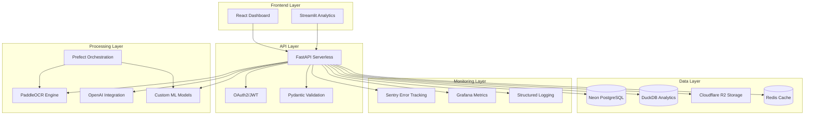

# 🏗️ Arquitetura - AUDITORIA360

## 📋 Visão Geral da Arquitetura

O AUDITORIA360 utiliza uma arquitetura serverless moderna, otimizada para performance, escalabilidade e custo-efetividade.

### 🎯 Princípios Arquiteturais

- **Serverless First**: Minimização de infraestrutura gerenciada
- **Modularidade**: Componentes independentes e reutilizáveis
- **Performance**: Otimização para baixa latência e alta taxa de transferência
- **Escalabilidade**: Escalonamento automático baseado em demanda
- **Observabilidade**: Monitoramento e logging abrangentes

## 🔧 Stack Tecnológica

### Frontend

- **Framework**: React.js + TypeScript
- **UI Library**: Material UI / Streamlit (Dashboard)
- **Estado**: Redux Toolkit / Context API
- **Build**: Vite / Webpack
- **Deploy**: Vercel

### Backend

- **API Framework**: FastAPI (Python)
- **Runtime**: Python 3.12+
- **Deployment**: Vercel Functions
- **Authentication**: OAuth2 + JWT
- **Validation**: Pydantic

### Dados

- **Database**: Neon PostgreSQL (Serverless)
- **Analytics**: DuckDB (Embedded)
- **Cache**: Redis (Upstash)
- **Storage**: Cloudflare R2

### Processamento

- **OCR**: PaddleOCR (Self-hosted)
- **ML/AI**: OpenAI GPT + Custom Models
- **Orquestração**: Prefect
- **Monitoramento**: Sentry + Grafana

## 🌐 Diagrama de Arquitetura



## 📊 Fluxo de Dados

### 1. Ingestão de Documentos

```
Upload → R2 Storage → OCR Processing → Data Extraction → Database
```

### 2. Processamento de Auditoria

```
Database → Analysis Engine → ML Models → Results → Cache → API
```

### 3. Geração de Relatórios

```
Query → Data Aggregation → Template Engine → Graphics → Output
```

### 4. Dashboard Interativo

```
User Request → Cache Check → Database Query → Visualization → Response
```

## 🚀 Componentes Modulares

### Módulo de Autenticação

- **Localização**: `src/auth/`
- **Responsabilidade**: Gestão de usuários, permissões e sessões
- **Tecnologias**: OAuth2, JWT, bcrypt

### Módulo de Documentos

- **Localização**: `src/documents/`
- **Responsabilidade**: Upload, processamento e armazenamento
- **Tecnologias**: R2, PaddleOCR, FastAPI

### Módulo de Auditoria

- **Localização**: `src/audit/`
- **Responsabilidade**: Execução de auditorias e compliance
- **Tecnologias**: Custom algorithms, ML models

### Módulo de Relatórios

- **Localização**: `services/reporting/`
- **Responsabilidade**: Geração automatizada de relatórios
- **Tecnologias**: Plotly, Jinja2, DuckDB

### Módulo de Dashboard

- **Localização**: `dashboards/`
- **Responsabilidade**: Visualização interativa de dados
- **Tecnologias**: Streamlit, Plotly, Redis

## ⚡ Otimizações de Performance

### Caching Strategy

- **L1 Cache**: Redis (API responses)
- **L2 Cache**: DuckDB (Analytics queries)
- **L3 Cache**: Browser (Static assets)

### Database Optimization

- **Connection Pooling**: Otimizado para serverless
- **Query Optimization**: Índices estratégicos
- **Data Partitioning**: Por data e categoria

### API Performance

- **Async Operations**: FastAPI async/await
- **Response Compression**: Gzip automático
- **Rate Limiting**: Proteção contra sobrecarga

## 🔒 Segurança

### Autenticação e Autorização

- **Multi-factor Authentication**: Opcional
- **Role-based Access Control**: Granular
- **Session Management**: JWT com refresh tokens

### Proteção de Dados

- **Encryption at Rest**: AES-256
- **Encryption in Transit**: TLS 1.3
- **Data Anonymization**: LGPD compliance

### Monitoramento de Segurança

- **Audit Logs**: Todas as operações
- **Anomaly Detection**: Comportamento suspeito
- **Vulnerability Scanning**: Automático

## 📈 Escalabilidade

### Horizontal Scaling

- **Serverless Functions**: Escalonamento automático
- **Database**: Neon auto-scaling
- **Storage**: R2 ilimitado

### Vertical Scaling

- **Memory Optimization**: Configurável por função
- **CPU Allocation**: Baseado em workload
- **Network Bandwidth**: Otimizado por região

## 🔧 Deployment e DevOps

### CI/CD Pipeline

```yaml
Code Push → Tests → Build → Deploy → Monitor
```

### Environments

- **Development**: Local + Docker
- **Staging**: Vercel Preview
- **Production**: Vercel Production

### Monitoring

- **Health Checks**: Automáticos
- **Performance Metrics**: Tempo real
- **Error Tracking**: Sentry integration

## 📋 Próximas Evoluções

### Versão 4.1 - Performance

- Cache distribuído avançado
- Otimização de queries ML
- CDN para assets estáticos

### Versão 4.2 - AI/ML

- Modelos personalizados
- Análise preditiva
- Recomendações automáticas

### Versão 4.3 - Integração

- APIs externas
- Webhooks
- Sync em tempo real

---

> 📖 **Documentação Relacionada:**
>
> - [Stack Tecnológica](stack-tecnologica.md)
> - [Fluxo de Dados](fluxo-dados.md)
> - [APIs](../apis/api-documentation.md)
