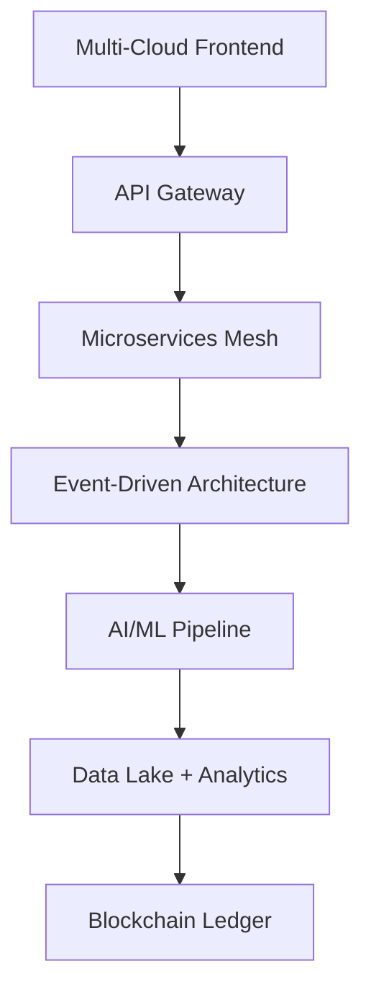

# 🗺️ Roadmap Estratégico AUDITORIA360

> **Planejamento estratégico e visão de futuro** - Horizonte 2025-2027

---

## 🎯 **VISÃO ESTRATÉGICA**

### 🌟 **Missão**
Transformar a gestão de auditoria e compliance em um processo automatizado, inteligente e seguro, eliminando riscos operacionais e maximizando a eficiência organizacional.

### 🚀 **Visão 2027**
Ser a plataforma líder em auditoria automatizada no Brasil, com IA avançada, compliance total e experiência do usuário excepcional.

### 💎 **Valores**
- **Transparência**: Total visibilidade dos processos
- **Segurança**: Proteção máxima de dados sensíveis
- **Inovação**: Tecnologia de ponta e IA avançada
- **Compliance**: Aderência total às normas e regulamentações

---

## 📅 **CRONOGRAMA ESTRATÉGICO**

### 🏁 **2025 Q1 - Finalização e Estabilização (96% → 100%)**

#### ✅ **Janeiro 2025**
- [x] Migração serverless 100% concluída
- [x] Documentação unificada
- [x] Testes de performance (90%+ cobertura)
- [ ] Deploy produção inicial

#### 🎯 **Fevereiro-Março 2025**
- [ ] Testes E2E finais (95% cobertura)
- [ ] Otimizações de performance
- [ ] Monitoramento avançado
- [ ] Treinamento de usuários
- [ ] Go-live produção

### 📈 **2025 Q2-Q4 - Otimização e Expansão**

#### 🚀 **Q2 2025 (Abril-Junho)**
- [ ] **IA Avançada**: Machine Learning para detecção de anomalias
- [ ] **Analytics Avançados**: Dashboards preditivos
- [ ] **API Marketplace**: Integrações com ERPs
- [ ] **Mobile App**: Aplicativo nativo iOS/Android

#### 📊 **Q3 2025 (Julho-Setembro)**
- [ ] **White Label**: Customização para diferentes organizações
- [ ] **Multi-tenant**: Arquitetura para múltiplos clientes
- [ ] **Compliance Internacional**: SOX, IFRS, GAAP
- [ ] **Relatórios BI**: Power BI e Tableau integration

#### 🌐 **Q4 2025 (Outubro-Dezembro)**
- [ ] **Cloud Híbrida**: Suporte AWS, Azure, GCP
- [ ] **Blockchain**: Auditoria imutável
- [ ] **API Gateway**: Rate limiting e monetização
- [ ] **Certificações**: ISO 27001, SOC 2 Type II

---

## 🚀 **2026 - EXPANSÃO E INOVAÇÃO**

### 🤖 **IA e Automação Avançada**
```yaml
Q1_2026:
  - NLP_Avançado: Processamento de documentos em linguagem natural
  - Computer_Vision: OCR inteligente para documentos complexos
  - Chatbot_IA: Assistente virtual especializado
  - Predição_Riscos: Machine Learning para compliance proativo

Q2_2026:
  - AutoML: Modelos de ML automatizados
  - Real_Time_Analytics: Análise em tempo real
  - Voice_Commands: Comandos de voz para relatórios
  - AR_Visualization: Realidade aumentada para dashboards

Q3_2026:
  - Edge_Computing: Processamento local para performance
  - Federated_Learning: IA distribuída preservando privacidade
  - Quantum_Ready: Preparação para computação quântica
  - Digital_Twin: Gêmeo digital dos processos

Q4_2026:
  - AGI_Integration: Integração com IA geral
  - Autonomous_Auditing: Auditoria completamente autônoma
  - Predictive_Compliance: Previsão de mudanças regulatórias
  - Smart_Contracts: Contratos inteligentes para compliance
```

### 🌍 **Expansão Internacional**
- **América Latina**: Argentina, Chile, Colombia
- **Europa**: Portugal, Espanha (GDPR compliance)
- **América do Norte**: EUA, Canadá (SOX compliance)
- **Ásia-Pacífico**: Coreia do Sul, Japão (partnerships)

---

## 🔮 **2027 - LIDERANÇA E TRANSFORMAÇÃO**

### 🏆 **Objetivos Estratégicos**
```yaml
Market_Leadership:
  - Position: "#1 Audit Platform in Latin America"
  - Market_Share: "25% Brazil, 15% LATAM"
  - Customer_Base: "1000+ enterprise clients"
  - Revenue_Target: "$50M ARR"

Technology_Excellence:
  - AI_Accuracy: "99%+ anomaly detection"
  - Performance: "<50ms API response"
  - Availability: "99.99% uptime SLA"
  - Security: "Zero major incidents"

Innovation_Index:
  - Patents_Filed: "20+ AI/ML innovations"
  - Open_Source: "10+ community projects"
  - Research_Papers: "5+ published studies"
  - Awards: "Top 10 FinTech innovations"
```

### 🌟 **Produtos Futuros**
- **AUDITORIA360 Enterprise**: Versão corporativa
- **AUDITORIA360 Cloud**: SaaS global
- **AUDITORIA360 AI**: Plataforma de IA especializada
- **AUDITORIA360 Marketplace**: Ecossistema de integrações

---

## 📊 **MÉTRICAS E KPIs ESTRATÉGICOS**

### 🎯 **2025 Targets**
```yaml
Technical_KPIs:
  - Code_Coverage: "95%+"
  - Performance: "<100ms P95"
  - Security_Score: "A+ grade"
  - Documentation: "100% complete"

Business_KPIs:
  - Customer_Satisfaction: "4.8/5.0"
  - Feature_Adoption: "80%+"
  - Churn_Rate: "<5% annual"
  - NPS_Score: "70+"

Operational_KPIs:
  - Deployment_Frequency: "Daily"
  - Lead_Time: "<2 days"
  - MTTR: "<30 minutes"
  - Error_Rate: "<0.1%"
```

### 📈 **2026-2027 Projections**
```yaml
Revenue_Growth:
  2025: "$2M ARR"
  2026: "$10M ARR"
  2027: "$50M ARR"

User_Growth:
  2025: "100 enterprise clients"
  2026: "500 enterprise clients"  
  2027: "1000+ enterprise clients"

Market_Expansion:
  2025: "Brazil (100%)"
  2026: "LATAM (60%)"
  2027: "Global (40%)"
```

---

## 🛠️ **ARQUITETURA FUTURA**

### 🏗️ **2025-2026: Evolution Stack**


### 🚀 **2027: Next-Gen Architecture**
- **Quantum-Ready**: Preparação para computação quântica
- **Edge Computing**: Processamento distribuído
- **5G Integration**: Ultra-low latency
- **Serverless Everything**: 100% serverless stack

---

## 🎯 **ESTRATÉGIAS DE IMPLEMENTAÇÃO**

### 📋 **Metodologia Ágil**
- **Sprints**: 2 semanas
- **Releases**: Mensais
- **Major Updates**: Trimestrais
- **Architecture Reviews**: Semestrais

### 🤝 **Parcerias Estratégicas**
- **Cloud Providers**: AWS, Azure, GCP partnerships
- **Technology**: OpenAI, Google AI, Microsoft AI
- **Compliance**: PwC, KPMG, Deloitte consulting
- **Integration**: SAP, Oracle, Microsoft partnerships

### 💰 **Estratégia de Investimento**
```yaml
2025_Investment:
  - R&D: "40% budget"
  - Infrastructure: "30% budget"
  - Marketing: "20% budget"
  - Operations: "10% budget"

2026_Focus:
  - AI/ML: "50% R&D budget"
  - International: "30% R&D budget"
  - Platform: "20% R&D budget"

2027_Priorities:
  - Innovation: "60% R&D budget"
  - Scale: "25% R&D budget"
  - Optimization: "15% R&D budget"
```

---

## 🔄 **GESTÃO DE RISCOS**

### ⚠️ **Riscos Identificados**
- **Tecnológicos**: Obsolescência rápida, segurança
- **Regulatórios**: Mudanças na legislação
- **Competitivos**: Novos entrantes, big techs
- **Operacionais**: Escala, performance, talentos

### 🛡️ **Estratégias de Mitigação**
- **Tech**: Arquitetura modular, atualizações contínuas
- **Regulatory**: Compliance proativo, monitoring
- **Competitive**: Inovação constante, patents
- **Operational**: Automation, SRE practices

---

## 📞 **COMUNICAÇÃO DO ROADMAP**

### 📊 **Stakeholder Updates**
- **Mensal**: Status reports executivos
- **Trimestral**: Roadmap reviews
- **Semestral**: Strategic planning sessions
- **Anual**: Vision and strategy alignment

### 📈 **Metrics Dashboard**
- **Real-time**: KPI monitoring
- **Weekly**: Progress tracking
- **Monthly**: Goal assessment
- **Quarterly**: Strategic review

---

> 🎯 **Próxima revisão**: Trimestral | **Owner**: Product & Strategy Team | **Aprovação**: Executive Board

**Última atualização**: Janeiro 2025 | **Versão**: 1.0 | **Horizonte**: 2025-2027